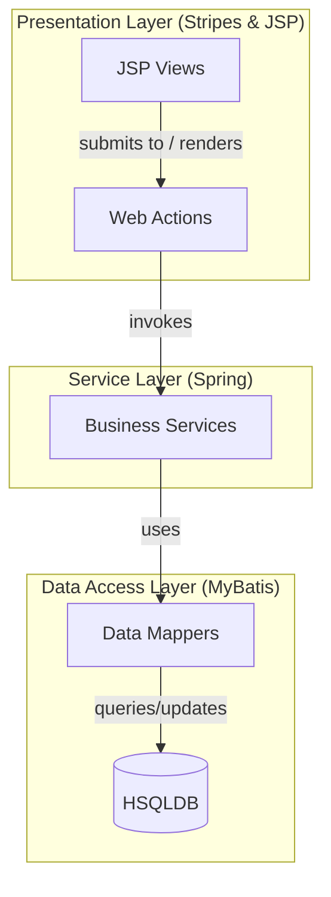

### Rationale

The system employs a classic layered monolithic architecture, distinctly separating concerns into presentation, business, and data access tiers. The Web Actions, built with the Stripes framework, handle user interactions and delegate all business logic to the Spring-managed Service Layer. This Service Layer, in turn, communicates with the database exclusively through MyBatis Mappers, enforcing a clean, unidirectional dependency flow and a clear separation of persistence logic.