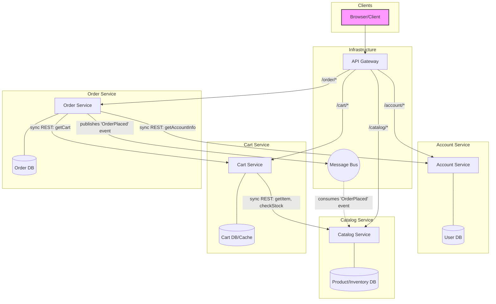

### Rationale

This decomposition separates the application into four distinct microservices based on the clear bounded contexts of Account, Catalog, Cart, and Order management. The behavioral analysis from the sequence diagrams is critical in defining the communication patterns between these services. For instance, the "Add Item to Cart" sequence dictates a synchronous REST call from the Cart Service to the Catalog Service to fetch real-time item and stock information. In contrast, the "Place Order" sequence, which involves a transactional update to inventory, is modeled as an asynchronous, event-driven flow; the Order Service publishes an `OrderPlaced` event to a message bus, which the Catalog Service subscribes to, decoupling the critical checkout process from inventory management and increasing system resilience.