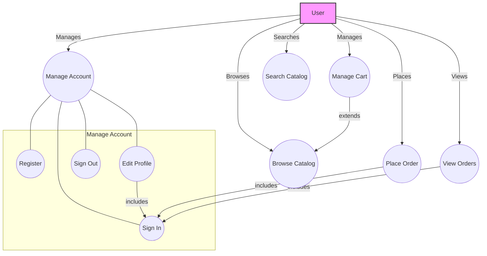
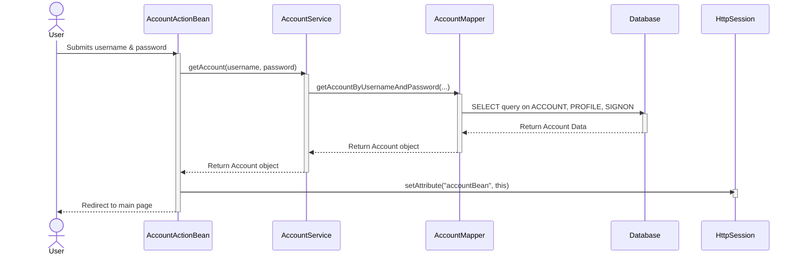
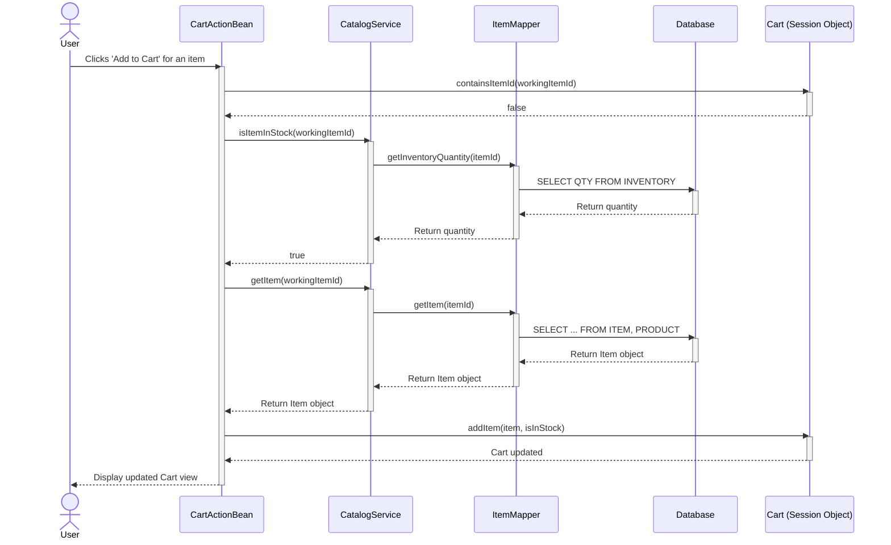
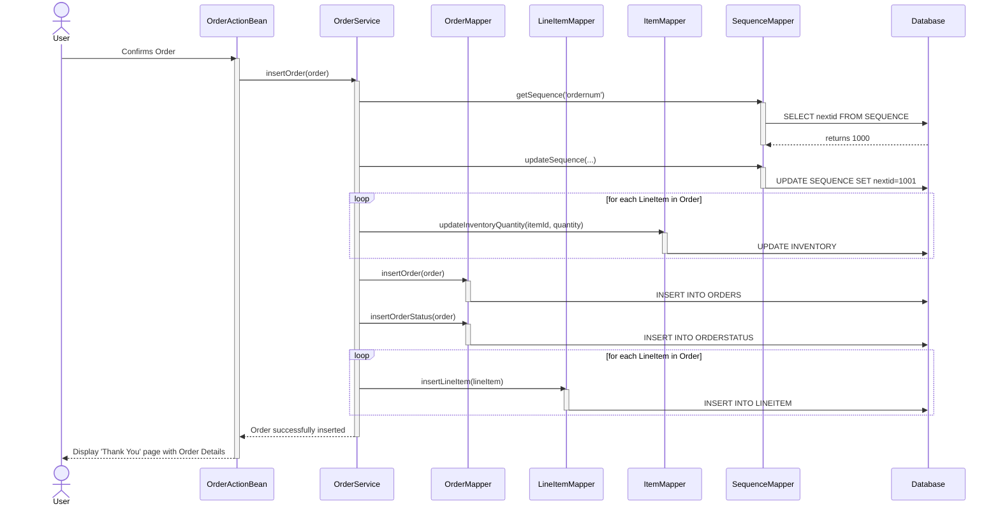
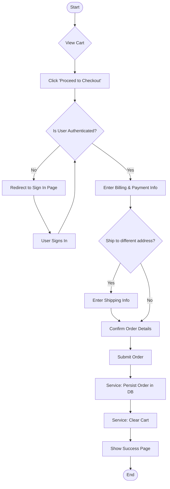

Here are the possible behavioral diagrams for the JPetStore application.

### 1. Use Case Diagram

#### Rationale
A Use Case diagram provides a high-level, bird's-eye view of the system's functionality. It's essential for understanding the primary goals a user can achieve and how different system functions relate to each other. This diagram identifies the main actor (`User`) and the key interactions they can have with the JPetStore system, such as managing their account, browsing the catalog, and placing an order. It clarifies which actions require authentication (e.g., `Place Order` includes `Sign In`).

#### Mermaid Diagram


***

### 2. Sequence Diagrams

Sequence diagrams are perfect for illustrating how different components of the system collaborate over time to complete a specific task. They show the exact sequence of method calls and interactions between objects.

#### a. User Sign-In Sequence

**Rationale**
This diagram details the step-by-step process of a user signing in. It shows the flow of control from the web layer (`AccountActionBean`) to the service layer (`AccountService`) and finally to the data access layer (`AccountMapper`). This clearly visualizes the separation of concerns and how each layer contributes to authenticating the user and establishing a session.

**Mermaid Diagram**


#### b. Add Item to Cart Sequence

**Rationale**
This diagram illustrates one of the most common e-commerce interactions. It shows the logic involved when a user adds an item to their shopping cart. Key steps like checking item availability (`isItemInStock`) and retrieving item details (`getItem`) are clearly shown, demonstrating the collaboration between the `CartActionBean`, `CatalogService`, and the underlying data mappers. The interaction with the `Cart` object, which is maintained in the user's session, is also highlighted.

**Mermaid Diagram**


#### c. Place Order Sequence

**Rationale**
The checkout process is the most critical workflow in an e-commerce application. This sequence diagram details the entire flow, from the user confirming their order to the system persisting it in the database. It effectively showcases the transactional nature of the `OrderService.insertOrder` method, where multiple database operations (getting a new order ID, updating inventory, inserting order and line items) must succeed or fail as a single unit.

**Mermaid Diagram**


***

### 3. Activity Diagram

#### Checkout Process Activity

**Rationale**
While a sequence diagram shows the interaction between objects, an activity diagram excels at modeling the flow of control in a complex process. This diagram visualizes the entire checkout workflow from the user's perspective. It clearly shows decision points (like checking for authentication or shipping to a different address) and the paths the user can take, making it easy to understand the overall business process.

**Mermaid Diagram**


***

### 4. State Machine Diagram

#### User Session State

**Rationale**
A state machine diagram is ideal for modeling the lifecycle of an object with distinct states. This diagram models the state of a user's session. A session can be in one of two primary states: `Unauthenticated` or `Authenticated`. The diagram shows the specific events (like `signon`, `signoff`, `newAccount`) that cause a transition from one state to another, providing a clear and concise model of user session management.

**Mermaid Diagram**
```mermaid
stateDiagram-v2
    [*] --> Unauthenticated

    state Unauthenticated {
        [*] --> NotLoggedIn
        NotLoggedIn --> Authenticated: signon(valid_credentials)
        NotLoggedIn --> Authenticated: newAccount(successful_registration)
    }

    state Authenticated {
        [*] --> LoggedIn
        LoggedIn --> LoggedIn: editAccount()
        LoggedIn --> Unauthenticated: signoff()
    }
```