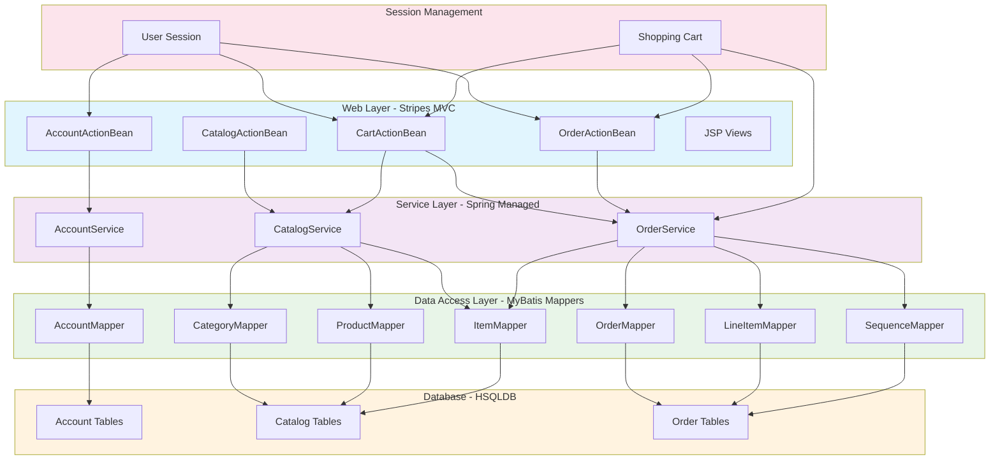

The component boundaries follow a classic layered architecture with clear separation between presentation (Stripes ActionBeans/JSP), business logic (Spring services), and data access (MyBatis mappers). Communication patterns are strictly top-down with web components delegating to services, which coordinate transactions and business rules before accessing data through mapper interfaces. Session-based components like Shopping Cart maintain user state across the web layer while services remain stateless for scalability.