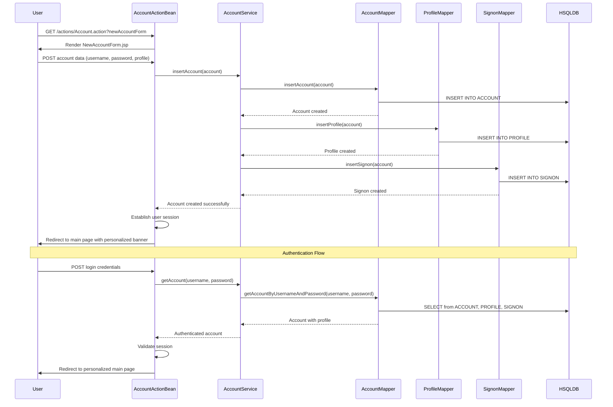
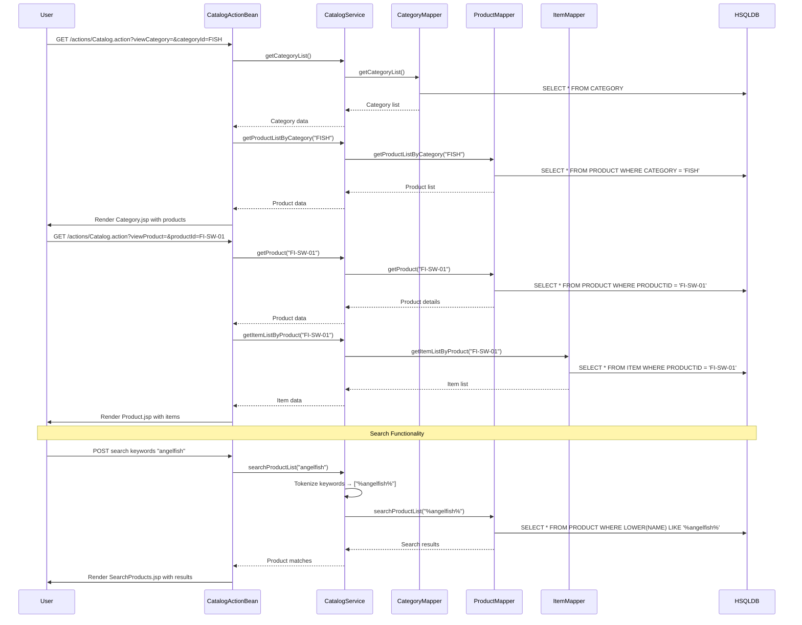
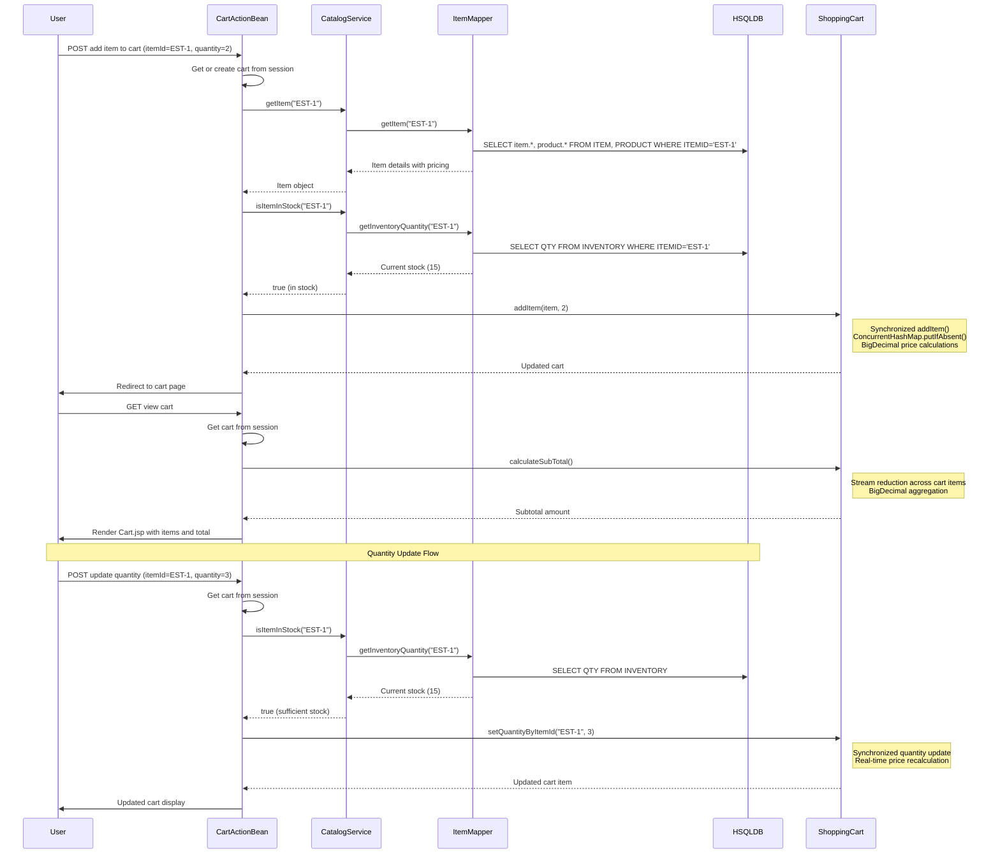
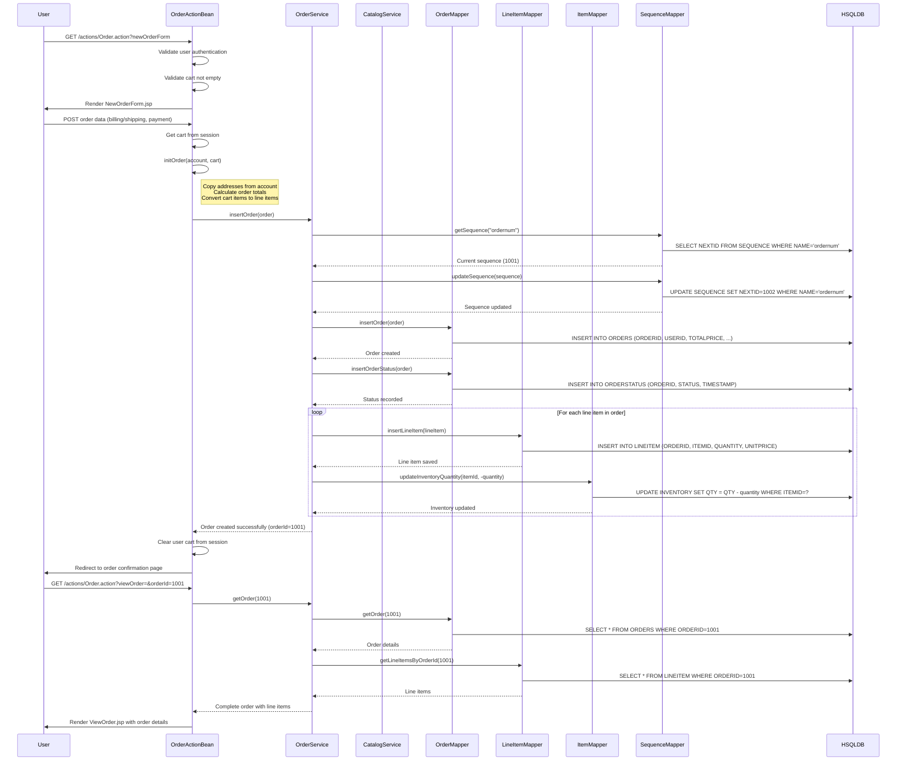
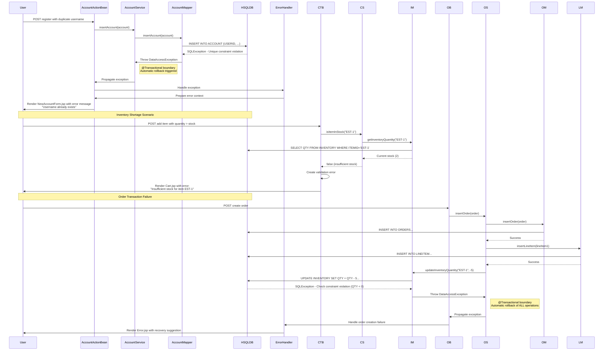

```markdown
# MyBatis JPetStore - Dynamic Interaction Flows

## Workflow 1: User Registration & Authentication

### Description
Complete user registration and authentication flow including account creation, profile setup, and login process. This workflow establishes user identity and personalization preferences.

### Communication Patterns
- **Synchronous**: REST-style form submissions via Stripes ActionBeans
- **Database Transactions**: Atomic account creation across multiple tables
- **Session Management**: HTTP session establishment for authenticated users

### Sequence Diagram



## Workflow 2: Product Browsing & Search

### Description
Catalog navigation workflow including category browsing, product viewing, item selection, and keyword-based search functionality. This workflow demonstrates the hierarchical catalog structure.

### Communication Patterns
- **Synchronous**: Page navigation with catalog data loading
- **Database Queries**: Hierarchical category→product→item queries
- **Search Algorithm**: Keyword tokenization and pattern matching

### Sequence Diagram



## Workflow 3: Shopping Cart Management

### Description
Complete shopping cart lifecycle including item addition, quantity updates, real-time inventory validation, and price calculations. This workflow demonstrates session-based cart management with thread-safe operations.

### Communication Patterns
- **Session-based**: Cart persistence in HTTP session
- **Synchronous**: Real-time inventory validation
- **Thread-safe**: Synchronized cart operations
- **Price Calculation**: BigDecimal arithmetic for monetary operations

### Sequence Diagram



## Workflow 4: Order Creation & Checkout

### Description
Complete order processing workflow including cart validation, order creation, inventory updates, and payment processing. This demonstrates transactional order management with distributed ID generation.

### Communication Patterns
- **Database Transactions**: Atomic order creation across multiple tables
- **Sequence Generation**: Distributed ID generation for orders
- **Inventory Updates**: Real-time stock reduction
- **Saga Pattern**: Multi-step order creation process

### Sequence Diagram



## Workflow 5: Error Handling & Recovery

### Description
Comprehensive error handling workflow demonstrating exception propagation, transaction rollback, and user-friendly error reporting across different failure scenarios.

### Communication Patterns
- **Exception Propagation**: Service layer to presentation layer
- **Transaction Rollback**: @Transactional automatic rollback on exceptions
- **User Feedback**: Graceful error pages with recovery options
- **Validation**: Client-side and server-side validation coordination

### Sequence Diagram

