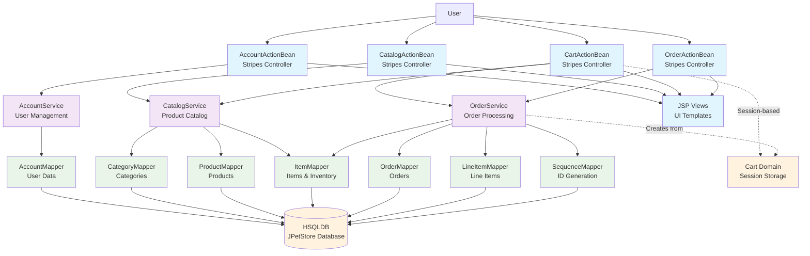

```markdown
1. A Mermaid diagram in graph TB syntax showing the key components/modules and their interactions.



2. A short rationale (2-3 sentences) explaining the component boundaries and communication patterns.

The architecture follows a traditional layered pattern with clear separation between web presentation (Stripes ActionBeans), business services, and data access layers (MyBatis Mappers). Communication flows synchronously downward through the layers, with web controllers calling services that coordinate transactions across multiple mappers. Session-based state management handles shopping cart data, while the service layer enforces transactional boundaries for critical operations like order creation and inventory updates.
```