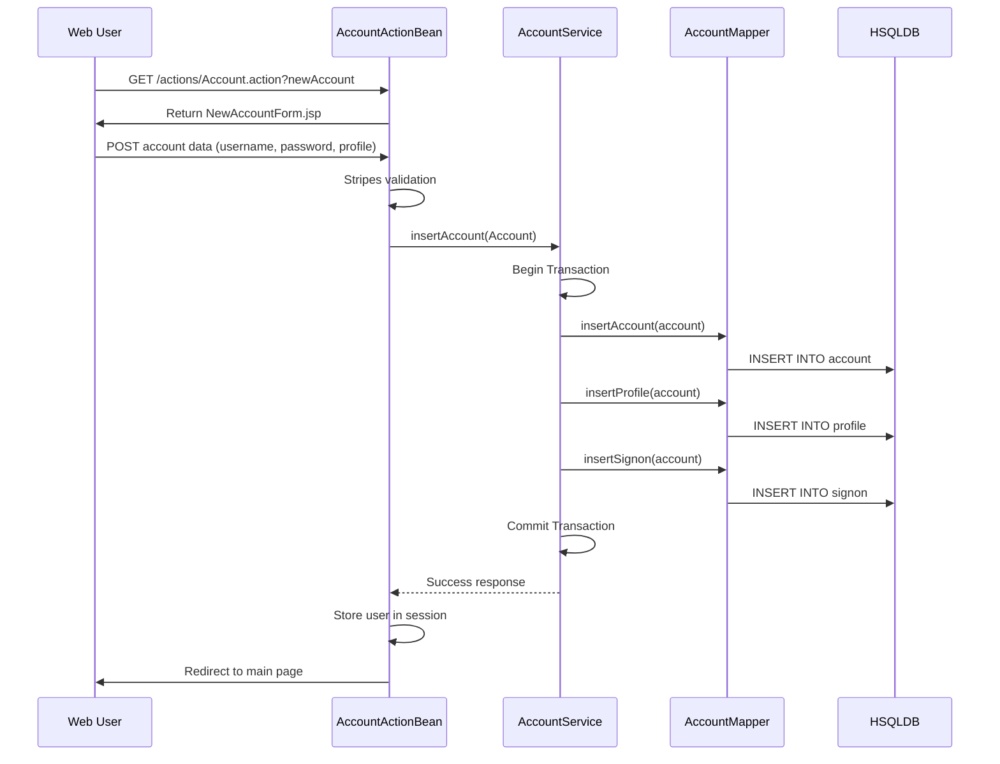
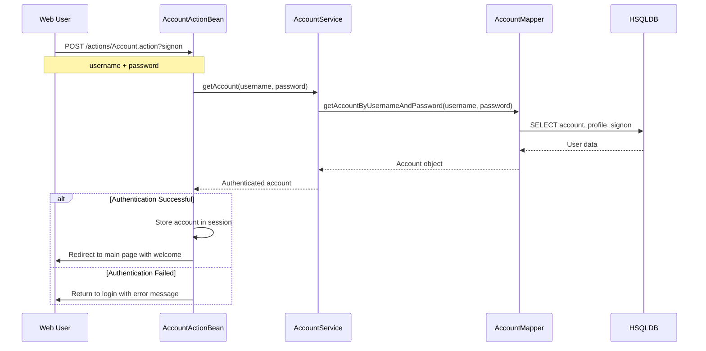
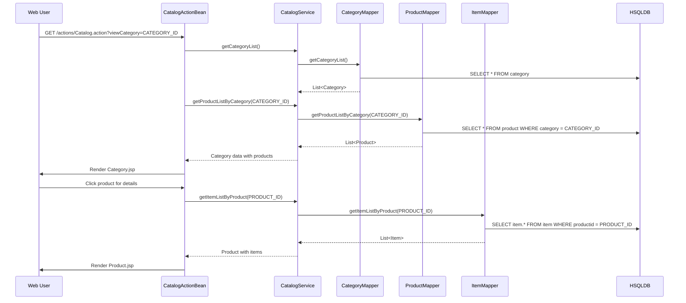
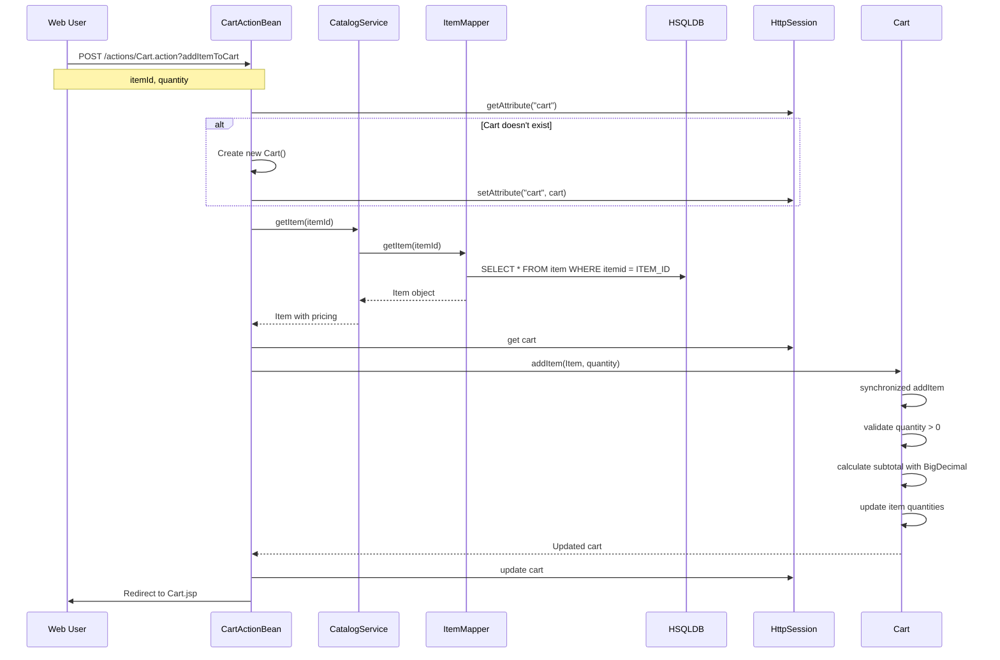
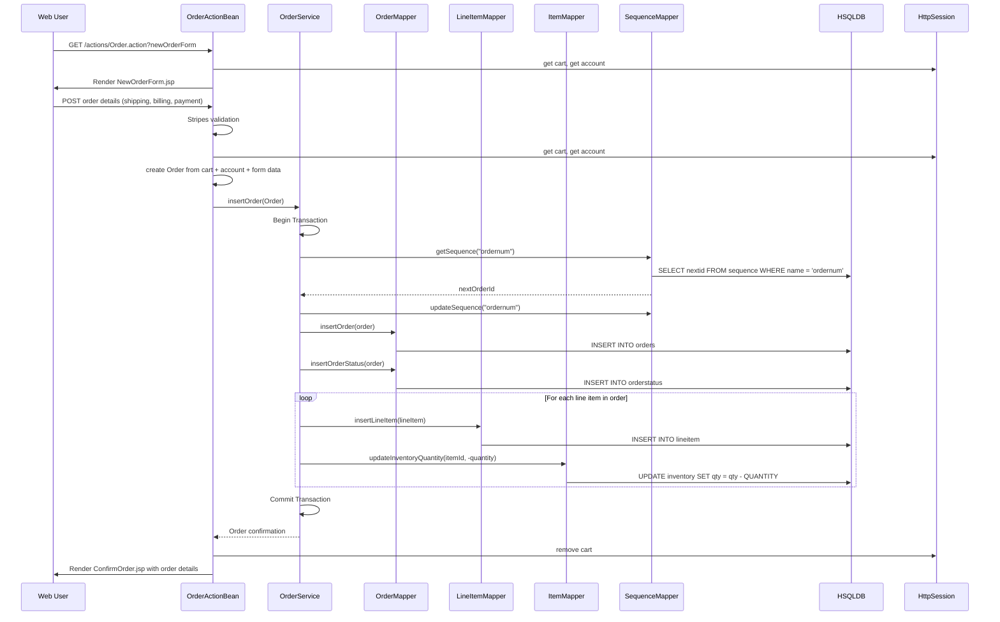
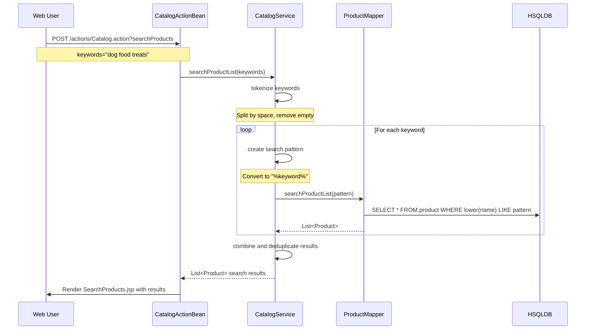
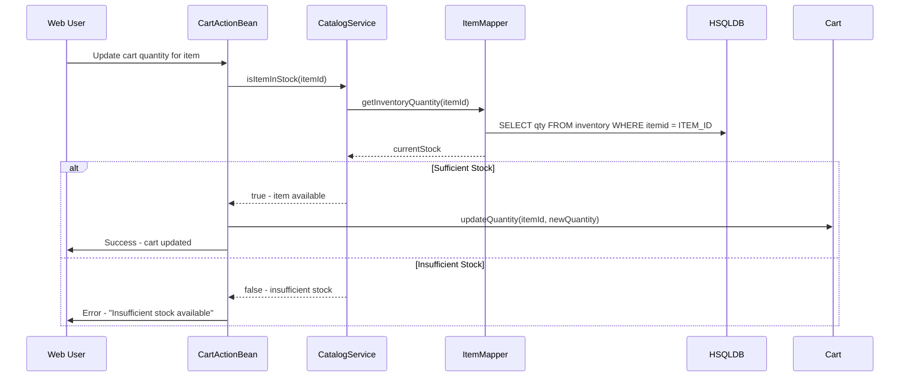
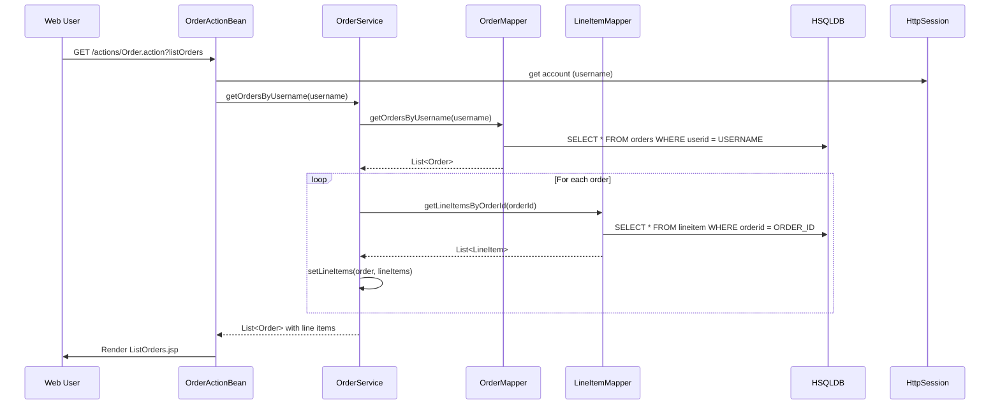

```markdown
# JPetStore Dynamic Interaction Flows

## 1. User Registration Workflow

### Purpose
Complete user account creation including profile setup and authentication credentials.

### Triggers
- New user accesses registration form
- Form submission with account details

### Communication Patterns
- Synchronous REST calls (Stripes ActionBeans)
- Database transactions (Spring @Transactional)
- Session management

### Sequence Diagram



## 2. User Authentication Workflow

### Purpose
User login with credential verification and session establishment.

### Triggers
- User submits login form
- Session timeout requiring re-authentication

### Communication Patterns
- Synchronous authentication calls
- Session-based state management
- Password verification

### Sequence Diagram



## 3. Product Browsing and Search Workflow

### Purpose
Catalog navigation, product discovery, and search functionality.

### Triggers
- User navigates categories
- User performs keyword search
- Product detail viewing

### Communication Patterns
- Synchronous catalog queries
- Keyword tokenization and search
- Hierarchical data retrieval

### Sequence Diagram



## 4. Shopping Cart Management Workflow

### Purpose
Add items to cart, manage quantities, and calculate pricing.

### Triggers
- User adds item to cart
- User updates cart quantities
- User views cart contents

### Communication Patterns
- Session-based cart storage
- Synchronized cart operations
- Real-time inventory validation
- BigDecimal price calculations

### Sequence Diagram



## 5. Order Creation and Checkout Workflow

### Purpose
Complete order processing from cart to confirmed order with inventory updates.

### Triggers
- User initiates checkout
- User confirms order details
- Order submission

### Communication Patterns
- Transactional order creation
- Inventory quantity updates
- Sequence-based ID generation
- Multi-step form processing

### Sequence Diagram



## 6. Product Search Workflow

### Purpose
Keyword-based product search with tokenization and wildcard matching.

### Triggers
- User enters search terms in header
- Search form submission

### Communication Patterns
- Keyword tokenization
- Wildcard SQL search patterns
- Case-insensitive matching

### Sequence Diagram



## 7. Inventory Stock Validation Workflow

### Purpose
Real-time inventory checking during cart operations and order processing.

### Triggers
- Item added to cart
- Cart quantity updates
- Order submission

### Communication Patterns
- Synchronous inventory queries
- Stock availability validation
- Error handling for out-of-stock items

### Sequence Diagram



## 8. Order History Retrieval Workflow

### Purpose
Display user's previous orders with complete details and line items.

### Triggers
- User accesses order history page
- Click on specific order for details

### Communication Patterns
- User-specific order queries
- Order-line item aggregation
- Status timeline retrieval

### Sequence Diagram



## Communication Patterns Summary

### Synchronous Patterns
- **REST-like calls** between ActionBeans and Services
- **Database transactions** via MyBatis Mappers
- **Session management** for user state

### Asynchronous Patterns
- **Event-driven UI updates** in cart operations
- **Background inventory validation** during browsing

### Data Flow Patterns
- **Request-response** for web interactions
- **Transactional boundaries** at service layer
- **Session persistence** for shopping cart
- **Database sequences** for order ID generation

### Error Handling Patterns
- **Transaction rollback** on order failures
- **Stock validation** errors in cart operations
- **Authentication failures** with user feedback
- **Form validation** with client-side and server-side checks
```