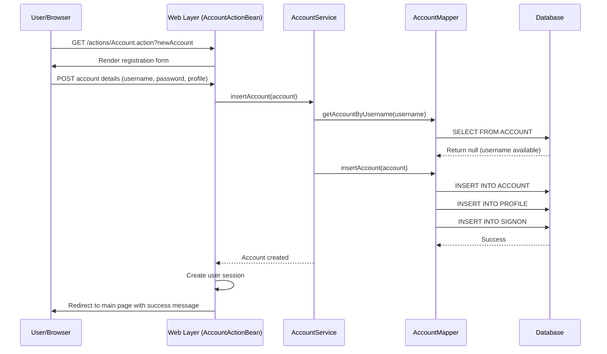
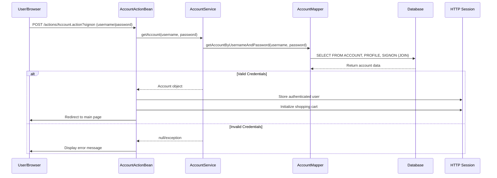
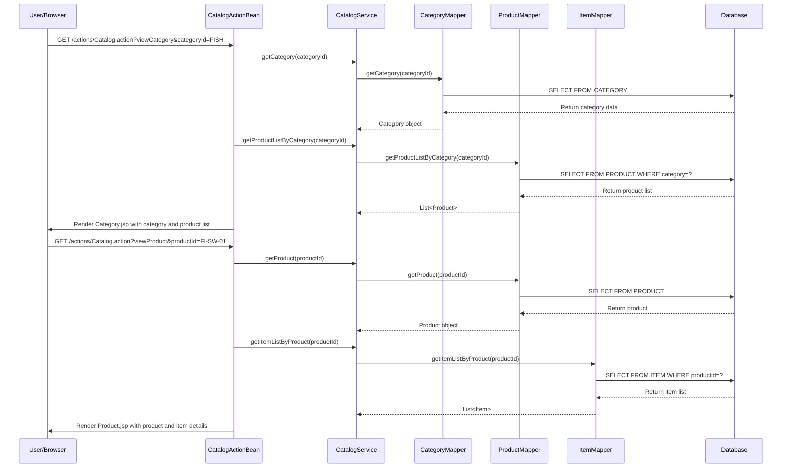
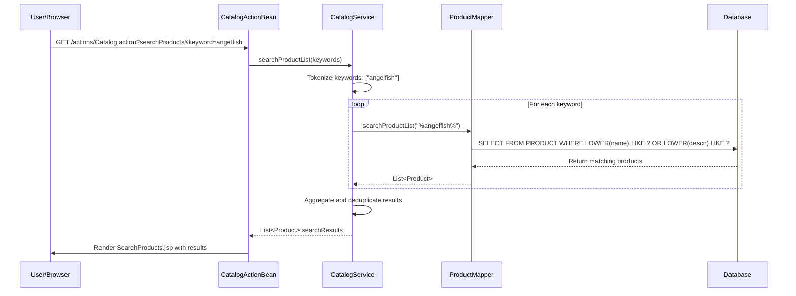
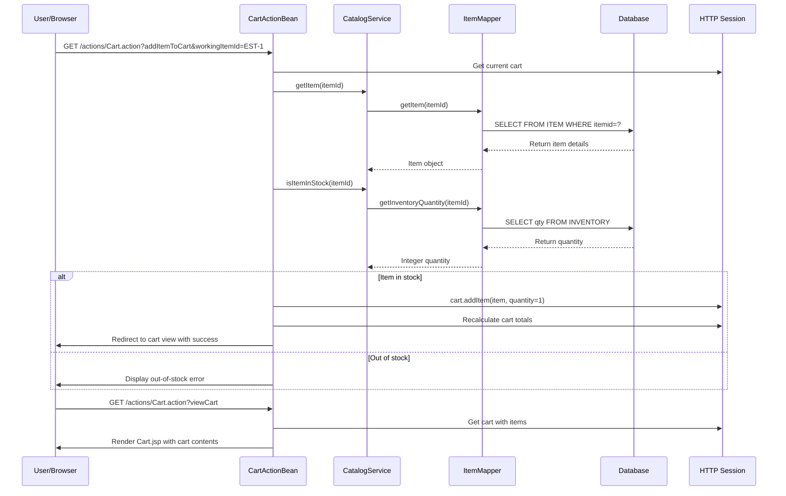
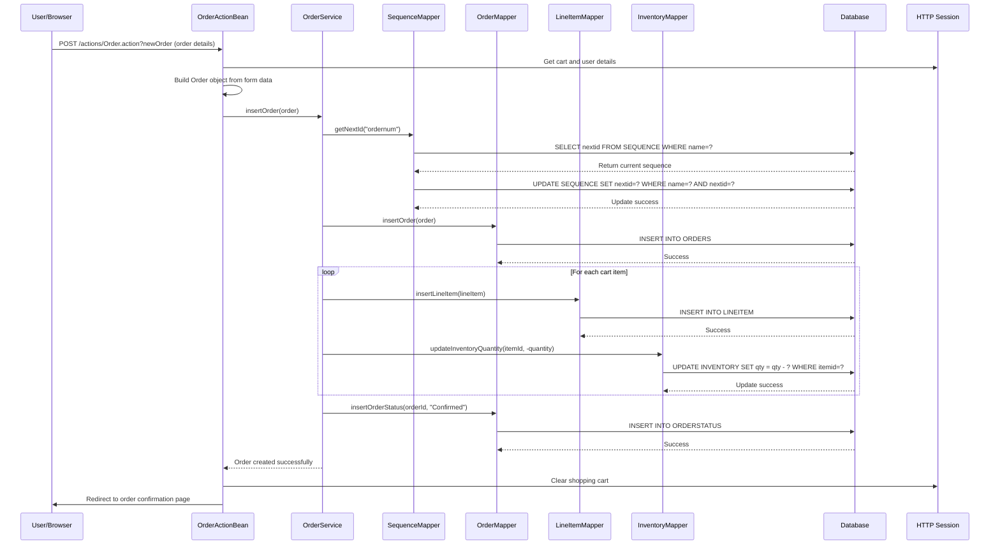
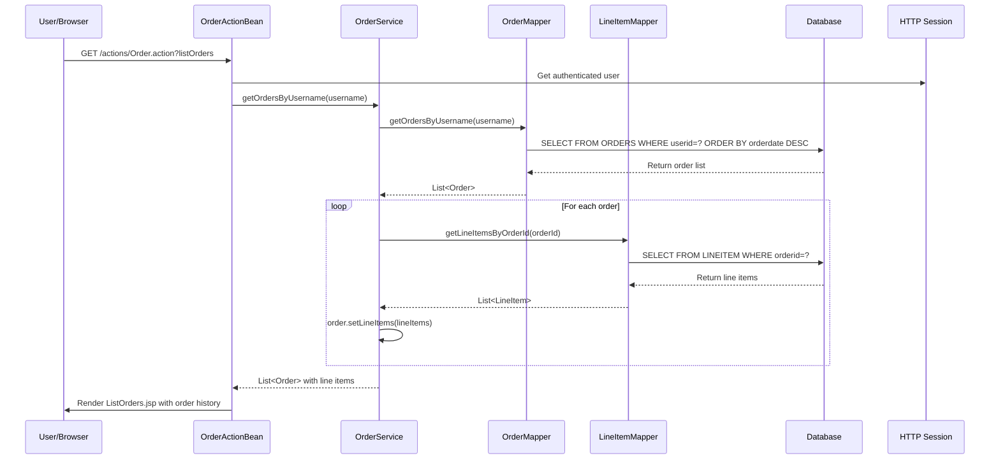
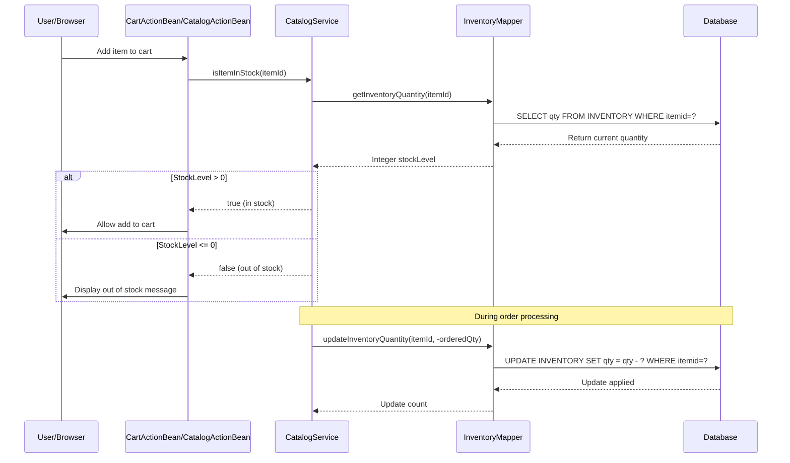
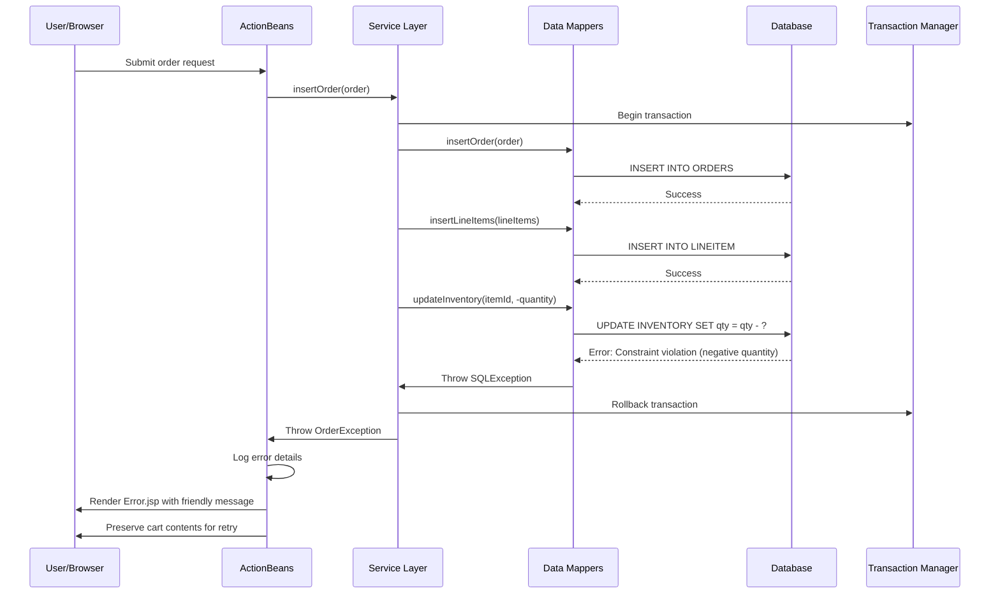
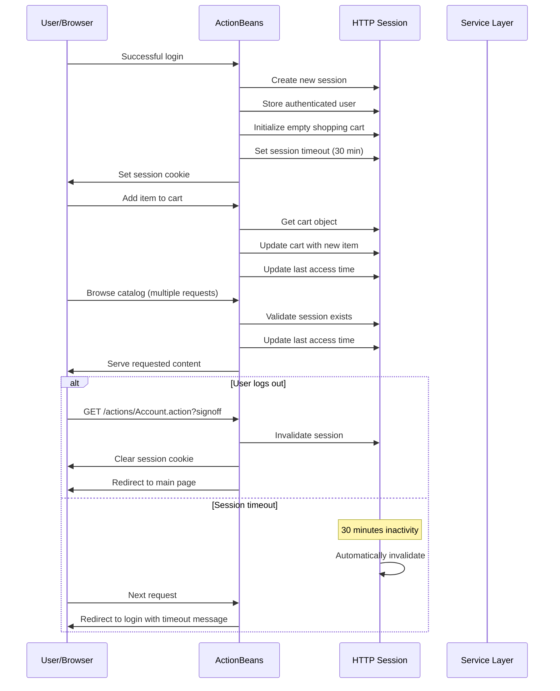

```markdown
# MyBatis JPetStore 6 - Dynamic Interaction Flows

## 1. User Registration Workflow

### Workflow Description
**Purpose:** New user account creation with profile setup
**Triggers:** User accesses registration form and submits account details
**Communication Patterns:** Synchronous REST calls, database transactions, session management

### Sequence Diagram


## 2. User Authentication Workflow

### Workflow Description
**Purpose:** User login and session establishment
**Triggers:** User submits credentials on signon form
**Communication Patterns:** Synchronous authentication, session creation, password validation

### Sequence Diagram


## 3. Catalog Browsing Workflow

### Workflow Description
**Purpose:** Product discovery and navigation through category hierarchy
**Triggers:** User clicks category links or uses search functionality
**Communication Patterns:** Synchronous database queries, hierarchical data retrieval

### Sequence Diagram


## 4. Product Search Workflow

### Workflow Description
**Purpose:** Keyword-based product discovery with multi-term search
**Triggers:** User enters search terms in search box
**Communication Patterns:** Synchronous search with wildcard pattern matching, result aggregation

### Sequence Diagram


## 5. Shopping Cart Management Workflow

### Workflow Description
**Purpose:** Add, remove, and update items in shopping cart with real-time inventory validation
**Triggers:** User interactions with cart (add item, update quantities, remove item)
**Communication Patterns:** Session-based state management, synchronous inventory checks

### Sequence Diagram


## 6. Order Processing Workflow

### Workflow Description
**Purpose:** Complete purchase transaction with inventory management and order creation
**Triggers:** User proceeds to checkout from shopping cart
**Communication Patterns:** Transactional database operations, sequence generation, inventory updates

### Sequence Diagram


## 7. Order History Retrieval Workflow

### Workflow Description
**Purpose:** Display user's order history with detailed order information
**Triggers:** User accesses order history page
**Communication Patterns:** Synchronous database queries, order-line item aggregation

### Sequence Diagram


## 8. Inventory Management Workflow

### Workflow Description
**Purpose:** Real-time inventory checking and stock level management
**Triggers:** Cart operations, order processing, product browsing
**Communication Patterns:** Synchronous stock queries, transactional inventory updates

### Sequence Diagram


## 9. Error Handling and Recovery Patterns

### Workflow Description
**Purpose:** System-wide error management and user-friendly error reporting
**Triggers:** Database errors, validation failures, business rule violations
**Communication Patterns:** Exception propagation, transaction rollback, user notification

### Sequence Diagram


## 10. Session Management Workflow

### Workflow Description
**Purpose:** User session lifecycle management including creation, maintenance, and cleanup
**Triggers:** Login, logout, session timeout, cart operations
**Communication Patterns:** HTTP session management, state synchronization

### Sequence Diagram
