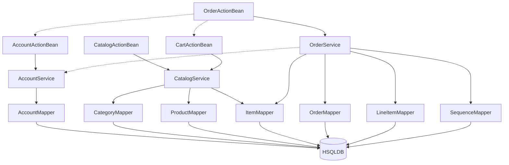

The component boundaries follow a traditional layered architecture with clear separation between web, service, and data access layers. Communication patterns are primarily synchronous in-process method calls, with the web layer (ActionBeans) delegating to service components that coordinate transactions across multiple data mappers. The architecture shows tight coupling between OrderService and CatalogService through shared ItemMapper usage, indicating a key integration point for microservice decomposition.