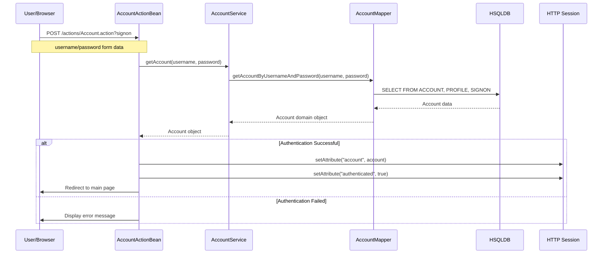
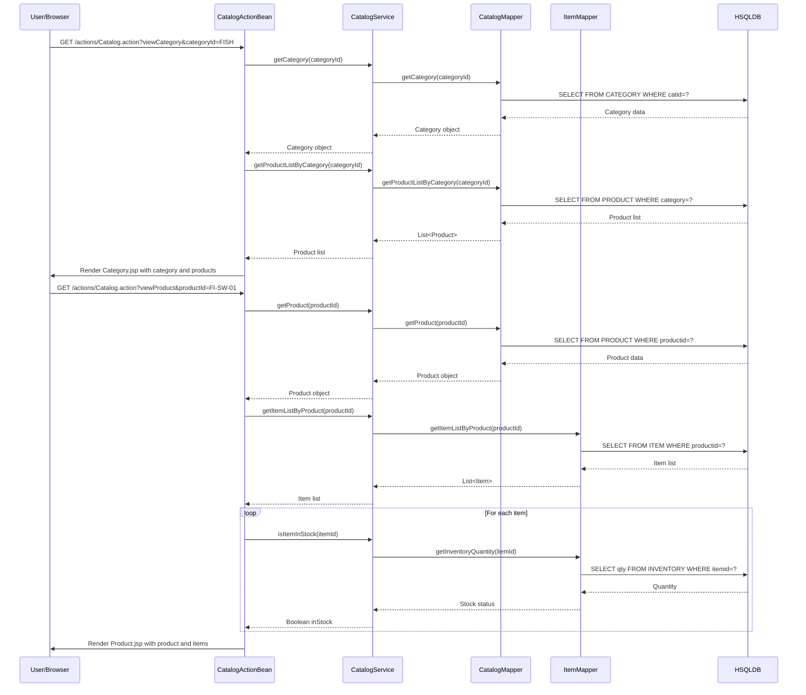
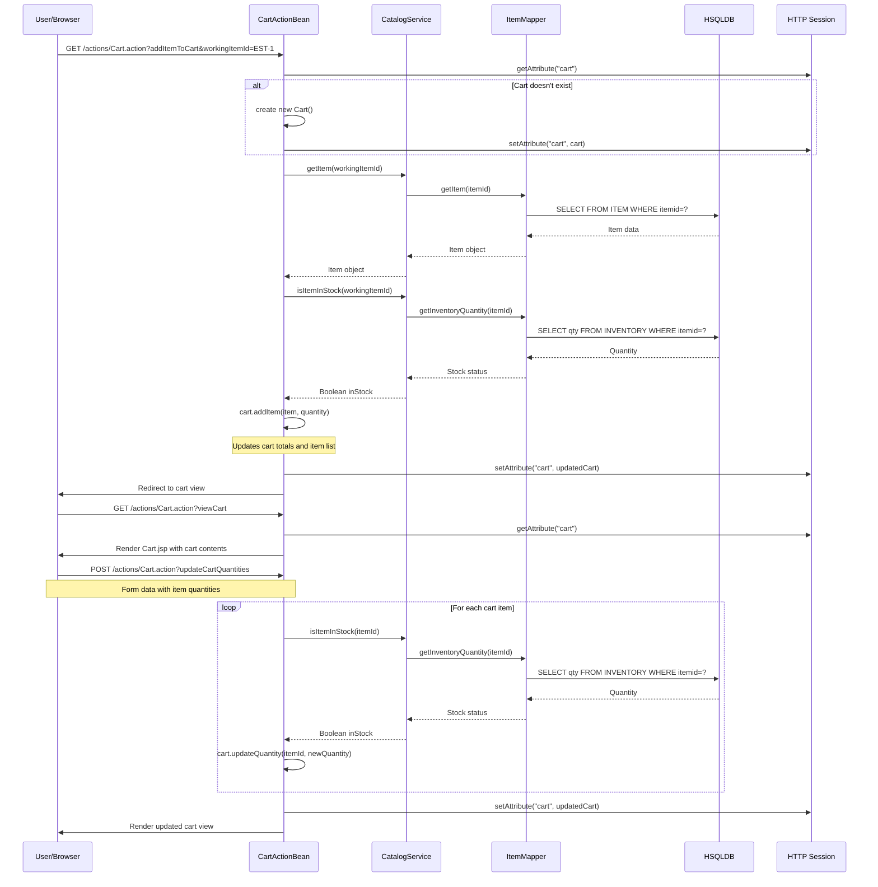
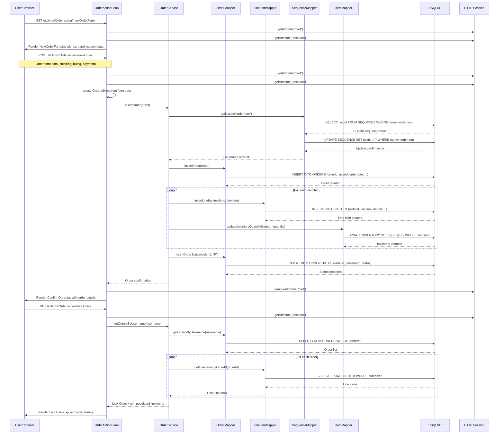
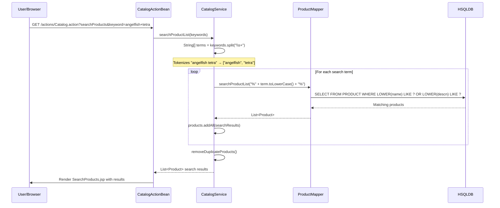
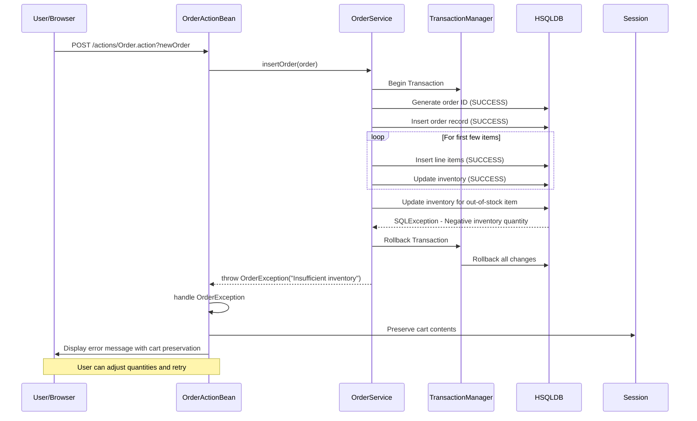

# MyBatis JPetStore 6 - Dynamic Interaction Flows

## 1. User Authentication Workflow

### Workflow Description
User login process that validates credentials and establishes session authentication state. Triggered when user submits login form.

**Communication Patterns:** REST-like form submission, session management, database authentication check

## 2. Product Browsing and Search Workflow

### Workflow Description
Catalog navigation flow allowing users to browse categories, view products, and search inventory. Triggered by catalog navigation or search form submission.

**Communication Patterns:** HTTP GET requests, database queries, hierarchical data loading

## 3. Shopping Cart Management Workflow

### Workflow Description
Complete shopping cart lifecycle including adding items, updating quantities, and removing items. Uses session-based cart storage.

**Communication Patterns:** Session state management, real-time inventory checks, synchronous service calls

## 4. Order Processing Workflow

### Workflow Description
Complete order lifecycle from checkout initiation to order confirmation and inventory updates. Involves transactional operations across multiple tables.

**Communication Patterns:** Database transactions, sequence generation, inventory updates, session cleanup

## 5. Product Search Workflow

### Workflow Description
Keyword-based product search with multi-term tokenization and wildcard matching. Demonstrates business logic in service layer.

**Communication Patterns:** HTTP GET parameters, service-layer algorithm, database pattern matching

## 6. Error Handling and Recovery Patterns

### Workflow Description
System-wide error handling demonstrating transaction rollback, user feedback, and session recovery mechanisms.

**Communication Patterns:** Exception propagation, transaction management, user feedback

