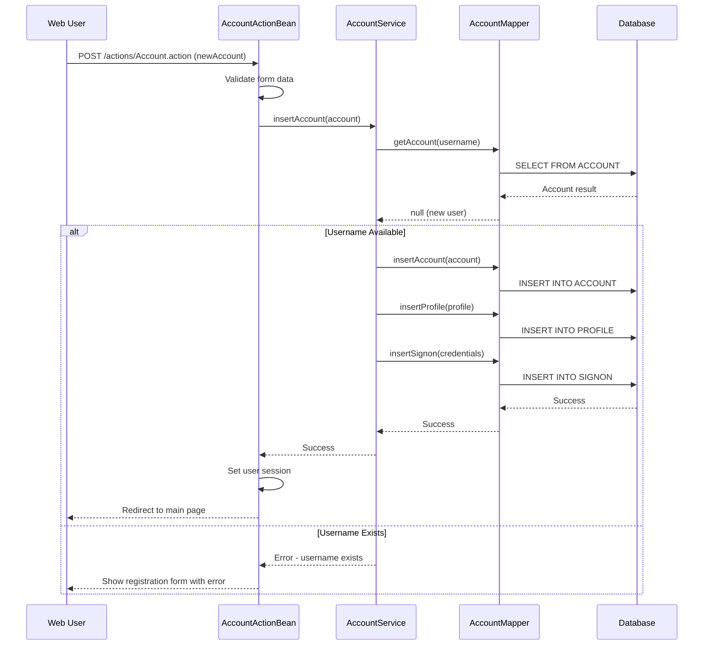
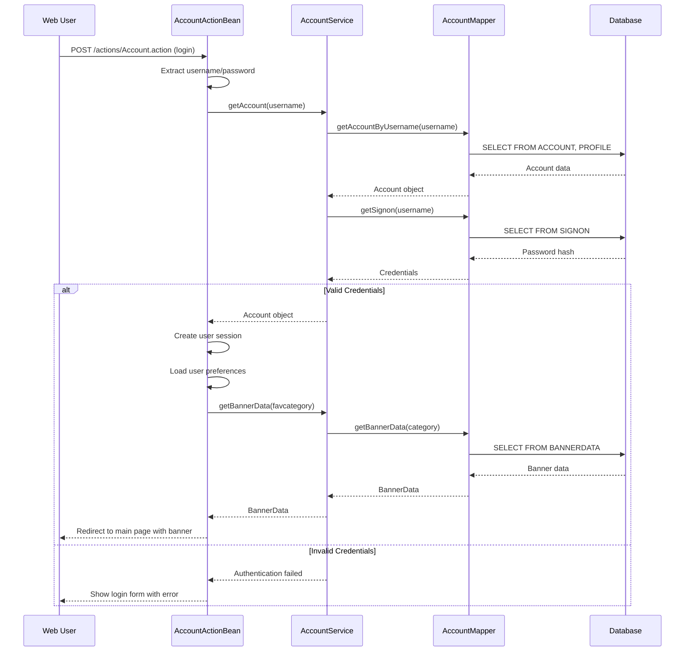
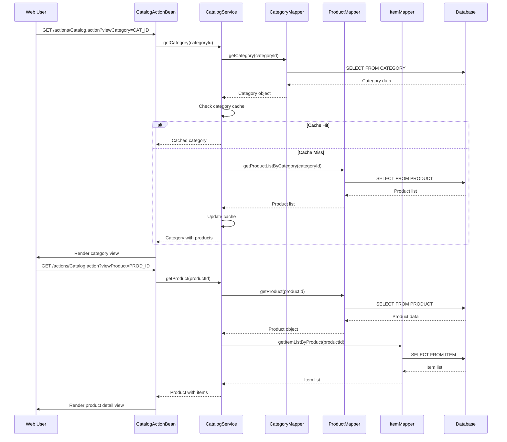
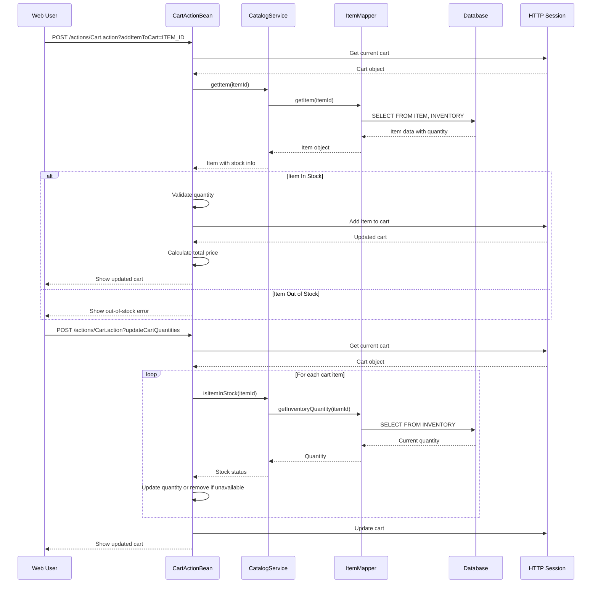
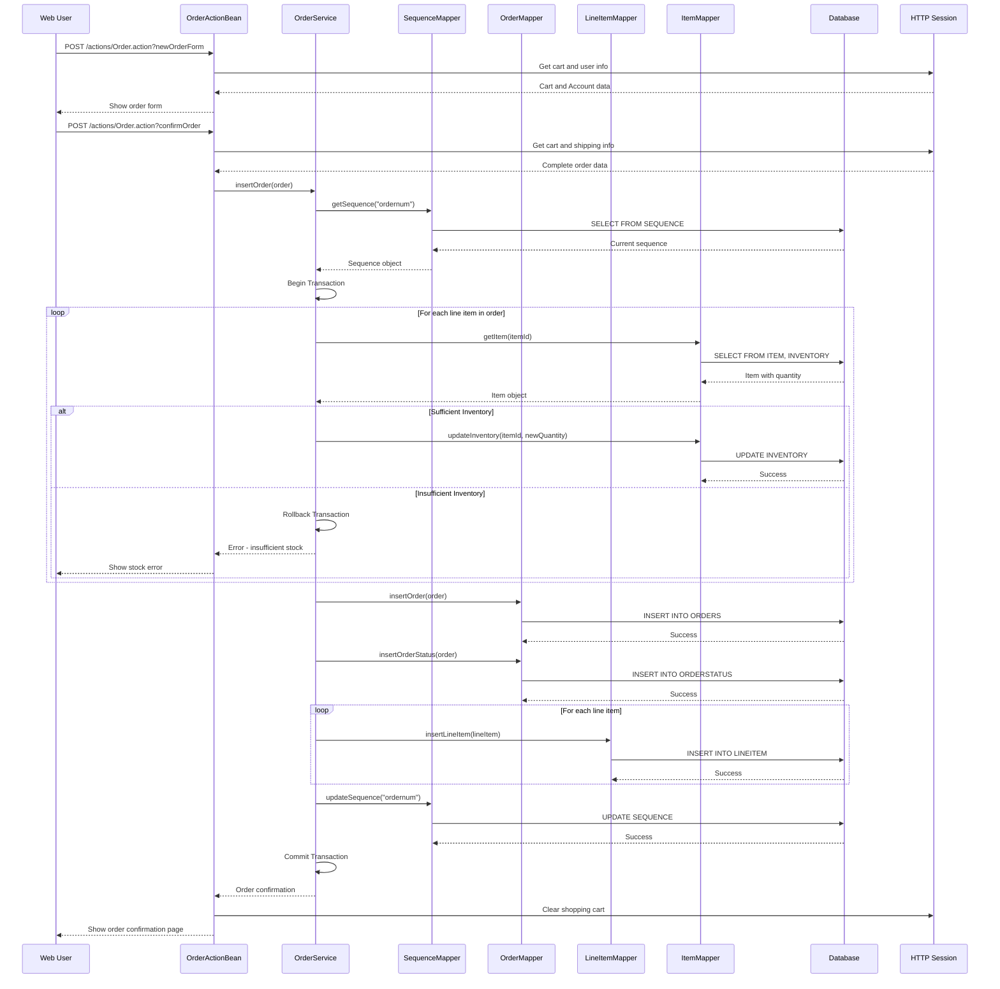
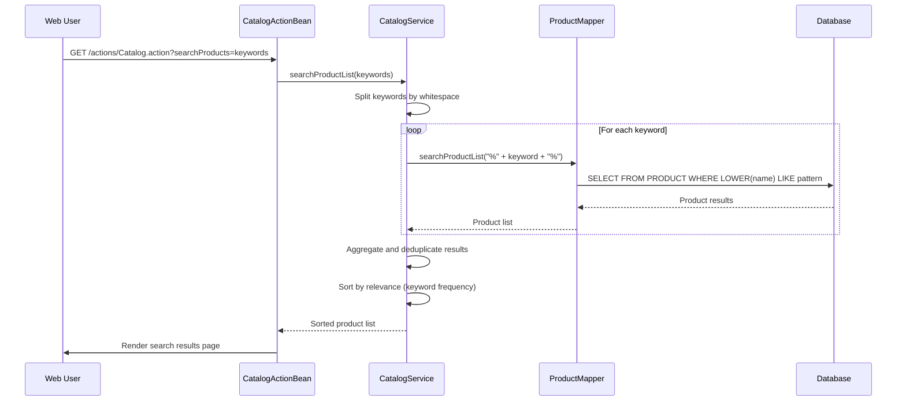
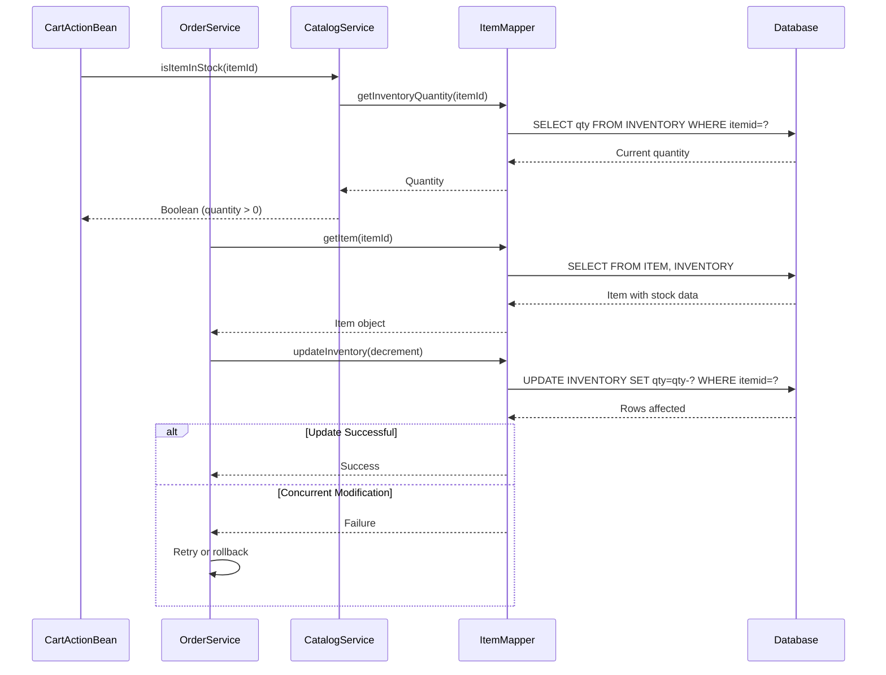
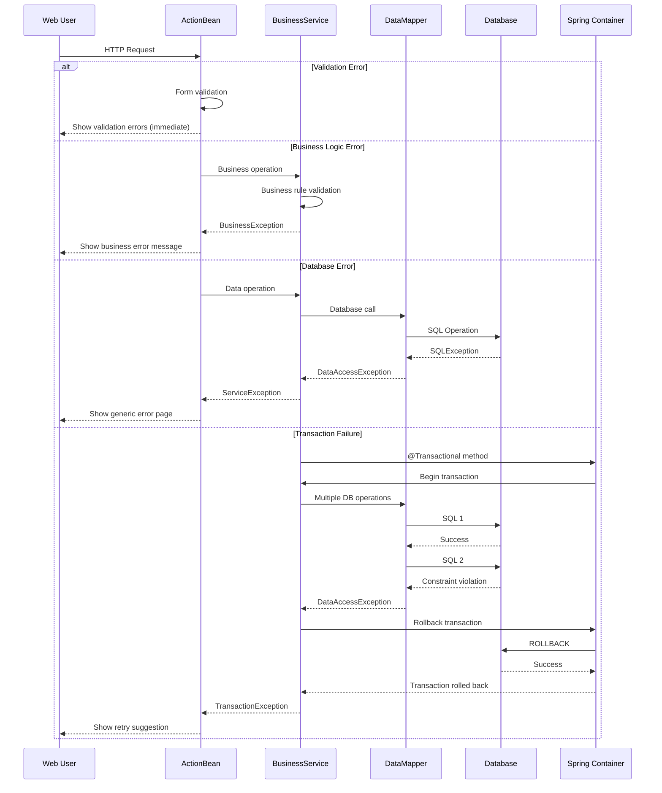

```markdown
# MyBatis JPetStore 6 - Dynamic Interaction Flows

## 1. User Registration Workflow

### Workflow Description
**Purpose**: New user account creation with profile setup
**Triggers**: User accesses registration form and submits account details
**Communication Patterns**: Synchronous REST-style form submission, database transactions



## 2. User Authentication Workflow

### Workflow Description
**Purpose**: User login and session establishment
**Triggers**: User submits login credentials
**Communication Patterns**: Synchronous authentication, session management



## 3. Product Browsing and Search Workflow

### Workflow Description
**Purpose**: Catalog navigation and product discovery
**Triggers**: User browses categories or searches for products
**Communication Patterns**: Synchronous database queries, cached category data



## 4. Shopping Cart Management Workflow

### Workflow Description
**Purpose**: Add/remove items from shopping cart with real-time inventory validation
**Triggers**: User adds items to cart or modifies quantities
**Communication Patterns**: Session-based cart storage, synchronous inventory checks



## 5. Order Processing Workflow

### Workflow Description
**Purpose**: Complete order creation with inventory updates and transaction management
**Triggers**: User proceeds to checkout from shopping cart
**Communication Patterns**: Database transactions, synchronous order processing, inventory updates



## 6. Product Search Workflow

### Workflow Description
**Purpose**: Multi-keyword product search with relevance ranking
**Triggers**: User enters search terms in search box
**Communication Patterns**: Database wildcard queries, result aggregation



## 7. Inventory Management Workflow

### Workflow Description
**Purpose**: Real-time stock validation and inventory updates
**Triggers**: Cart operations and order processing
**Communication Patterns**: Synchronous stock checks, transactional updates



## 8. Error Handling and Recovery Patterns

### Workflow Description
**Purpose**: Graceful error handling across different failure scenarios
**Triggers**: Database errors, validation failures, business rule violations
**Communication Patterns**: Exception propagation, transaction rollback, user feedback


```