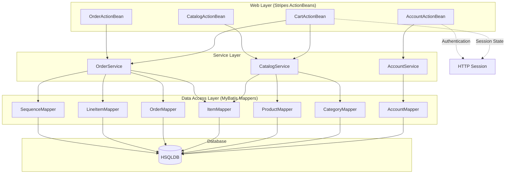

The component boundaries follow a classic three-tier architecture with clear separation between presentation (ActionBeans), business logic (Services), and data access (Mappers) layers. Communication patterns are strictly hierarchical with web components calling services, which in turn coordinate data access through MyBatis mappers. Session state is managed at the web layer for shopping cart and authentication, while transactional boundaries are enforced at the service layer for operations like order processing.