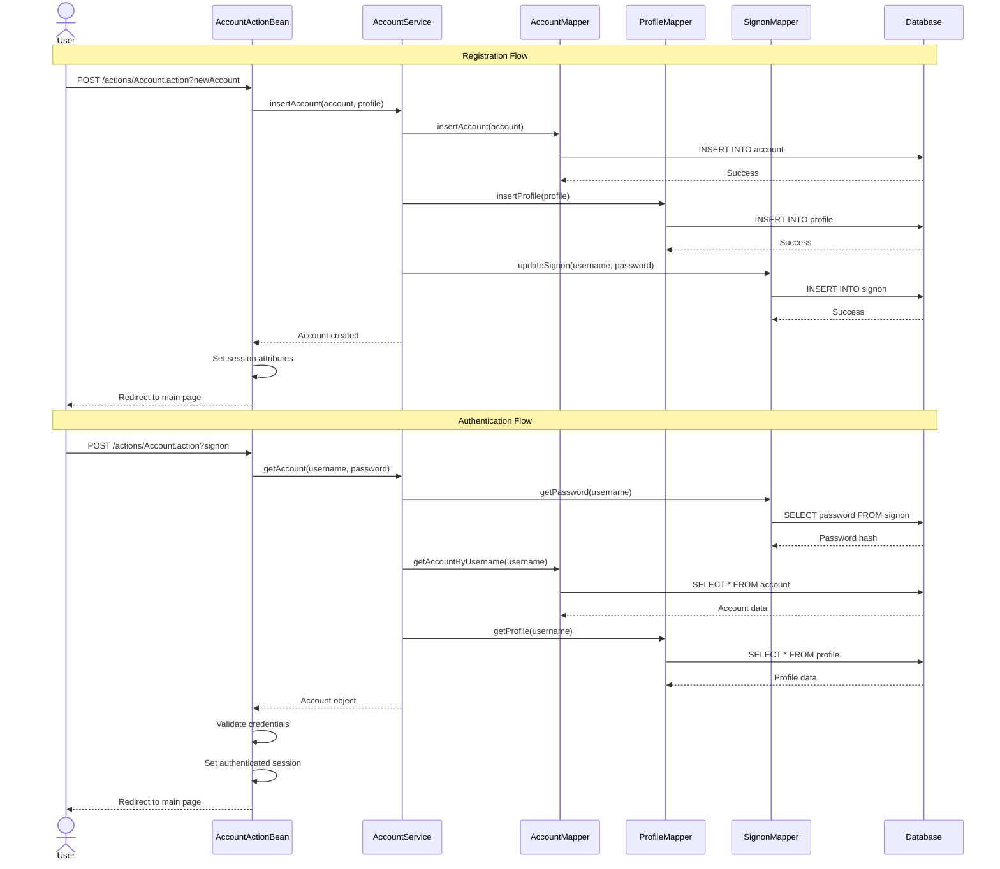
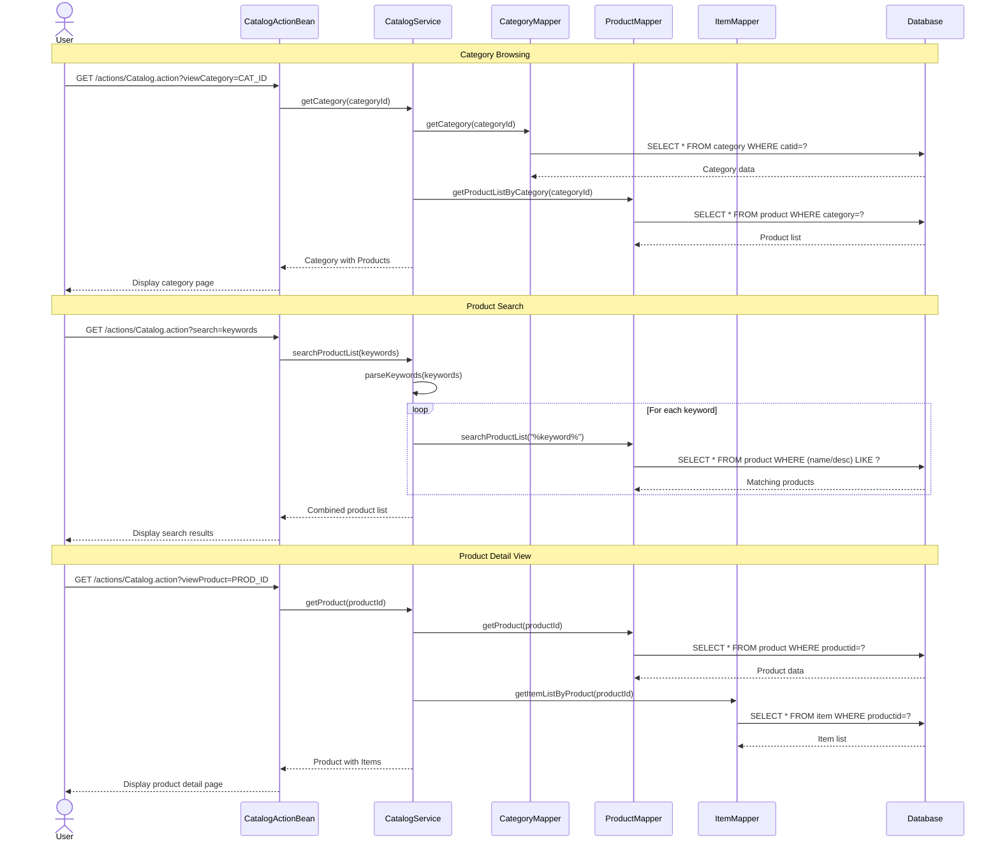
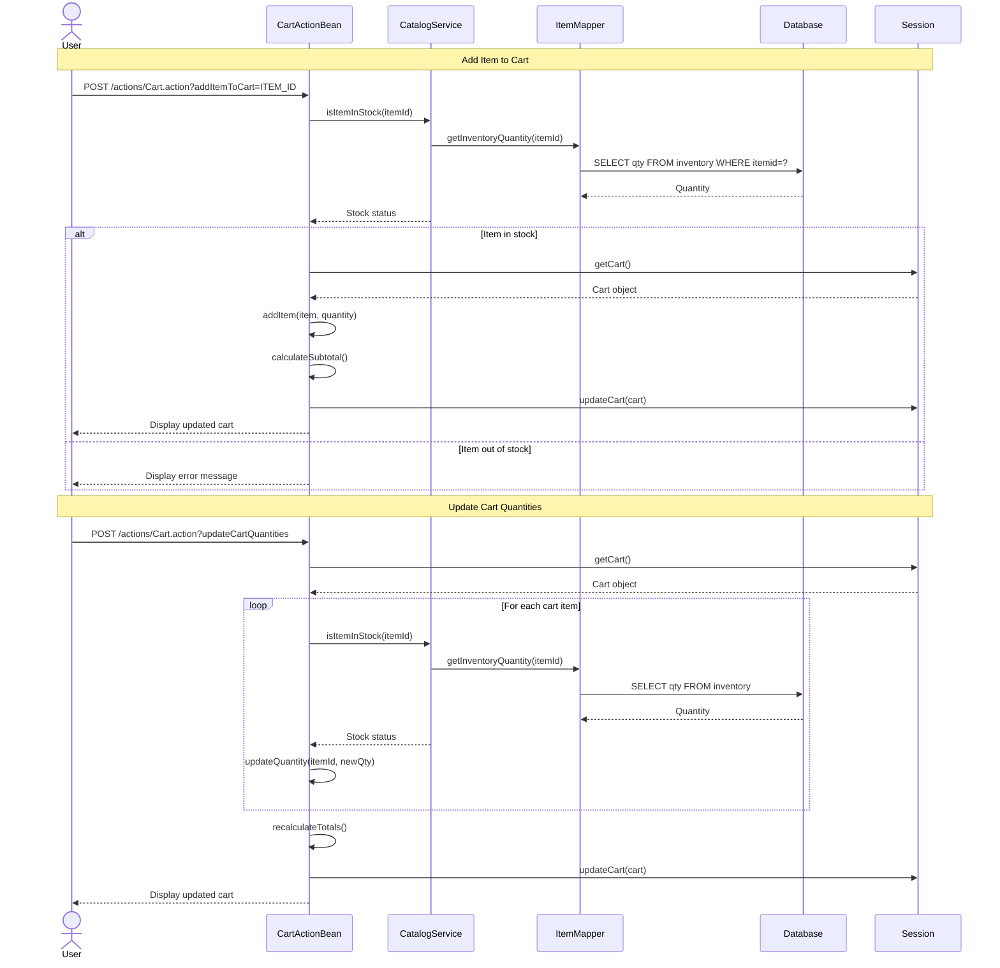
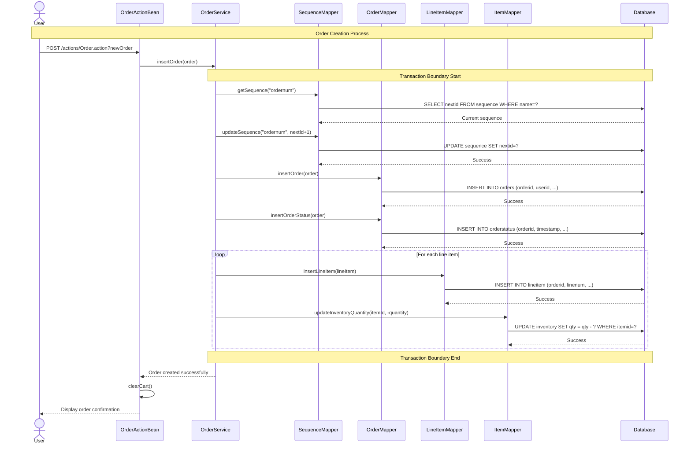
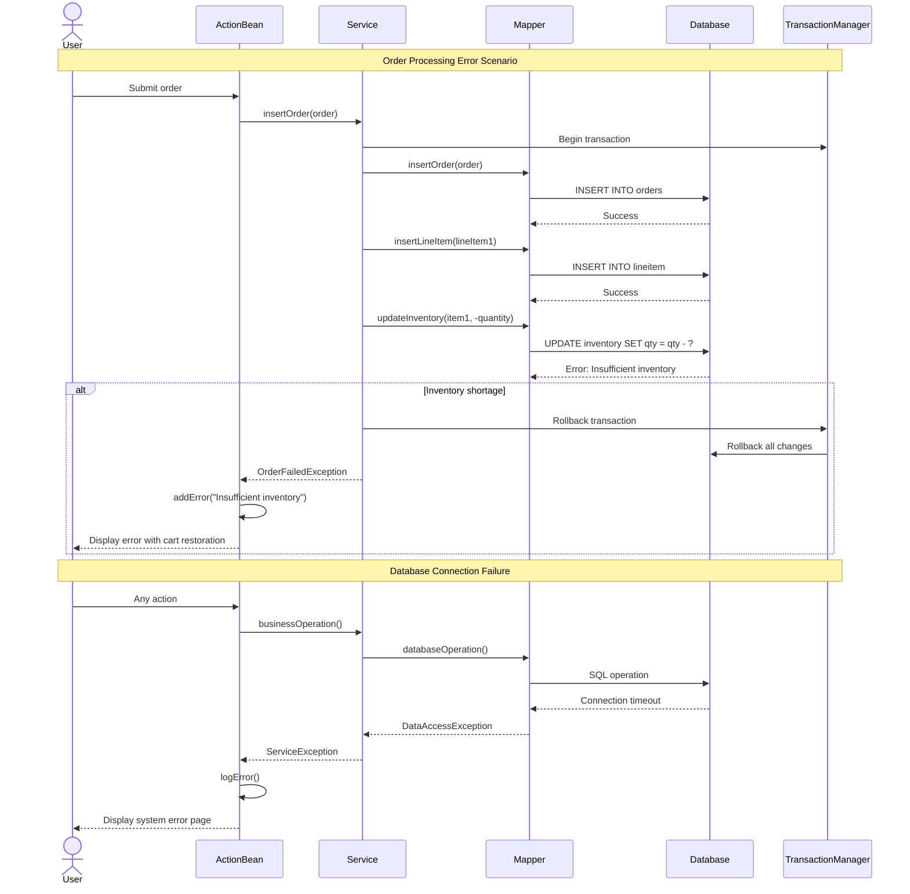

```markdown
# MyBatis JPetStore 6 - Dynamic Interaction Flows

## 1. User Registration and Authentication Workflow

### Purpose
New user account creation and authentication process, including profile setup and preference management.

### Triggers
- User accesses registration page
- User submits login credentials

### Communication Patterns
- Synchronous REST-style HTTP requests via Stripes Actions
- Database transactions for account creation
- Session-based authentication state management



## 2. Product Browsing and Search Workflow

### Purpose
Catalog navigation, product discovery, and inventory availability checking.

### Triggers
- User browses categories
- User searches for products
- User views product details

### Communication Patterns
- Synchronous catalog data retrieval
- Database queries with caching
- Multi-keyword search processing



## 3. Shopping Cart Management Workflow

### Purpose
Add items to cart, update quantities, and maintain cart state across user sessions.

### Triggers
- User adds item to cart
- User updates item quantities
- User views cart contents

### Communication Patterns
- Session-based cart storage
- Synchronous inventory validation
- Real-time price calculations



## 4. Order Processing and Checkout Workflow

### Purpose
Complete order creation with inventory updates, sequence generation, and transaction management.

### Triggers
- User proceeds to checkout
- User confirms order placement

### Communication Patterns
- Transactional database operations
- Sequence-based ID generation
- Atomic inventory updates



## 5. Error Handling and Recovery Patterns

### Purpose
Handle system failures, validation errors, and maintain data consistency.

### Triggers
- Database constraints violations
- Inventory shortages
- Authentication failures

### Communication Patterns
- Transaction rollback on failures
- Session timeout handling
- User-friendly error messages



## Communication Pattern Summary

| Workflow | Primary Pattern | Data Flow | Error Handling |
|----------|-----------------|-----------|----------------|
| User Auth | Synchronous REST | Session-based state | Credential validation |
| Catalog Browse | Synchronous DB queries | Cached catalog data | Fallback to empty results |
| Cart Management | Session state + DB validation | Real-time inventory checks | Stock validation errors |
| Order Processing | Transactional DB operations | Atomic multi-table updates | Full transaction rollback |
| Error Recovery | Exception propagation | Graceful degradation | User-friendly messages |
```