```markdown

```mermaid
graph TB
    %% Presentation Layer
    subgraph "Presentation Layer (web.actions)"
        AA[AccountActionBean]
        CA[CatalogActionBean]
        CTA[CartActionBean]
        OA[OrderActionBean]
        ABA[AbstractActionBean]
    end
    
    %% Business Layer
    subgraph "Business Layer (service)"
        AS[AccountService]
        CS[CatalogService]
        OS[OrderService]
    end
    
    %% Data Access Layer
    subgraph "Data Access Layer (mapper)"
        AM[AccountMapper]
        CM[CategoryMapper]
        PM[ProductMapper]
        IM[ItemMapper]
        OM[OrderMapper]
        LIM[LineItemMapper]
        SM[SequenceMapper]
    end
    
    %% Domain Layer
    subgraph "Domain Layer (domain)"
        ACCT[Account]
        CAT[Category]
        PROD[Product]
        ITEM[Item]
        CART[Cart]
        CARTI[CartItem]
        ORDER[Order]
        LINE[LineItem]
        SEQ[Sequence]
    end
    
    %% Database
    DB[(Database)]
    
    %% Infrastructure
    subgraph "Infrastructure"
        MW[MavenWrapperDownloader]
        IT[ScreenTransitionIT]
    end
    
    %% Primary Interactions
    AA --> AS
    CA --> CS
    CTA --> CART
    OA --> OS
    
    AS --> AM
    CS --> CM
    CS --> PM
    CS --> IM
    OS --> OM
    OS --> LIM
    OS --> SM
    
    AM --> ACCT
    CM --> CAT
    PM --> PROD
    IM --> ITEM
    OM --> ORDER
    LIM --> LINE
    SM --> SEQ
    
    AM --> DB
    CM --> DB
    PM --> DB
    IM --> DB
    OM --> DB
    LIM --> DB
    SM --> DB
    
    %% Domain Model Usage
    AA -.-> ACCT
    AS -.-> ACCT
    CA -.-> CAT
    CA -.-> PROD
    CA -.-> ITEM
    CTA -.-> CART
    CTA -.-> CARTI
    OA -.-> ORDER
    OS -.-> ORDER
    OS -.-> LINE
    
    %% Cart to Order Conversion
    CART --> ORDER
    CARTI --> LINE
    
    %% Infrastructure connections
    IT -.-> AA
    IT -.-> CA
    IT -.-> CTA
    IT -.-> OA
    
    %% Base class inheritance
    ABA --> AA
    ABA --> CA
    ABA --> CTA
    ABA --> OA
```


The component boundaries follow a classic layered architecture with clear separation of concerns: Presentation Layer handles web interactions, Business Layer orchestrates workflows, Data Access Layer manages persistence, and Domain Layer encapsulates business entities. Communication patterns are primarily synchronous and top-down, with each layer only depending on the layer immediately below it. The Domain Layer is shared across all layers, enabling consistent data representation throughout the application.
```