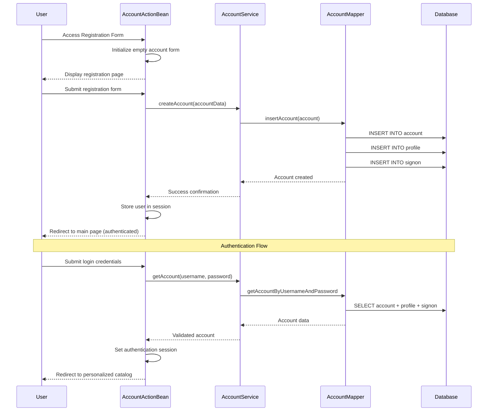
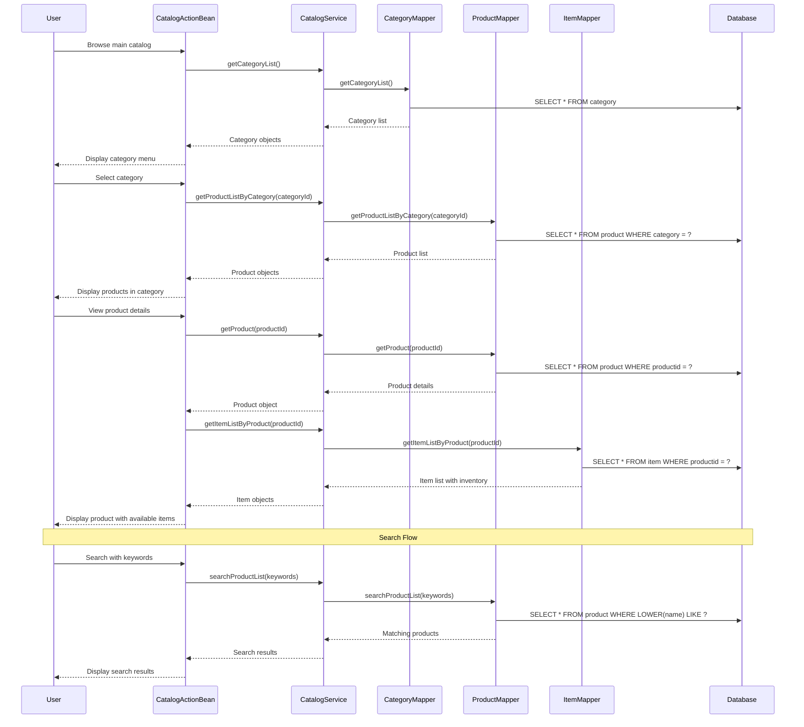
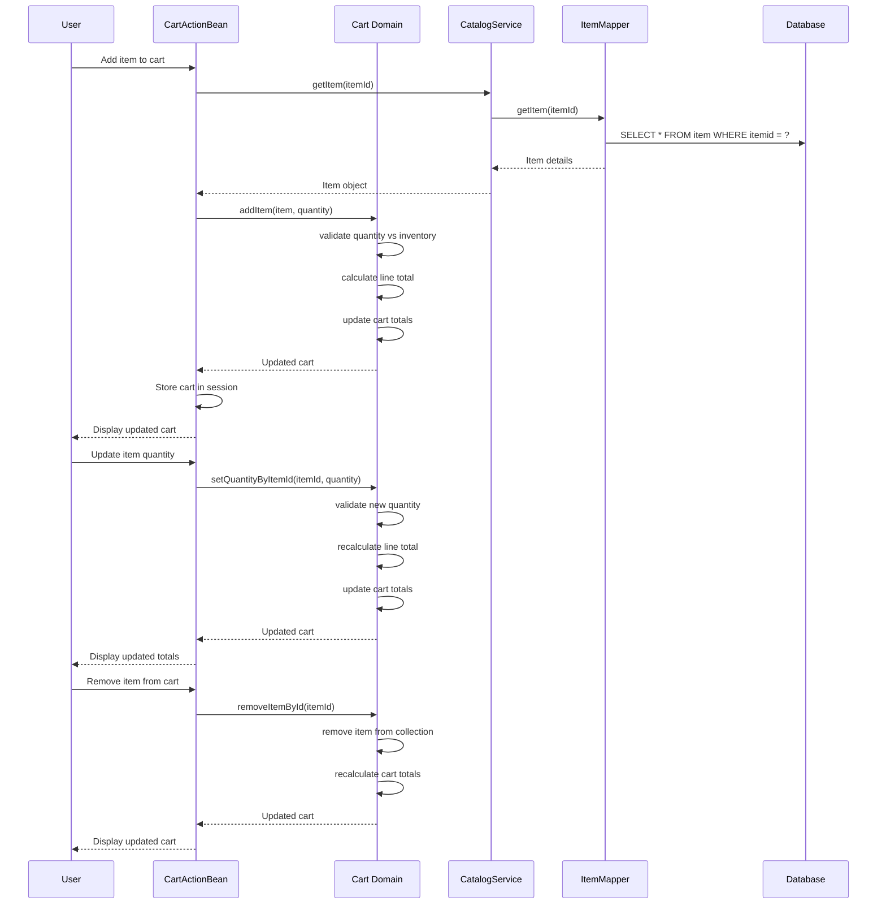
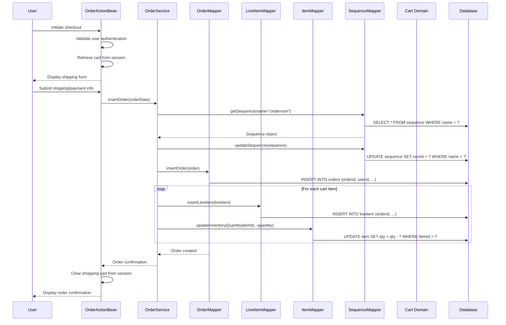
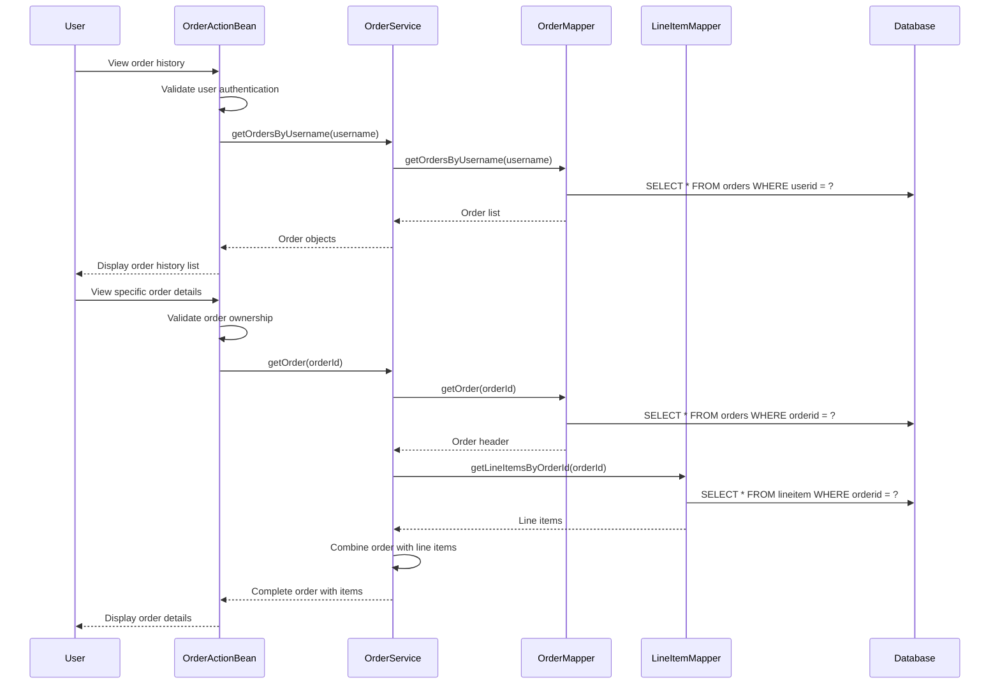
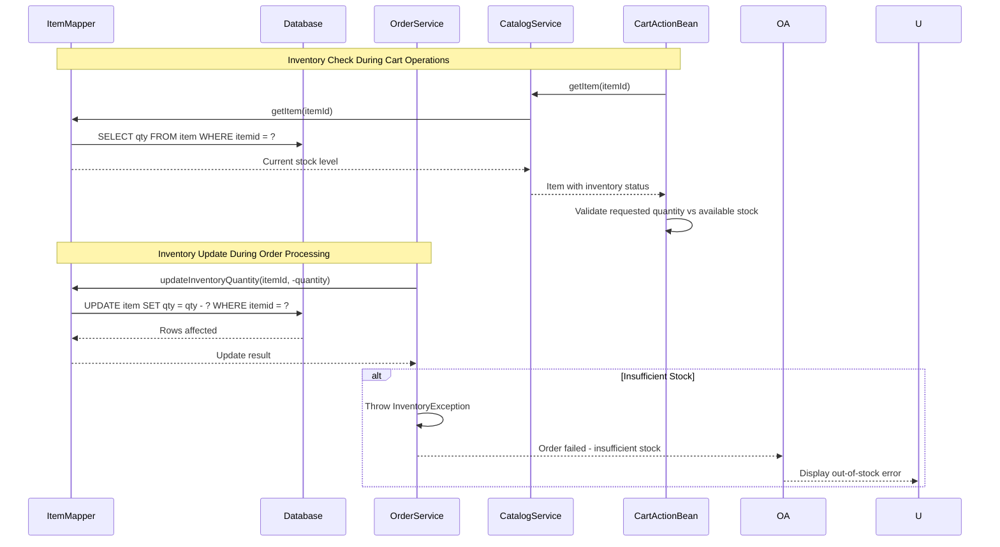
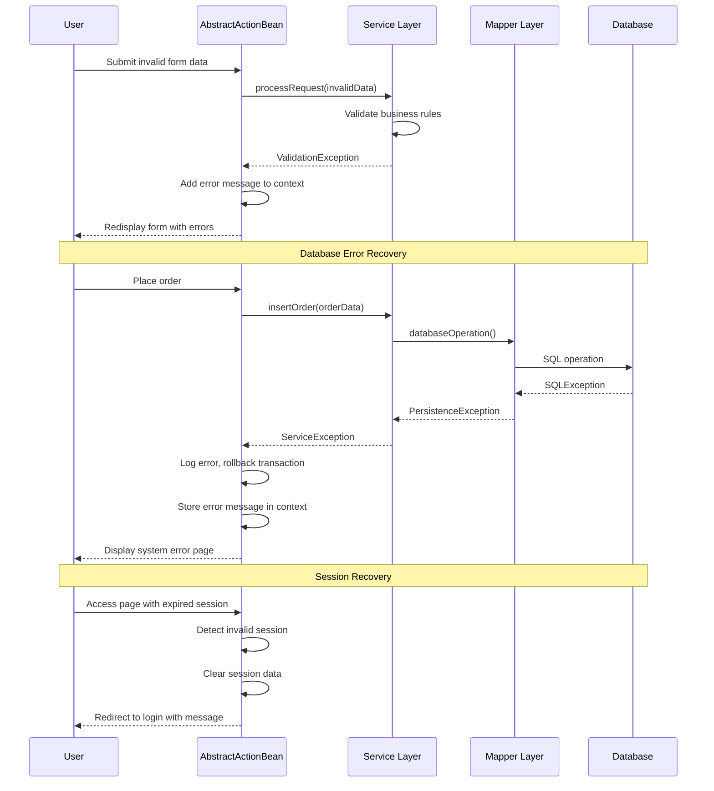

```markdown
# JPetStore Dynamic Interaction Flows

## 1. User Registration and Authentication Workflow

### Purpose
Complete customer account lifecycle management including registration, authentication, and profile updates.

### Communication Patterns
- **Synchronous**: REST-style form submissions
- **Session-based**: HTTP session management for authentication state
- **Database Transactions**: Multi-table operations for account persistence

### Sequence Diagram


## 2. Product Browsing and Search Workflow

### Purpose
Enable customers to discover products through category navigation and keyword search.

### Communication Patterns
- **Synchronous**: Catalog service calls
- **Cached**: Category and product listings
- **Database Queries**: Multi-table joins for catalog data

### Sequence Diagram


## 3. Shopping Cart Management Workflow

### Purpose
Manage temporary product selections with real-time inventory validation and price calculations.

### Communication Patterns
- **Session-based**: Cart state maintained in HTTP session
- **Synchronous**: Inventory validation calls
- **Event-driven**: Cart update notifications

### Sequence Diagram


## 4. Order Processing and Checkout Workflow

### Purpose
Complete transactional order creation with inventory management and payment processing.

### Communication Patterns
- **Transactional**: Multi-table database operations
- **Synchronous**: Order service coordination
- **Event-driven**: Inventory update notifications

### Sequence Diagram


## 5. Order History and Tracking Workflow

### Purpose
Provide customers with access to their purchase history and order details.

### Communication Patterns
- **Synchronous**: Order retrieval calls
- **Database Queries**: Multi-table joins for order data
- **Authorization**: User-specific data access controls

### Sequence Diagram


## 6. Inventory Management and Stock Updates

### Purpose
Real-time inventory tracking and stock level management during order processing.

### Communication Patterns
- **Event-driven**: Inventory update triggers
- **Transactional**: Atomic stock operations
- **Synchronous**: Stock validation calls

### Sequence Diagram


## 7. Error Handling and Recovery Patterns

### Purpose
Manage system failures, validation errors, and exceptional conditions gracefully.

### Communication Patterns
- **Exception Propagation**: Structured error handling across layers
- **Transaction Rollback**: Database operation reversal
- **User Feedback**: Meaningful error messages

### Sequence Diagram


## Communication Pattern Summary

| Pattern Type | Usage Context | Technologies |
|-------------|---------------|-------------|
| **Synchronous** | User interactions, form submissions, immediate data retrieval | Stripes MVC, Service calls, Database queries |
| **Asynchronous** | Not currently implemented in this codebase | (Future enhancement potential) |
| **Event-driven** | Inventory updates, cart modifications, session events | Domain object state changes, Session listeners |
| **Transactional** | Order processing, account creation, inventory updates | Database transactions, Service layer coordination |
| **Session-based** | User authentication, shopping cart, navigation state | HTTP Session, ActionBean context |
| **Database-centric** | All persistent operations, data retrieval | MyBatis, JDBC, Embedded HSQLDB |
```