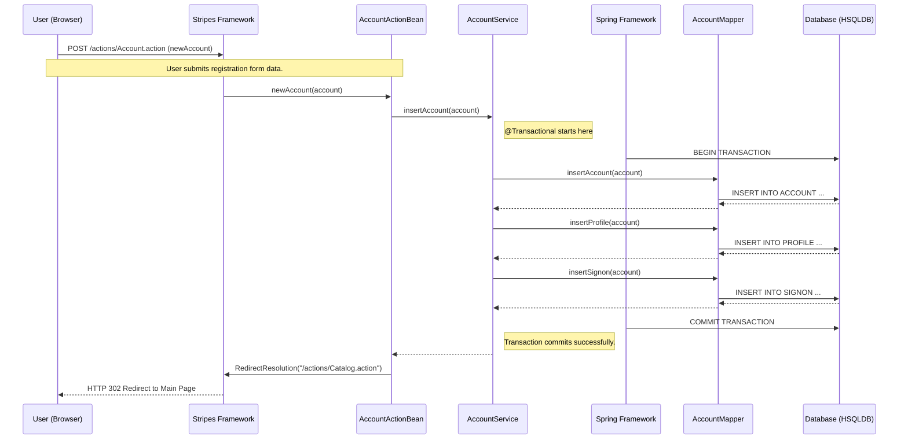
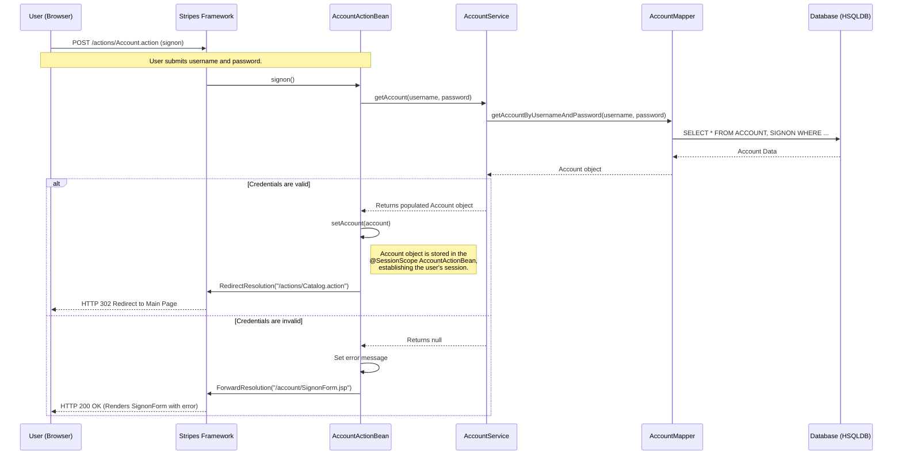
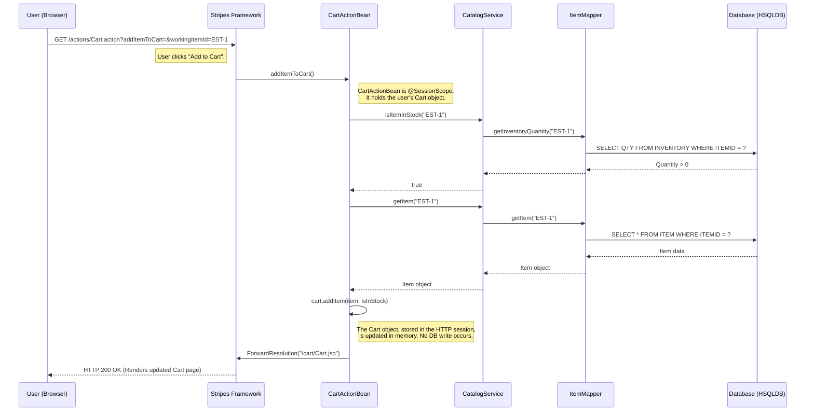
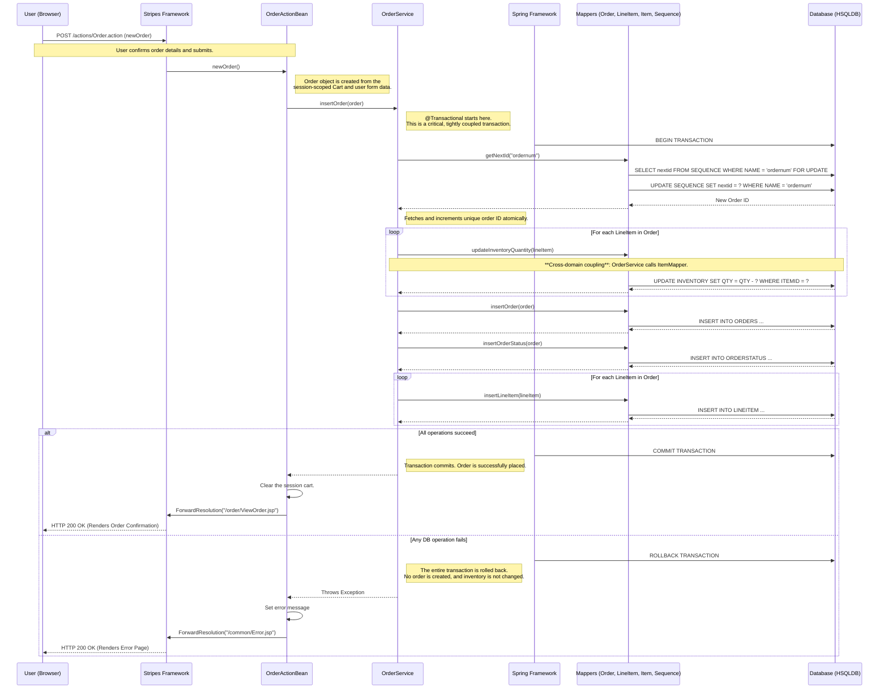

### 1. New User Registration

-   **Workflow Purpose and Trigger:** This workflow is triggered when a new user fills out and submits the registration form. Its purpose is to create a complete user profile, including account details, preferences, and sign-on credentials, ensuring all related data is stored atomically.
-   **Communication Patterns:**
    -   **Web Interaction:** Synchronous HTTP POST request from the user's browser to the server.
    -   **Internal Communication:** Synchronous, in-process Java method calls between the Web (`AccountActionBean`), Service (`AccountService`), and Data Access (`AccountMapper`) layers.
    -   **Data Persistence:** A single, declarative database transaction (`@Transactional`) managed by Spring at the service layer. This ensures that inserts into the `ACCOUNT`, `PROFILE`, and `SIGNON` tables either all succeed or all fail together, maintaining data consistency.

### 2. User Login and Session Management

-   **Workflow Purpose and Trigger:** Triggered when a user submits their credentials via the sign-on form. The system authenticates the user against the database and, upon success, establishes a stateful session by storing the user's account information in the HTTP session.
-   **Communication Patterns:**
    -   **Web Interaction:** Synchronous HTTP POST request.
    -   **Internal Communication:** Synchronous method calls.
    -   **State Management:** The workflow relies heavily on the stateful HTTP session. The `AccountActionBean` is `@SessionScope`, meaning its instance (and the `account` object it holds) persists across subsequent requests from the same user, keeping them authenticated.

### 3. Adding an Item to the Shopping Cart

-   **Workflow Purpose and Trigger:** Triggered when a user clicks the "Add to Cart" button for a product item. The system retrieves the item's data and adds it to the user's personal shopping cart, which is managed entirely within the user's HTTP session.
-   **Communication Patterns:**
    -   **Web Interaction:** Synchronous HTTP GET request.
    -   **State Management:** This is a prime example of event-driven logic within a stateful, session-based architecture. The `CartActionBean` and its internal `Cart` object are session-scoped. The entire operation is performed in memory on the server; there is no database write operation for modifying the cart.
    -   **Data Retrieval:** A synchronous call is made to the `CatalogService` to fetch item details before adding them to the in-memory cart.

### 4. Placing an Order (Checkout)

-   **Workflow Purpose and Trigger:** This is the application's most critical business transaction, triggered when a user confirms their order. It converts the session-based cart into a permanent order, updates inventory levels, and saves all order details to the database within a single, atomic operation.
-   **Communication Patterns:**
    -   **Web Interaction:** Synchronous HTTP POST request.
    -   **Tightly Coupled Transaction:** The core of this workflow is a single database transaction on the `OrderService.insertOrder` method. This transaction tightly couples the **Order** domain with the **Inventory** domain (part of Catalog).
    -   **Synchronous Cross-Domain Calls:** The `OrderService` makes direct, synchronous calls to the `ItemMapper` to update inventory. A failure here will cause the entire order placement to fail and roll back.
    -   **Error Handling:** The transactional boundary ensures data consistency. If the inventory update fails for any item (e.g., insufficient stock), the entire transaction is rolled back, and no order records are created.

