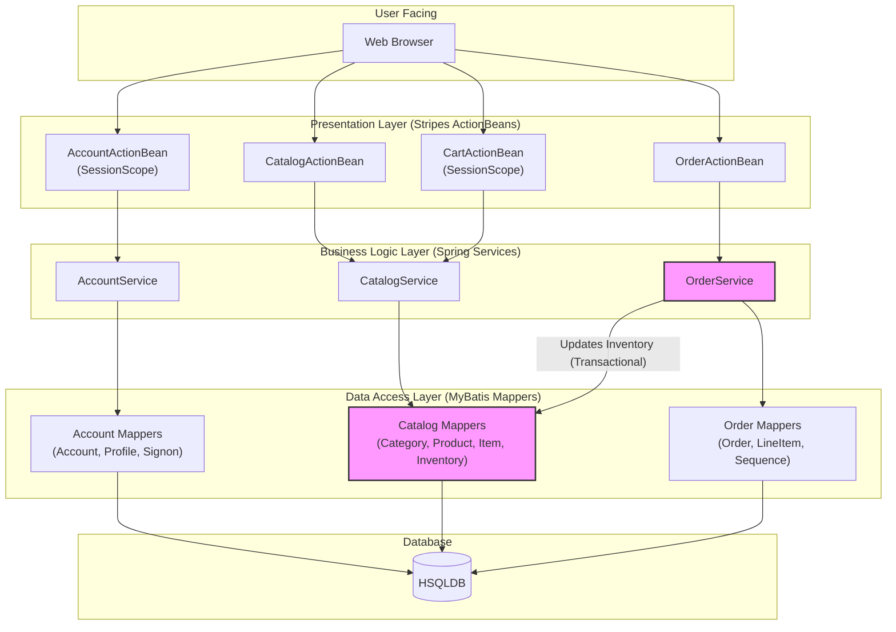

```markdown


The diagram illustrates a classic three-tier monolithic architecture, with components grouped logically by business domain (Account, Catalog, Order) within each layer. Communication is synchronous and in-process, flowing downwards from the Presentation layer to the Database. A critical cross-domain coupling exists where the `OrderService` directly modifies inventory data via the `CatalogMappers` within a single shared transaction, highlighting a tight bond between the Order and Catalog domains.
```