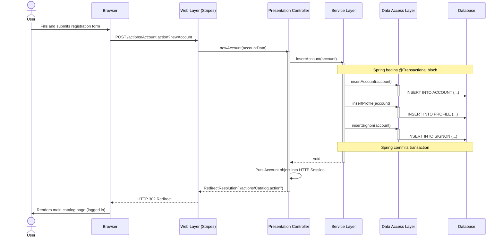
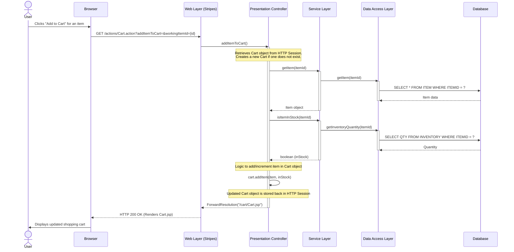
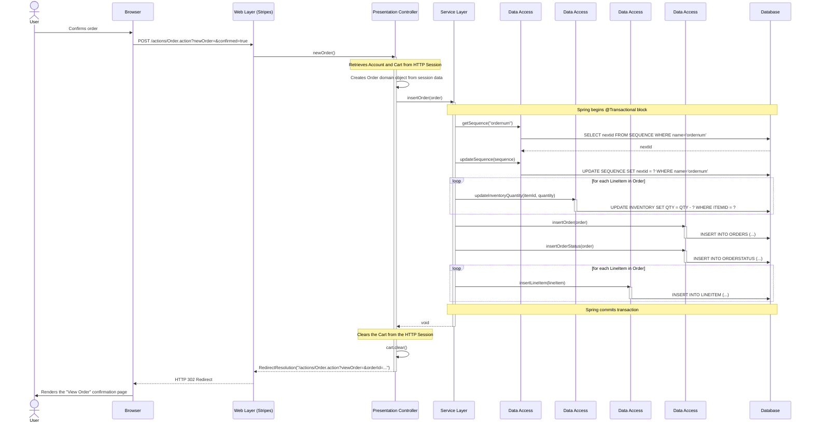

### 1. User Registration Workflow

*   **Workflow Purpose and Triggers:** This workflow describes how a new user creates an account. It is triggered when the user submits the "New Account" registration form. The process is a single, atomic transaction that creates records in three separate but related tables (`ACCOUNT`, `PROFILE`, `SIGNON`).

*   **Communication Patterns:**
    *   **HTTP POST:** The user's browser sends user details to the server.
    *   **Synchronous Method Calls:** The `AccountActionBean` invokes the `AccountService`, which in turn calls the `AccountMapper`. This is a direct, in-process communication flow.
    *   **Database Transaction:** The entire operation within the `AccountService` is wrapped in a Spring-managed declarative transaction (`@Transactional`). If any of the database inserts fail, all previous inserts in the same transaction are rolled back, ensuring data consistency.

### 2. Add Item to Cart Workflow

*   **Workflow Purpose and Triggers:** This workflow captures the process of a user adding an item to their shopping cart. It is triggered when the user clicks an "Add to Cart" button for a specific item. The workflow demonstrates the use of stateful HTTP sessions to manage user-specific data (the cart) without immediate database persistence.

*   **Communication Patterns:**
    *   **HTTP GET:** A request is sent to add a specific item to the cart.
    *   **HTTP Session State:** The `CartActionBean` and the `Cart` object itself are session-scoped. The user's cart is stored in memory on the server, tied to their session. It is not written to the database until an order is placed.
    *   **Synchronous Method Calls:** The action bean calls the `CatalogService` to fetch item details and check stock levels.
    *   **Database Read Operations:** The `CatalogService` uses the `ItemMapper` to perform read-only `SELECT` queries against the database to get item and inventory data.

### 3. Place Order Workflow

*   **Workflow Purpose and Triggers:** This is the most critical business workflow, handling the conversion of a user's shopping cart into a persisted order. It is triggered when the user confirms their order on the final checkout page. This flow highlights strong transactional consistency across multiple business domains (Order and Inventory/Catalog).

*   **Communication Patterns:**
    *   **HTTP POST:** The final confirmation is sent to the server to create the order.
    *   **HTTP Session State:** The workflow retrieves the `Account` and `Cart` objects from the user's session to build the `Order` object.
    *   **Synchronous Method Calls:** A chain of direct method calls from the `OrderActionBean` to the `OrderService` and then to multiple mappers (`SequenceMapper`, `ItemMapper`, `LineItemMapper`, `OrderMapper`).
    *   **Database Transaction:** The `OrderService.insertOrder` method is marked as `@Transactional`. This single transaction encompasses multiple database writes: updating the sequence number, decrementing inventory for each item, and inserting records into the `LINEITEM`, `ORDERS`, and `ORDERSTATUS` tables. This ensures that an order is only placed if the inventory can be successfully updated for all items.
    *   **Error Handling (Implicit):** If any database operation within the transaction fails (e.g., an inventory update), the entire transaction is rolled back, preventing partial order creation and ensuring data integrity.

