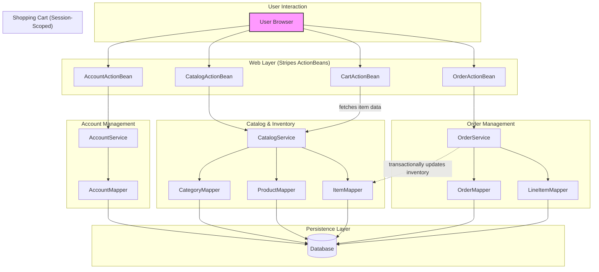

```markdown


The diagram illustrates a classic three-tier monolithic architecture, with components logically grouped into functional domains (Account, Catalog, Cart, Order) but deployed as a single unit. Communication is strictly synchronous via in-process Java method calls, flowing from Stripes ActionBeans in the presentation layer, through transactional Spring services in the business layer, to MyBatis mappers in the persistence layer. A critical tight coupling exists where the Order service makes a direct, transactional call to the Catalog's Item mapper to update inventory, highlighting a key challenge for service decomposition.
```