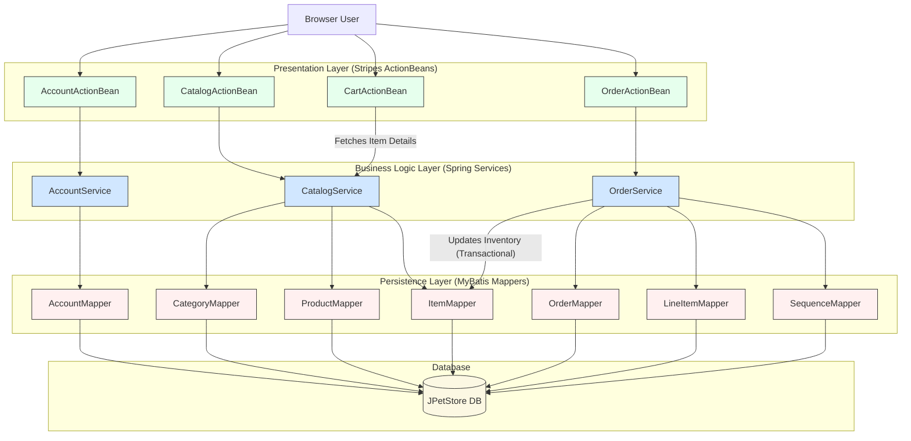

```markdown


The diagram illustrates a classic three-tier monolithic architecture with distinct Presentation (ActionBeans), Business Logic (Services), and Persistence (Mappers) layers. Communication is synchronous, in-process method invocation, where web actions delegate to services which in turn orchestrate data access via mappers. A key interaction is the `OrderService` directly calling the `ItemMapper` to update inventory, creating a tight, transactional coupling between the order and catalog domains.
```