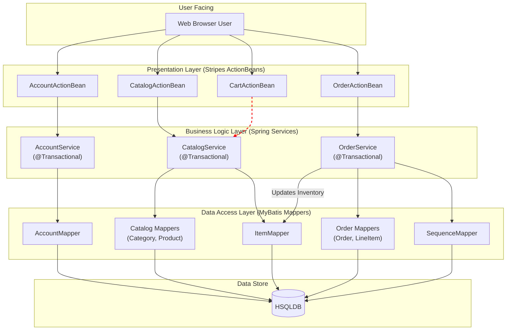

```markdown


The architecture is a classic three-tier monolith where component boundaries align with distinct layers: Presentation (Stripes ActionBeans), Business Logic (Spring Services), and Data Access (MyBatis Mappers). Communication is synchronous and in-process, flowing top-down from user actions to the database via direct method calls orchestrated by dependency injection. A key tight coupling is visible where the `OrderService` directly invokes the `ItemMapper` (from the catalog domain) to update inventory, demonstrating a cross-domain dependency at the persistence layer.
```