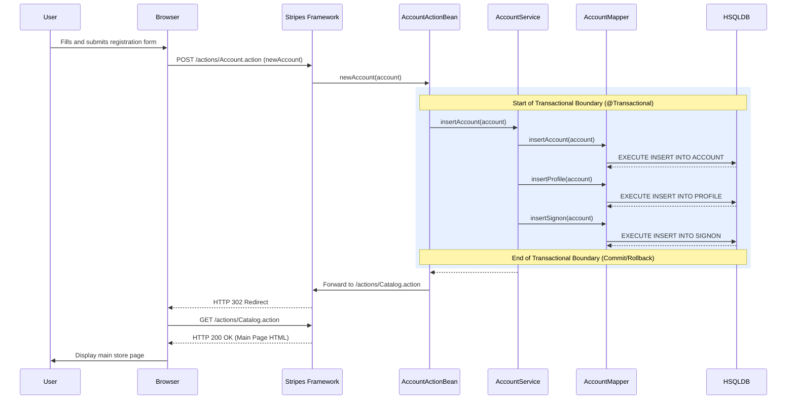
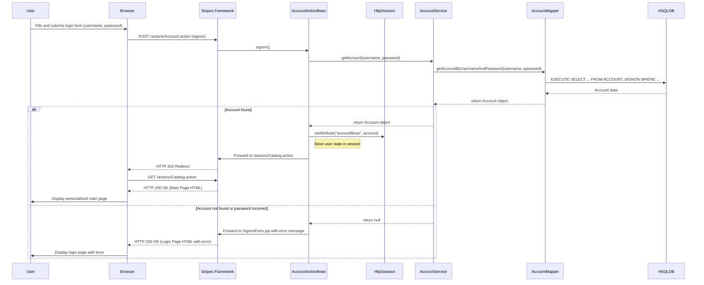
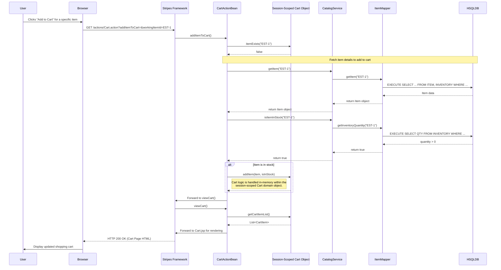
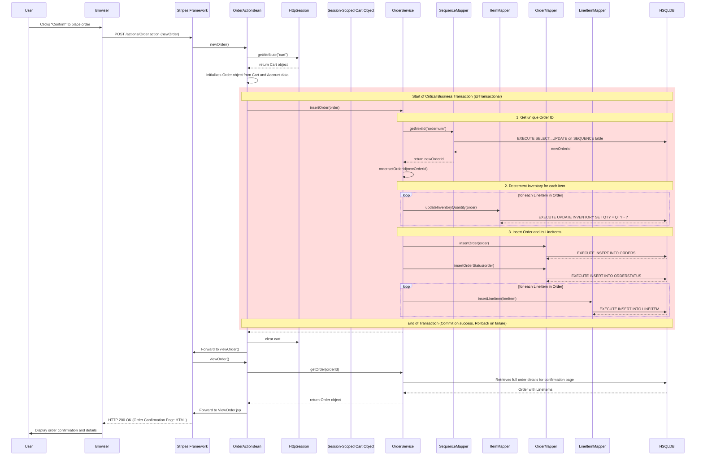
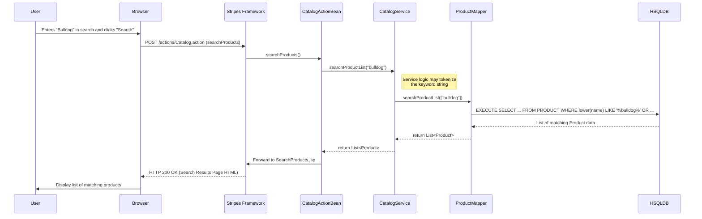

### 1. User Registration

*   **Description:** A new user fills out and submits a registration form to create an account. This is a critical transactional operation that persists user data across three related database tables (`ACCOUNT`, `PROFILE`, `SIGNON`).
*   **Trigger:** User submits the "New Account" form.
*   **Communication Patterns:**
    *   **HTTP POST Request/Response:** The primary web communication.
    *   **Synchronous Method Calls:** Direct, in-process calls from `ActionBean` -> `Service` -> `Mapper`.
    *   **Database Transaction:** The `insertAccount` service method is annotated with `@Transactional`, ensuring all database writes are performed as a single, atomic unit.

### 2. User Login and Session Management

*   **Description:** An existing user signs into the application. Upon successful authentication, the user's `Account` object is retrieved from the database and stored in the HTTP session, establishing an authenticated state for subsequent requests.
*   **Trigger:** User submits the login form.
*   **Communication Patterns:**
    *   **HTTP POST Request/Response:** For submitting credentials.
    *   **Synchronous Method Calls:** For authentication logic.
    *   **Database Read:** A `SELECT` query to validate credentials.
    *   **HTTP Session Interaction:** Writing the `Account` object to the session to maintain state.

### 3. Adding an Item to the Cart

*   **Description:** A user adds a specific item to their shopping cart. This workflow retrieves item and inventory data from the database but performs the core "add to cart" logic entirely in-memory by modifying the session-scoped `Cart` object. The state is not persisted in the database until checkout.
*   **Trigger:** User clicks an "Add to Cart" button.
*   **Communication Patterns:**
    *   **HTTP GET Request/Response:** To trigger the action.
    *   **Synchronous Method Calls:** To fetch item data.
    *   **Database Read:** To get item and inventory details.
    *   **In-Memory State Manipulation:** The `Cart` object, held in the `HttpSession`, is modified directly. This is a non-transactional, session-level operation.

### 4. Placing an Order (Checkout)

*   **Description:** This is the most critical workflow in the application. It converts the temporary, session-based `Cart` into a persistent `Order`. It executes a complex, multi-table database transaction that generates an order ID, decrements inventory, and creates records in the `ORDERS`, `ORDERSTATUS`, and `LINEITEM` tables, ensuring data consistency across the catalog and order domains.
*   **Trigger:** User confirms their order on the final checkout page.
*   **Communication Patterns:**
    *   **HTTP POST Request/Response:** To submit the final order.
    *   **Synchronous Method Calls:** Orchestrating the order placement.
    *   **Complex Database Transaction:** The `insertOrder` service method wraps all database writes in a single, atomic transaction. A failure at any step (e.g., updating inventory) will cause the entire operation to roll back. This demonstrates a strong, synchronous coupling between the Order and Catalog (Inventory) domains.

### 5. Product Search

*   **Description:** A user enters keywords into the search bar to find relevant products. The service layer tokenizes the input and queries the database using `LIKE` clauses to find matches.
*   **Trigger:** User submits the product search form.
*   **Communication Patterns:**
    *   **HTTP POST Request/Response:** To submit the search query.
    *   **Synchronous Method Calls:** To execute the search logic.
    *   **Database Read:** A `SELECT` query with `LIKE` clauses.

