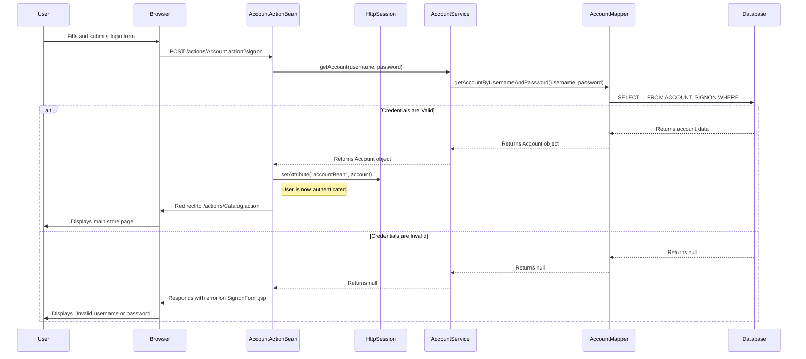
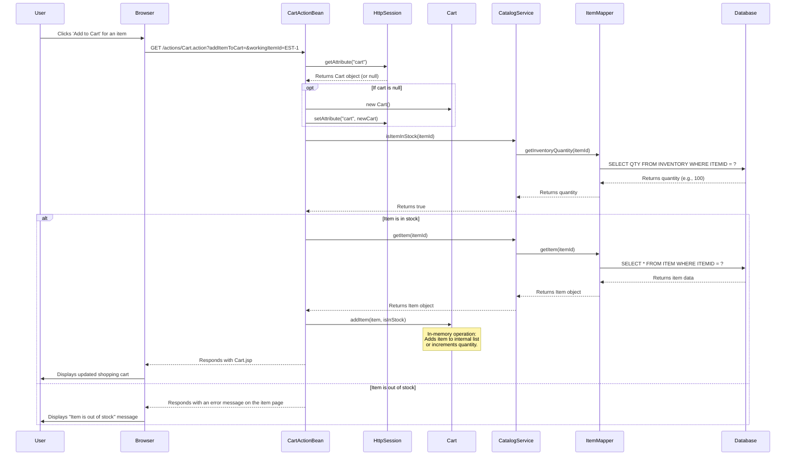

### 1. User Registration and Login Workflow

**Workflow Description**

This workflow covers two distinct but related user actions: registering a new account and signing in with an existing account. The registration process involves submitting user details, which are then persisted across multiple database tables within a single transaction. The sign-in process validates credentials against the database and establishes a user session.

**Triggers:**
*   A new user navigates to the registration page and submits the form.
*   An existing user navigates to the sign-in page and submits their credentials.

**Communication Patterns:**
*   **HTTP Requests:** The browser sends user data via HTTP POST to the Stripes `AccountActionBean`.
*   **Synchronous Method Calls:** The web layer (`AccountActionBean`) makes direct, synchronous calls to the business layer (`AccountService`).
*   **Database Transaction:** The `AccountService.insertAccount` method is annotated with `@Transactional`, ensuring that inserts into the `ACCOUNT`, `PROFILE`, and `SIGNON` tables are atomic. A failure in any of these operations will roll back the entire transaction.
*   **Session Management:** Upon successful login, the user's `Account` object is stored in the `HttpSession`.

**Sequence Diagram: New User Registration**
```mermaid
sequenceDiagram
    participant User
    participant Browser
    participant AccountActionBean
    participant AccountService
    participant AccountMapper
    participant Database

    User->>Browser: Clicks 'Register'
    Browser->>AccountActionBean: GET /actions/Account.action?newAccountForm
    AccountActionBean-->>Browser: Responds with NewAccountForm.jsp
    User->>Browser: Fills and submits registration form
    Browser->>AccountActionBean: POST /actions/Account.action?newAccount
    AccountActionBean->>AccountService: insertAccount(account)
    
    box rgb(235, 245, 255) DB Transaction
    AccountService->>AccountMapper: insertAccount(account)
    AccountMapper->>Database: INSERT INTO ACCOUNT...
    Database-->>AccountMapper: Success
    AccountMapper-->>AccountService: 
    
    AccountService->>AccountMapper: insertProfile(account)
    AccountMapper->>Database: INSERT INTO PROFILE...
    Database-->>AccountMapper: Success
    AccountMapper-->>AccountService: 

    AccountService->>AccountMapper: insertSignon(account)
    AccountMapper->>Database: INSERT INTO SIGNON...
    Database-->>AccountMapper: Success
    AccountMapper-->>AccountService: 
    end
    
    alt Registration Successful
        AccountService-->>AccountActionBean: Returns void
        AccountActionBean->>Browser: Redirect to /actions/Catalog.action
        Browser->>User: Displays main store page
    else Registration Failed (e.g., DB error)
        AccountService-->>AccountActionBean: Throws Exception
        note over AccountService, Database: Transaction is rolled back
        AccountActionBean-->>Browser: Responds with error message on NewAccountForm.jsp
        Browser->>User: Displays error
    end
```

**Sequence Diagram: User Sign-In**


### 2. Add Item to Cart Workflow

**Workflow Description**

This workflow describes how a user, while browsing the catalog, selects a specific item and adds it to their shopping cart. The system checks for item availability before adding it to the cart, which is a stateful, in-memory object stored in the user's `HttpSession`.

**Triggers:**
*   User clicks the "Add to Cart" button on an item's detail page.

**Communication Patterns:**
*   **HTTP Request:** A GET or POST request is sent to the `CartActionBean`.
*   **Synchronous Method Calls:** `CartActionBean` calls `CatalogService` to fetch item details and check stock.
*   **Session Management:** The core of this workflow is the manipulation of the `Cart` object stored in the `HttpSession`. All cart operations (adding, removing, updating quantities) are performed on this in-memory object. There is no database write operation until the final order is placed.
*   **Data Flow:** The `itemId` is passed from the browser. The full `Item` object is fetched from the database and added to the session-scoped `Cart` object.

**Sequence Diagram**


### 3. Place Order (Checkout) Workflow

**Workflow Description**

This is the most critical business workflow in the application. A logged-in user with items in their cart proceeds to checkout. They confirm their billing and shipping information, and upon final confirmation, the system creates a new order. This process involves multiple database operations that must be executed atomically: updating inventory, creating the order record, and saving the line items.

**Triggers:**
*   User clicks "Proceed to Checkout" from the cart view and submits the final "Confirm" button on the order confirmation page.

**Communication Patterns:**
*   **HTTP Requests:** A series of GET and POST requests guide the user through the multi-step checkout form handled by `OrderActionBean`.
*   **Session Management:** The `OrderActionBean` retrieves the authenticated `Account` and the `Cart` from the `HttpSession` to construct the `Order` object.
*   **Atomic Database Transaction:** The `OrderService.insertOrder` method is the transactional heart of the system. Spring's `@Transactional` annotation ensures that all database writes within this method (inventory updates, order inserts, line item inserts) either all succeed or all fail and are rolled back. This prevents data inconsistency, such as an order being created without the inventory being updated.
*   **Synchronous Cross-Component Calls:** `OrderService` (Order domain) directly calls `ItemMapper` (Catalog domain) to update inventory, demonstrating tight coupling between logical domains in the monolith.

**Sequence Diagram**
```mermaid
sequenceDiagram
    participant User
    participant Browser
    participant OrderActionBean
    participant HttpSession
    participant OrderService
    participant SequenceMapper
    participant ItemMapper
    participant OrderMapper
    participant LineItemMapper
    participant Database

    User->>Browser: Submits final 'Confirm Order' form
    Browser->>OrderActionBean: POST /actions/Order.action?newOrder=&confirmed=true

    OrderActionBean->>HttpSession: getAttribute("accountBean")
    HttpSession-->>OrderActionBean: Returns Account
    OrderActionBean->>HttpSession: getAttribute("cart")
    HttpSession-->>OrderActionBean: Returns Cart

    note over OrderActionBean: Constructs Order object from Account and Cart data
    
    OrderActionBean->>OrderService: insertOrder(order)
    
    rect rgba(255, 220, 220, 0.5) Critical DB Transaction
        OrderService->>SequenceMapper: getNextId("ordernum")
        SequenceMapper->>Database: SELECT nextid FROM SEQUENCE...; UPDATE SEQUENCE...
        Database-->>SequenceMapper: Returns new orderId
        SequenceMapper-->>OrderService: 
        
        loop for each LineItem in Order
            OrderService->>ItemMapper: updateInventoryQuantity(itemId, quantity)
            ItemMapper->>Database: UPDATE INVENTORY SET QTY = QTY - ? WHERE ITEMID = ?
            Database-->>ItemMapper: Success
            ItemMapper-->>OrderService: 
        end
        
        OrderService->>OrderMapper: insertOrder(order)
        OrderMapper->>Database: INSERT INTO ORDERS...
        Database-->>OrderMapper: Success
        OrderMapper-->>OrderService: 

        OrderService->>OrderMapper: insertOrderStatus(order)
        OrderMapper->>Database: INSERT INTO ORDERSTATUS...
        Database-->>OrderMapper: Success
        OrderMapper-->>OrderService: 

        loop for each LineItem in Order
            OrderService->>LineItemMapper: insertLineItem(lineItem)
            LineItemMapper->>Database: INSERT INTO LINEITEM...
            Database-->>LineItemMapper: Success
            LineItemMapper-->>OrderService:
        end
    end

    alt Order Placement Successful
        note over OrderService, Database: Transaction is committed
        OrderService-->>OrderActionBean: Returns void
        OrderActionBean->>HttpSession: removeAttribute("cart")
        note right of OrderActionBean: Clears the shopping cart
        OrderActionBean-->>Browser: Responds with ViewOrder.jsp
        Browser->>User: Displays order confirmation and details
    else Order Placement Failed (e.g., Insufficient Stock)
        ItemMapper->>OrderService: Throws DataAccessException (or similar)
        note over OrderService, Database: Transaction is rolled back automatically
        OrderService-->>OrderActionBean: Throws Exception
        OrderActionBean-->>Browser: Responds with an error page (Error.jsp)
        Browser->>User: Displays "An error occurred. Please try again."
    end
```