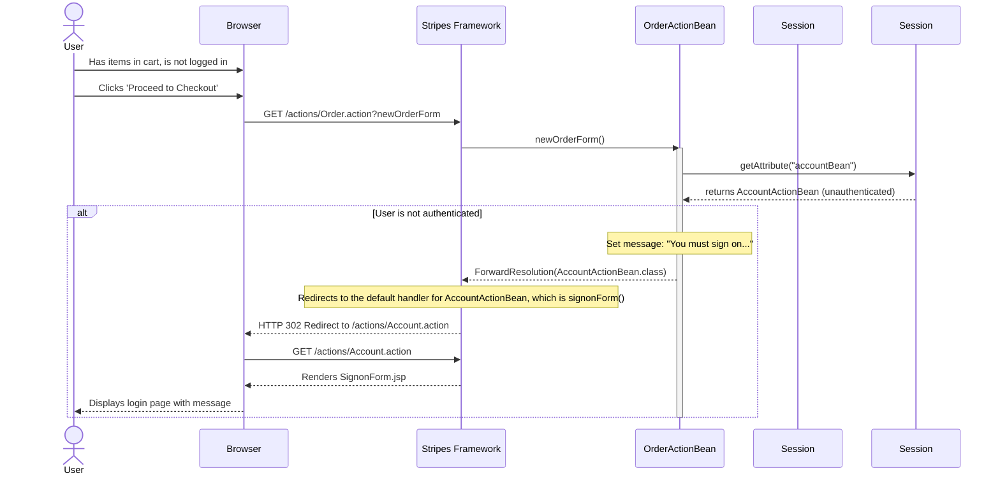

### 1. User Registration Workflow

- **Workflow Purpose and Triggers:** This workflow describes how a new user creates an account in the JPetStore. It's triggered when a user clicks the "Register Now!" link on the sign-in page and submits the registration form.
- **Communication Patterns:** The interaction is entirely synchronous, initiated by an HTTP POST request. The service layer method `insertAccount` is marked as `@Transactional`, ensuring that creating the account, profile, and sign-on records is an atomic operation. All communication is based on synchronous Java method calls and JDBC database transactions.

```mermaid
sequenceDiagram
    actor User
    participant Browser
    participant StripesFW as Stripes Framework
    participant AccountActionBean
    participant AccountService
    participant AccountMapper
    database Database

    User->>Browser: Clicks 'Register Now!' link
    Browser->>StripesFW: GET /actions/Account.action?newAccountForm
    StripesFW->>AccountActionBean: newAccountForm()
    AccountActionBean-->>StripesFW: ForwardResolution(NewAccountForm.jsp)
    StripesFW-->>Browser: Renders NewAccountForm.jsp
    Browser-->>User: Displays registration form

    User->>Browser: Fills out form and clicks 'Save'
    Browser->>StripesFW: POST /actions/Account.action?newAccount
    StripesFW->>AccountActionBean: newAccount()
    AccountActionBean->>AccountService: insertAccount(account)
    
    activate AccountService
    note over AccountService, Database: Start DB Transaction (@Transactional)
    AccountService->>AccountMapper: insertAccount(account)
    AccountMapper->>Database: INSERT INTO ACCOUNT
    Database-->>AccountMapper: 
    AccountMapper-->>AccountService: 
    
    AccountService->>AccountMapper: insertProfile(account)
    AccountMapper->>Database: INSERT INTO PROFILE
    Database-->>AccountMapper: 
    AccountMapper-->>AccountService: 
    
    AccountService->>AccountMapper: insertSignon(account)
    AccountMapper->>Database: INSERT INTO SIGNON
    Database-->>AccountMapper: 
    AccountMapper-->>AccountService: 
    note over AccountService, Database: End DB Transaction (Commit)
    deactivate AccountService

    AccountActionBean->>AccountService: getAccount(username)
    AccountService->>AccountMapper: getAccountByUsername(username)
    AccountMapper->>Database: SELECT FROM ACCOUNT, PROFILE, SIGNON...
    Database-->>AccountMapper: Account details
    AccountMapper-->>AccountService: returns Account
    AccountService-->>AccountActionBean: returns Account
    
    AccountActionBean-->>StripesFW: RedirectResolution(CatalogActionBean.class)
    StripesFW-->>Browser: HTTP 302 Redirect to /actions/Catalog.action
    Browser->>StripesFW: GET /actions/Catalog.action
    StripesFW-->>Browser: Renders main catalog page
    Browser-->>User: Displays main store page (logged in)

```

### 2. User Sign-In and Authentication Workflow

- **Workflow Purpose and Triggers:** This flow details the process of a registered user signing into the application. It begins when the user clicks the "Sign In" link and submits their credentials.
- **Communication Patterns:** This is a synchronous workflow initiated by an HTTP POST. It involves synchronous method calls from the web layer to the service layer, which in turn calls the data access layer. A successful login results in the `AccountActionBean` being stored in the `HttpSession`, establishing an authenticated session. Database interaction is a single SELECT query.

```mermaid
sequenceDiagram
    actor User
    participant Browser
    participant StripesFW as Stripes Framework
    participant AccountActionBean
    participant AccountService
    participant AccountMapper
    database Database
    participant HttpSession

    User->>Browser: Clicks 'Sign In' link
    Browser->>StripesFW: GET /actions/Account.action?signonForm
    StripesFW->>AccountActionBean: signonForm()
    AccountActionBean-->>StripesFW: ForwardResolution(SignonForm.jsp)
    StripesFW-->>Browser: Renders SignonForm.jsp
    Browser-->>User: Displays login form

    User->>Browser: Enters username/password and clicks 'Login'
    Browser->>StripesFW: POST /actions/Account.action?signon
    StripesFW->>AccountActionBean: signon()
    AccountActionBean->>AccountService: getAccount(username, password)
    activate AccountService
    AccountService->>AccountMapper: getAccountByUsernameAndPassword(username, password)
    activate AccountMapper
    AccountMapper->>Database: SELECT account details
    Database-->>AccountMapper: returns Account data or null
    deactivate AccountMapper
    AccountMapper-->>AccountService: returns Account object
    deactivate AccountService
    AccountService-->>AccountActionBean: returns Account object
    
    alt Login Successful
        AccountActionBean->>HttpSession: setAttribute("accountBean", this)
        AccountActionBean-->>StripesFW: RedirectResolution(CatalogActionBean.class)
        StripesFW-->>Browser: HTTP 302 Redirect to /actions/Catalog.action
        Browser->>StripesFW: GET /actions/Catalog.action
        StripesFW-->>Browser: Renders main catalog page
        Browser-->>User: Displays main store page with welcome message
    else Login Failed
        AccountActionBean-->>StripesFW: ForwardResolution(SignonForm.jsp) with error message
        StripesFW-->>Browser: Renders SignonForm.jsp with error
        Browser-->>User: Displays login form with error message
    end

```

### 3. Add Item to Cart Workflow

- **Workflow Purpose and Triggers:** This workflow shows a user browsing the catalog and adding a specific item to their shopping cart. The trigger is the user clicking the "Add to Cart" button on a product or item page.
- **Communication Patterns:** This is a synchronous workflow. The `Cart` object is stored in the user's `HttpSession`. When an item is added, the system first makes synchronous calls to the database via the `CatalogService` to check stock and retrieve item details. Then, it updates the `Cart` object in the session memory. No database writes occur in this flow.

```mermaid
sequenceDiagram
    actor User
    participant Browser
    participant StripesFW as Stripes Framework
    participant CartActionBean
    participant CatalogService
    participant ItemMapper
    database Database
    participant "HttpSession(Cart)" as Cart

    User->>Browser: On item page, clicks 'Add to Cart'
    Browser->>StripesFW: POST /actions/Cart.action?addItemToCart&workingItemId=EST-1
    StripesFW->>CartActionBean: addItemToCart()
    activate CartActionBean
    
    CartActionBean->>Cart: containsItemId("EST-1")
    Cart-->>CartActionBean: false
    
    CartActionBean->>CatalogService: isItemInStock("EST-1")
    activate CatalogService
    CatalogService->>ItemMapper: getInventoryQuantity("EST-1")
    activate ItemMapper
    ItemMapper->>Database: SELECT QTY FROM INVENTORY
    Database-->>ItemMapper: returns quantity
    deactivate ItemMapper
    ItemMapper-->>CatalogService: returns quantity
    CatalogService-->>CartActionBean: true (item is in stock)
    deactivate CatalogService

    CartActionBean->>CatalogService: getItem("EST-1")
    activate CatalogService
    CatalogService->>ItemMapper: getItem("EST-1")
    activate ItemMapper
    ItemMapper->>Database: SELECT * FROM ITEM, PRODUCT...
    Database-->>ItemMapper: returns Item object
    deactivate ItemMapper
    ItemMapper-->>CatalogService: returns Item object
    deactivate CatalogService
    CatalogService-->>CartActionBean: returns Item object

    CartActionBean->>Cart: addItem(item, isInStock)
    note right of Cart: Cart object in HttpSession is updated
    
    CartActionBean-->>StripesFW: ForwardResolution(Cart.jsp)
    deactivate CartActionBean
    StripesFW-->>Browser: Renders Cart.jsp
    Browser-->>User: Displays updated shopping cart
```

### 4. Checkout and Place Order Workflow

- **Workflow Purpose and Triggers:** This is the critical workflow for completing a purchase. It starts when a logged-in user with items in their cart proceeds to checkout, confirms their details, and submits the order.
- **Communication Patterns:** This multi-step process is synchronous. The most critical part is the `OrderService.insertOrder()` method, which is wrapped in a single database transaction (`@Transactional`). This ensures that updating inventory, creating the order record, and saving line items are all completed successfully or rolled back together. This demonstrates an essential data consistency pattern.

```mermaid
sequenceDiagram
    actor User
    participant Browser
    participant StripesFW as Stripes Framework
    participant OrderActionBean
    participant "HttpSession" as Session
    participant OrderService
    participant ItemMapper
    participant OrderMapper
    participant LineItemMapper
    participant SequenceMapper
    database Database

    User->>Browser: Clicks 'Proceed to Checkout'
    Browser->>StripesFW: GET /actions/Order.action?newOrderForm
    StripesFW->>OrderActionBean: newOrderForm()
    OrderActionBean->>Session: getAttribute("accountBean")
    Session-->>OrderActionBean: returns AccountActionBean
    OrderActionBean->>Session: getAttribute("cartBean")
    Session-->>OrderActionBean: returns CartActionBean
    note over OrderActionBean: Initializes Order object with account and cart data
    OrderActionBean-->>StripesFW: ForwardResolution(NewOrderForm.jsp)
    StripesFW-->>Browser: Renders NewOrderForm.jsp

    User->>Browser: Fills payment info, clicks 'Continue'
    Browser->>StripesFW: POST /actions/Order.action?newOrder
    StripesFW->>OrderActionBean: newOrder()
    OrderActionBean-->>StripesFW: ForwardResolution(ConfirmOrder.jsp)
    StripesFW-->>Browser: Renders confirmation page

    User->>Browser: Clicks 'Confirm'
    Browser->>StripesFW: POST /actions/Order.action?newOrder&confirmed=true
    StripesFW->>OrderActionBean: newOrder()
    activate OrderActionBean
    OrderActionBean->>OrderService: insertOrder(order)
    activate OrderService
    note over OrderService, Database: Start DB Transaction (@Transactional)

    OrderService->>SequenceMapper: getSequence("ordernum")
    SequenceMapper->>Database: SELECT ... FROM SEQUENCE
    Database-->>SequenceMapper: returns nextId
    SequenceMapper-->>OrderService: 
    OrderService->>SequenceMapper: updateSequence(...)
    SequenceMapper->>Database: UPDATE SEQUENCE ...
    Database-->>SequenceMapper: 
    SequenceMapper-->>OrderService: 
    note right of OrderService: Order ID is now set on the Order object

    loop for each line item in order
        OrderService->>ItemMapper: updateInventoryQuantity(itemId, quantity)
        ItemMapper->>Database: UPDATE INVENTORY ...
        Database-->>ItemMapper: 
        ItemMapper-->>OrderService: 
    end

    OrderService->>OrderMapper: insertOrder(order)
    OrderMapper->>Database: INSERT INTO ORDERS ...
    Database-->>OrderMapper: 
    OrderMapper-->>OrderService: 
    
    OrderService->>OrderMapper: insertOrderStatus(order)
    OrderMapper->>Database: INSERT INTO ORDERSTATUS ...
    Database-->>OrderMapper: 
    OrderMapper-->>OrderService: 
    
    loop for each line item in order
        OrderService->>LineItemMapper: insertLineItem(lineItem)
        LineItemMapper->>Database: INSERT INTO LINEITEM ...
        Database-->>LineItemMapper: 
        LineItemMapper-->>OrderService: 
    end
    note over OrderService, Database: End DB Transaction (Commit)
    deactivate OrderService

    OrderActionBean->>Session: getAttribute("cartBean").clear()
    note right of Session: Cart is cleared from session
    OrderActionBean-->>StripesFW: ForwardResolution(ViewOrder.jsp)
    deactivate OrderActionBean
    StripesFW-->>Browser: Renders order summary page
    Browser-->>User: Displays 'Thank you' message and order details
```

### 5. Error Handling: Attempt to Checkout Without Logging In

- **Workflow Purpose and Triggers:** This flow demonstrates the system's behavior when a non-authenticated user attempts to check out. It serves as a guard, redirecting the user to the sign-in page before they can proceed.
- **Communication Patterns:** This is a simple synchronous redirect pattern. The system checks the session state and, finding no authenticated user, performs an HTTP redirect to the login page. This is a common pattern for protecting resources that require authentication.

