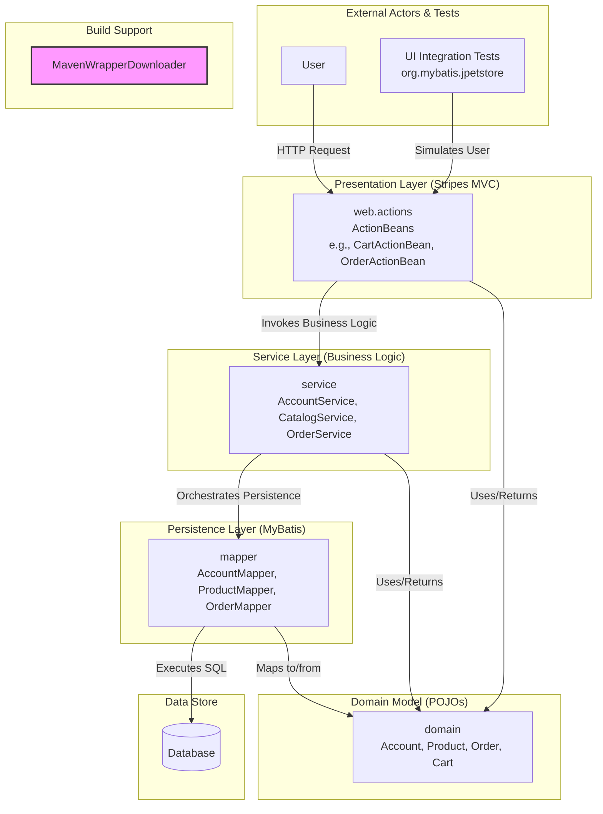

The system employs a classic layered architecture with a clear separation of concerns. User requests are handled by the Presentation Layer (`ActionBeans`), which delegates business operations to the Service Layer. The Service Layer encapsulates core logic and orchestrates data access by invoking methods on the Persistence Layer (`Mappers`), with all layers using the shared `Domain` objects as the common data transfer model.