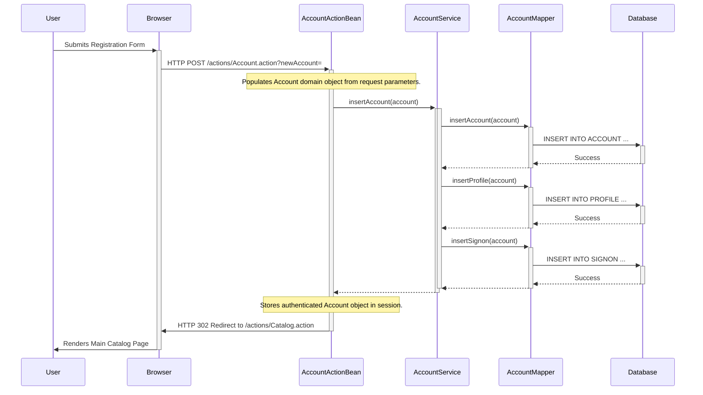

### 1. New User Registration

-   **Workflow Description:** This flow is triggered when a new user fills out the registration form and clicks "Save Account Information". The `AccountActionBean` receives the request, populates an `Account` domain object, and calls the `AccountService` to perform the registration. The service layer then coordinates with the `AccountMapper` to insert the new account, profile, and sign-on credentials into the database as separate records.
-   **Communication Patterns:** This is a synchronous workflow initiated by an HTTP POST request. It involves direct, synchronous method calls between the web, service, and persistence layers. The persistence operations on `ACCOUNT`, `PROFILE`, and `SIGNON` tables should ideally be wrapped in a single database transaction managed at the service layer to ensure data consistency.



### 2. Product Browsing and Adding an Item to Cart

-   **Workflow Description:** This flow begins when a user clicks on a product to view its details. The `CatalogActionBean` fetches the specific item information via the `CatalogService`. When the user clicks "Add to Cart", the `CartActionBean` takes over. It first checks for item availability by calling the `CatalogService`, which queries the database for inventory. If the item is in stock, the `CartActionBean` adds the `CartItem` to the `Cart` object, which is stored in the user's HTTP session.
-   **Communication Patterns:** This is a synchronous workflow driven by HTTP GET (viewing) and POST (adding to cart) requests. The shopping cart's state is managed within the user's session, which is a common pattern for stateful web applications. It involves synchronous database reads to fetch catalog and inventory data.

```mermaid
sequenceDiagram
    participant User
    participant Browser
    participant CatalogActionBean
    participant CartActionBean
    participant CatalogService
    participant ItemMapper
    participant Session
    participant Database

    User->>+Browser: Clicks on a product item
    Browser->>+CatalogActionBean: GET /actions/Catalog.action?viewItem=&itemId=EST-1
    CatalogActionBean->>+CatalogService: getItem("EST-1")
    CatalogService->>+ItemMapper: getItem("EST-1")
    ItemMapper->>+Database: SELECT * FROM ITEM WHERE ITEMID = ?
    Database-->>-ItemMapper: Item data
    ItemMapper-->>-CatalogService: Item object
    CatalogService-->>-CatalogActionBean: Item object
    CatalogActionBean->>-Browser: Responds with Item Details Page (HTML)
    Browser->>-User: Displays Item Details

    User->>+Browser: Clicks "Add to Cart"
    Browser->>+CartActionBean: POST /actions/Cart.action?addItemToCart=&workingItemId=EST-1
    CartActionBean->>+CatalogService: isItemInStock("EST-1")
    CatalogService->>+ItemMapper: getInventoryQuantity("EST-1")
    ItemMapper->>+Database: SELECT QTY FROM INVENTORY WHERE ITEMID = ?
    Database-->>-ItemMapper: Quantity
    ItemMapper-->>-CatalogService: quantity > 0
    CatalogService-->>-CartActionBean: true
    Note over CartActionBean: Item is in stock.

    CartActionBean->>+Session: Get Cart object
    Session-->>-CartActionBean: Cart object (or null)
    alt Cart is null
        CartActionBean->>CartActionBean: Create new Cart
    end
    CartActionBean->>CartActionBean: cart.addItem(item, inStock)
    CartActionBean->>+Session: Set updated Cart object
    Session-->>-CartActionBean:
    deactivate Session

    CartActionBean->>-Browser: HTTP 302 Redirect to /actions/Cart.action?viewCart=
    Browser->>-User: Renders Shopping Cart Page with new item
```

### 3. Checkout and Order Placement

-   **Workflow Description:** This critical workflow is initiated when a logged-in user confirms their purchase from the checkout screen. The `OrderActionBean` receives the request and invokes the `OrderService` to create the order. The `OrderService` performs a series of operations within a single transaction: it gets a new unique order ID from the `Sequence` table, updates the inventory for each item purchased, inserts the main order record, and inserts a record for each line item. If all operations succeed, the transaction is committed. The `OrderActionBean` then clears the user's cart from the session.
-   **Communication Patterns:** Synchronous HTTP POST request. The core of this workflow is a critical **database transaction** managed at the service layer to ensure atomicity. Failure at any step (e.g., inventory update) should roll back the entire transaction. This pattern is essential for maintaining data integrity in an e-commerce system.

```mermaid
sequenceDiagram
    participant User
    participant Browser
    participant OrderActionBean
    participant OrderService
    participant SequenceMapper
    participant ItemMapper
    participant OrderMapper
    participant LineItemMapper
    participant Session
    participant Database

    User->>+Browser: Clicks "Confirm Order"
    Browser->>+OrderActionBean: POST /actions/Order.action?newOrder=&confirmed=true
    Note over OrderActionBean: Retrieves Cart and Account from Session.

    OrderActionBean->>+OrderService: insertOrder(order)
    activate OrderService
    Note over OrderService: Begins Transaction

    OrderService->>+SequenceMapper: getSequence("ordernum")
    SequenceMapper->>+Database: SELECT * FROM SEQUENCE WHERE NAME = 'ordernum'
    Database-->>-SequenceMapper: Sequence(name='ordernum', nextId=1001)
    SequenceMapper-->>-OrderService: Sequence object
    Note over OrderService: Increments nextId locally (1002). Sets order ID to 1001.

    OrderService->>+SequenceMapper: updateSequence(sequence)
    SequenceMapper->>+Database: UPDATE SEQUENCE SET NEXTID = 1002 WHERE NAME = 'ordernum'
    Database-->>-SequenceMapper: Success
    SequenceMapper-->>-OrderService:

    loop for each LineItem in Order
        OrderService->>+ItemMapper: updateInventoryQuantity(lineItem)
        ItemMapper->>+Database: UPDATE INVENTORY SET QTY = QTY - ? WHERE ITEMID = ?
        Database-->>-ItemMapper: Success
        ItemMapper-->>-OrderService:
    end

    OrderService->>+OrderMapper: insertOrder(order)
    OrderMapper->>+Database: INSERT INTO ORDERS ...
    Database-->>-OrderMapper: Success
    OrderMapper-->>-OrderService:

    OrderService->>+LineItemMapper: insertLineItem(lineItem)
    LineItemMapper->>+Database: INSERT INTO LINEITEM ... (for each item)
    Database-->>-LineItemMapper: Success
    LineItemMapper-->>-OrderService:

    Note over OrderService: Commits Transaction
    deactivate OrderService
    OrderService-->>-OrderActionBean:
    deactivate Database

    OrderActionBean->>+Session: Clear Cart object
    Session-->>-OrderActionBean:
    deactivate Session

    OrderActionBean->>-Browser: HTTP 302 Redirect to /actions/Order.action?viewOrder=&orderId=...
    Browser->>-User: Renders Order Confirmation Page
```

### 4. User Login and View Order History

-   **Workflow Description:** A user initiates this flow by submitting their credentials on the login page. The `AccountActionBean` calls the `AccountService` to validate the username and password against the database. If authentication is successful, the user's complete `Account` object is stored in the session. The logged-in user can then navigate to their "My Orders" page. This triggers the `OrderActionBean`, which retrieves the username from the session, calls the `OrderService` to fetch the user's order history, and displays the list of past orders.
-   **Communication Patterns:** This flow uses synchronous HTTP POST (for login) and GET (for viewing orders) requests. It relies heavily on **HTTP Session Management** to maintain the user's authenticated state. The backend communication consists of synchronous method calls and database reads.

```mermaid
sequenceDiagram
    participant User
    participant Browser
    participant AccountActionBean
    participant AccountService
    participant AccountMapper
    participant OrderActionBean
    participant OrderService
    participant OrderMapper
    participant Session
    participant Database

    %% Login Flow
    User->>+Browser: Submits Login Form
    Browser->>+AccountActionBean: POST /actions/Account.action?signon=
    AccountActionBean->>+AccountService: getAccount("j2ee", "password")
    AccountService->>+AccountMapper: getAccountByUsernameAndPassword("j2ee", "password")
    AccountMapper->>+Database: SELECT * FROM ACCOUNT, SIGNON WHERE ...
    Database-->>-AccountMapper: Account data
    AccountMapper-->>-AccountService: Account object
    AccountService-->>-AccountActionBean: Account object

    Note over AccountActionBean: Login successful.
    AccountActionBean->>+Session: Store Account object
    Session-->>-AccountActionBean:
    deactivate Session

    AccountActionBean->>-Browser: HTTP 302 Redirect to /actions/Catalog.action
    Browser->>-User: Displays Main Catalog Page (as logged-in user)

    %% View Order History Flow
    User->>+Browser: Clicks "My Orders" link
    Browser->>+OrderActionBean: GET /actions/Order.action?listOrders=
    Note over OrderActionBean: Retrieves Account from Session to get username.
    OrderActionBean->>+OrderService: getOrdersByUsername("j2ee")
    OrderService->>+OrderMapper: getOrdersByUsername("j2ee")
    OrderMapper->>+Database: SELECT * FROM ORDERS WHERE USERID = ?
    Database-->>-OrderMapper: List of Order data
    OrderMapper-->>-OrderService: List<Order>
    OrderService-->>-OrderActionBean: List<Order>

    OrderActionBean->>-Browser: Responds with Order List Page (HTML)
    Browser->>-User: Displays list of past orders
```

### 5. Error Handling and Recovery Pattern

-   **Workflow Description:** This diagram illustrates a generic error handling pattern. A user attempts to add an item to the cart, but the `CatalogService` determines the item is out of stock. Instead of proceeding, it returns a `null` or signals a failure. The `CartActionBean` detects this condition, adds an informative error message to the `ActionBeanContext` (a feature provided by the `AbstractActionBean` base class), and forwards the user to a generic error page for a consistent user experience.
-   **Communication Patterns:** This demonstrates a synchronous error handling flow. The business logic in the service layer makes a decision that prevents the normal flow. The controller (`ActionBean`) is responsible for catching this condition, preparing a user-friendly message, and directing the application to a dedicated view for displaying errors, rather than letting an exception crash the request.

```mermaid
sequenceDiagram
    participant User
    participant Browser
    participant CartActionBean
    participant CatalogService
    participant ItemMapper
    participant Database

    User->>+Browser: Clicks "Add to Cart" for an out-of-stock item
    Browser->>+CartActionBean: POST /actions/Cart.action?addItemToCart=&workingItemId=EST-XX
    CartActionBean->>+CatalogService: isItemInStock("EST-XX")
    CatalogService->>+ItemMapper: getInventoryQuantity("EST-XX")
    ItemMapper->>+Database: SELECT QTY FROM INVENTORY WHERE ITEMID = ?
    Database-->>-ItemMapper: Quantity = 0
    ItemMapper-->>-CatalogService: quantity is 0
    CatalogService-->>-CartActionBean: false
    deactivate CatalogService

    alt Item is Out of Stock
        Note over CartActionBean: Logic detects item is not available.
        CartActionBean->>CartActionBean: addMessage("Item is out of stock.")
        Note over CartActionBean: Forwards to the common error page.
        CartActionBean->>-Browser: Forward to /WEB-INF/jsp/common/Error.jsp
    else Item is In Stock
        %% Normal flow as shown in previous diagram
        CartActionBean->>CartActionBean: cart.addItem(...)
        CartActionBean->>-Browser: Redirect to /actions/Cart.action?viewCart=
    end
    Browser->>-User: Displays "Item is out of stock" error page.
```