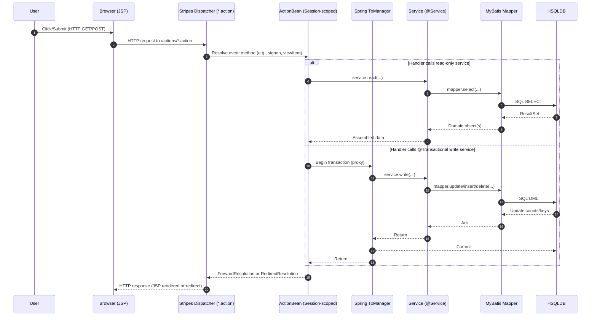
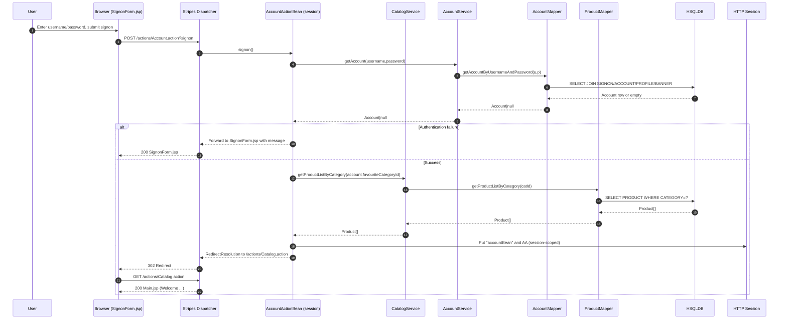
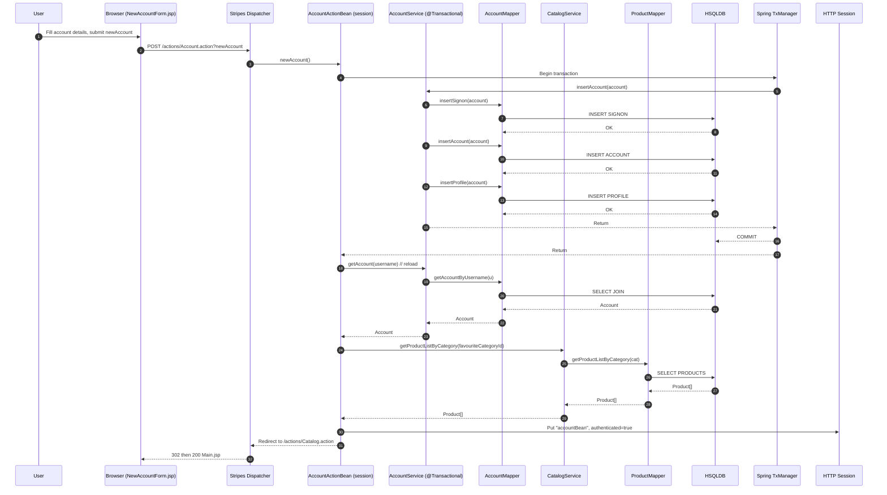
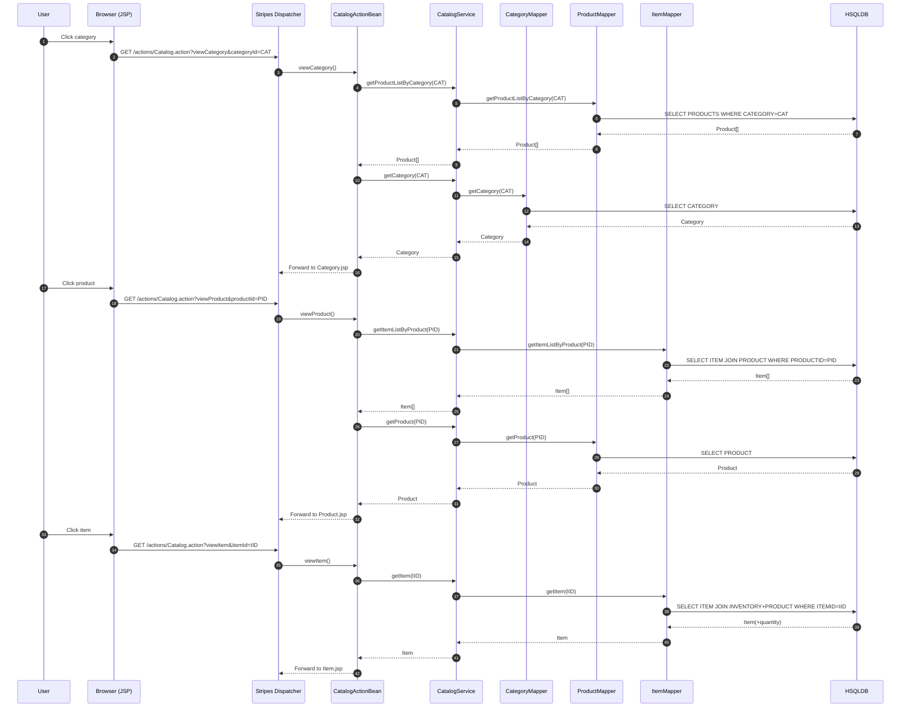
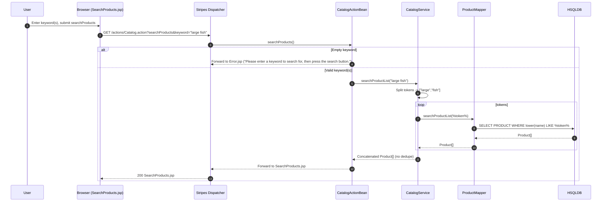
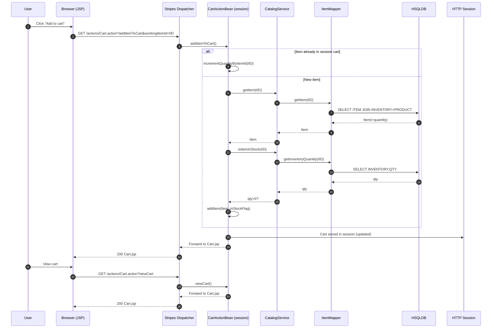
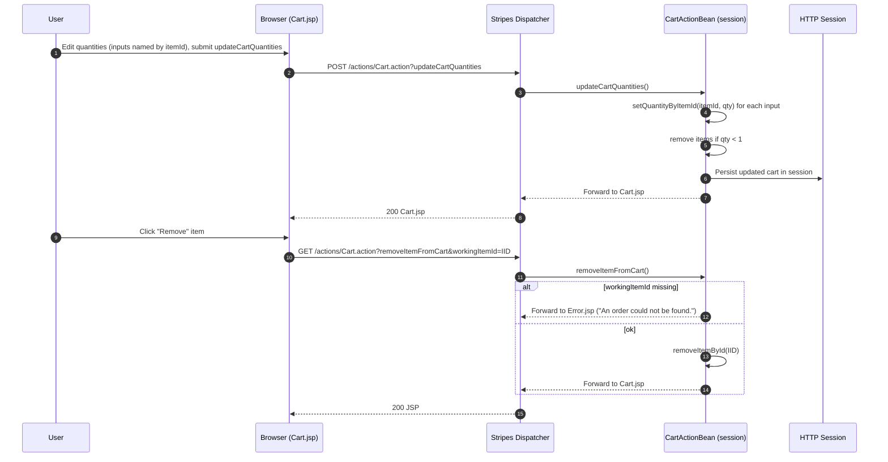
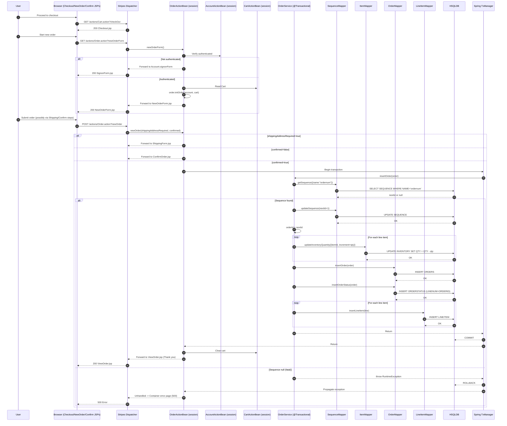
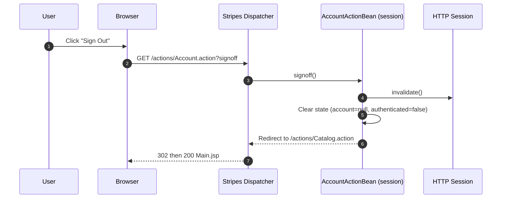
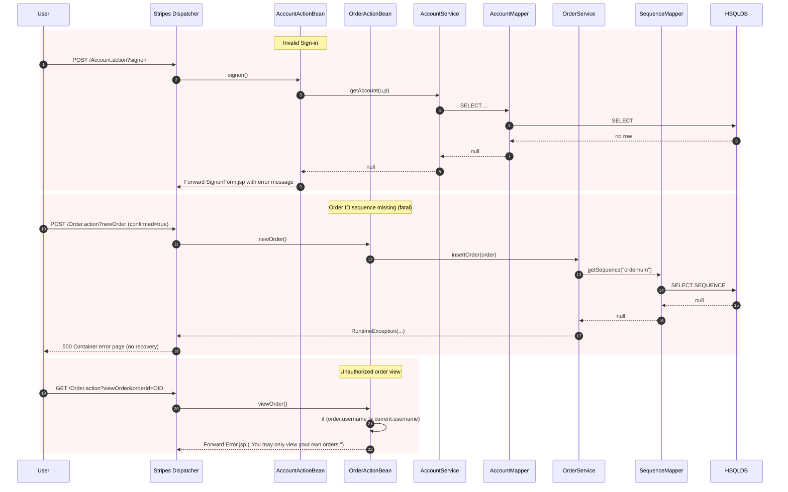

# Dynamic Interaction Flows and Sequence Diagrams — MyBatis JPetStore 6

## Common Request Lifecycle (Stripes + Spring + MyBatis)

- Purpose: Baseline call path and where transactions are opened/committed.
- Communication patterns:
  - HTTP synchronous requests to Stripes.
  - In-process method calls ActionBean -> Service -> Mapper.
  - MyBatis executes SQL over JDBC to HSQLDB.
  - Transactions managed by Spring AOP proxies on @Transactional services.
  - No asynchronous messaging or event bus.

---

## WF1: Sign In (AccountActionBean.signon)

- Purpose: Authenticate user and initialize personalized state (favorites, session).
- Triggers: POST to /actions/Account.action?signon from SignonForm.jsp.
- Communication patterns:
  - Synchronous HTTP request/response.
  - Synchronous read via AccountService -> AccountMapper (SELECT).
  - On success, read via CatalogService -> ProductMapper (SELECT).
  - Session mutation: stores accountBean and ActionBean in HTTP session.
  - No transaction (reads only). No events.

---

## WF2: New Account (AccountActionBean.newAccount)

- Purpose: Create a new account across SIGNON, ACCOUNT, PROFILE atomically.
- Triggers: POST to /actions/Account.action?newAccount.
- Communication patterns:
  - Synchronous HTTP.
  - Single ACID transaction (three INSERTs).
  - Follow-up reads to reload account and favorites.
  - No events.

---

## WF3: Browse Catalog (Categories -> Products -> Items)

- Purpose: Navigate and read catalog entities.
- Triggers: GET viewCategory/viewProduct/viewItem.
- Communication patterns:
  - Synchronous reads (SELECTs) via mappers.
  - No transactions.
  - No events.
  - MyBatis 2nd-level cache may serve repeated reads within the same app instance.

---

## WF4: Search Products (CatalogActionBean.searchProducts)

- Purpose: Full-text-like search across product names.
- Triggers: GET searchProducts with keyword.
- Communication patterns:
  - Multiple synchronous SELECTs, one per token.
  - No transaction, no dedupe logic, no events.

---

## WF5: Add to Cart and View Cart (CartActionBean.addItemToCart/viewCart)

- Purpose: Build and maintain a session-scoped shopping cart.
- Triggers: GET addItemToCart/viewCart.
- Communication patterns:
  - Read-only queries to validate stock and load item.
  - No transaction (cart is in-memory session state).
  - No events.

---

## WF6: Update Cart Quantities / Remove Item (CartActionBean.updateCartQuantities/removeItemFromCart)

- Purpose: Adjust or remove items in the cart.
- Triggers: POST updateCartQuantities; GET removeItemFromCart.
- Communication patterns:
  - Pure session manipulation; no DB calls.
  - No transactions. No events.

---

## WF7: Checkout and Place Order (OrderActionBean.newOrderForm/newOrder + OrderService.insertOrder)

- Purpose: End-to-end order placement with atomic writes and inventory decrement.
- Triggers: newOrderForm (GET) then newOrder (POST) with step flags.
- Communication patterns:
  - One ACID transaction spanning:
    - Sequence read/update (ID allocation).
    - Inventory decrements (UPDATE).
    - Order header/status/line item inserts.
  - All synchronous; no events/outbox.
  - Risk: inventory can go negative under concurrency; no optimistic checks.
  - MyBatis mapper-level cache invalidated by DML on respective mappers (not distributed).

---

## WF8: List Orders and View Order Details (OrderActionBean.listOrders/viewOrder + OrderService.getOrder)
```mermaid
sequenceDiagram
  autonumber
  participant U as User
  participant B as Browser (ListOrders/ViewOrder JSPs)
  participant S as Stripes Dispatcher
  participant OA as OrderActionBean (session)
  participant AA as AccountActionBean (session)
  participant OS as OrderService (@Transactional read)
  participant OM as OrderMapper
  participant LM as LineItemMapper
  participant IM as ItemMapper
  participant DB as HSQLDB

  U->>B: My Orders
  B->>S: GET /actions/Order.action?listOrders
  S->>OA: listOrders()
  OA->>AA: Get current username
  OA->>OS: getOrdersByUsername(username)
  OS->>OM: getOrdersByUsername(username)
  OM->>DB: SELECT ORDERS JOIN ORDERSTATUS WHERE USERID=?
  DB-->>OM: Order[]
  OM-->>OS: Order[]
  OS-->>OA: Order[]
  OA-->>S: Forward to ListOrders.jsp
  S-->>B: 200 ListOrders.jsp

  U->>B: Click an Order
  B->>S: GET /actions/Order.action?viewOrder&orderId=OID
  S->>OA: viewOrder()
  OA->>OS: getOrder(OID)
  OS->>OM: getOrder(OID)
  OM->>DB: SELECT ORDER JOIN STATUS WHERE ORDERID=OID
  DB-->>OM: Order
  OM-->>OS: Order
  OS->>LM: getLineItemsByOrderId(OID)
  LM->>DB: SELECT LINEITEM WHERE ORDERID=OID
  DB-->>LM: LineItem[]
  LM-->>OS: LineItem[]
  loop enrich each LineItem
    OS->>IM: getItem(itemId)
    IM->>DB: SELECT ITEM JOIN INVENTORY+PRODUCT WHERE ITEMID=?
    DB-->>IM: Item(+current qty)
    IM-->>OS: Item
    OS->>OS: lineItem.item = Item; lineItem.total = unitPrice*qty
  end
  OS-->>OA: Order with line items and current inventory
  OA->>AA: Verify order.username == current username
  alt Authorized
    OA-->>S: Forward to ViewOrder.jsp
    S-->>B: 200 ViewOrder.jsp
  else Unauthorized
    OA-->>S: Forward to Error.jsp ("You may only view your own orders.")
    S-->>B: 200 Error.jsp
  end
```
- Purpose: Retrieve user order history and order details, enriching with current item inventory.
- Triggers: listOrders (GET) and viewOrder (GET).
- Communication patterns:
  - Synchronous reads, no writes.
  - getOrder uses a transactional read to assemble aggregate with multiple SELECTs.
  - Authorization check in ActionBean before rendering.

---

## WF9: Sign Out (AccountActionBean.signoff)

- Purpose: End user session and clear server-side state.
- Triggers: GET signoff.
- Communication patterns:
  - Session invalidation; no DB operations. Synchronous redirect. No events.

---

## Error and Recovery Patterns (selected)

- Purpose: Capture main error flows and outcomes.
- Triggers: Invalid credentials; missing sequence row; cross-user order access.
- Communication patterns:
  - All synchronous; errors surfaced via forwards to Error.jsp or container 500.
  - Transaction behavior:
    - Sequence null -> transaction rollback via exception; no compensation needed.
  - No events.

---

## Communication Pattern Summary by Workflow
- WF1 Sign In:
  - HTTP POST, synchronous read; session mutation; no transaction.
- WF2 New Account:
  - HTTP POST; single transaction across SIGNON/ACCOUNT/PROFILE; synchronous.
- WF3 Browse Catalog:
  - HTTP GET; synchronous reads; optional MyBatis L2 cache hits; no transaction.
- WF4 Search Products:
  - HTTP GET; multiple synchronous SELECTs; no transaction.
- WF5 Add to Cart / View Cart:
  - HTTP GET; reads for item/inventory; cart stored in HTTP session; no transaction.
- WF6 Update Cart / Remove:
  - HTTP POST/GET; session-only operations; no DB; no transaction.
- WF7 Checkout and Place Order:
  - HTTP POST; single ACID transaction spanning inventory and order tables; synchronous; no messaging; potential race on inventory decrements.
- WF8 List Orders / View Order:
  - HTTP GET; transactional read to assemble aggregate; synchronous; authorization check in ActionBean.
- WF9 Sign Out:
  - HTTP GET; session invalidation; synchronous; no DB.

Notes on events and asynchrony:
- The monolith does not publish/consume messages; all flows are synchronous request/response with in-process calls.
- MyBatis second-level cache is per-mapper, in-memory, non-distributed; write operations on a mapper invalidate its local cache only.