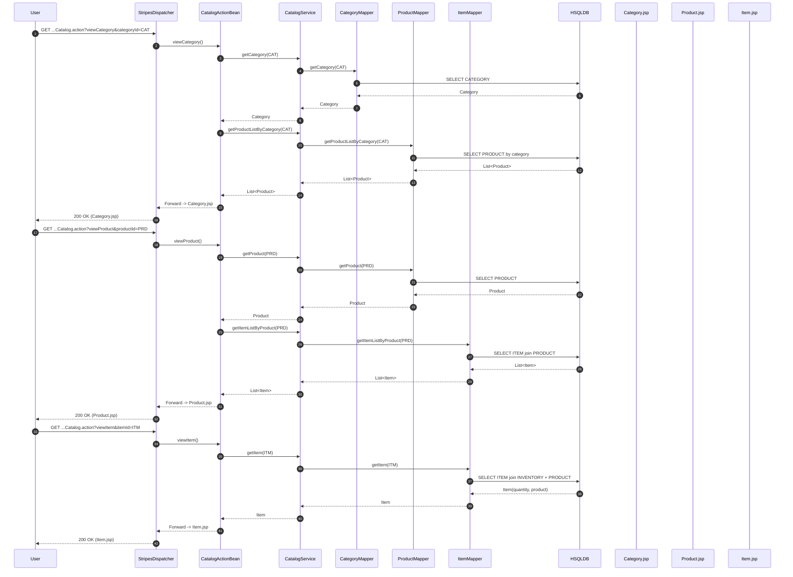
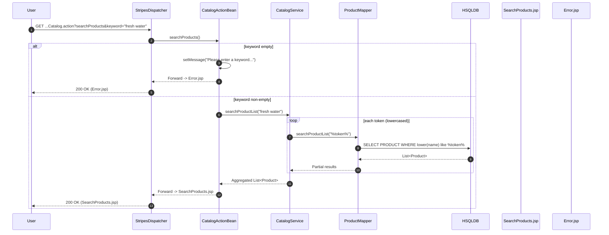
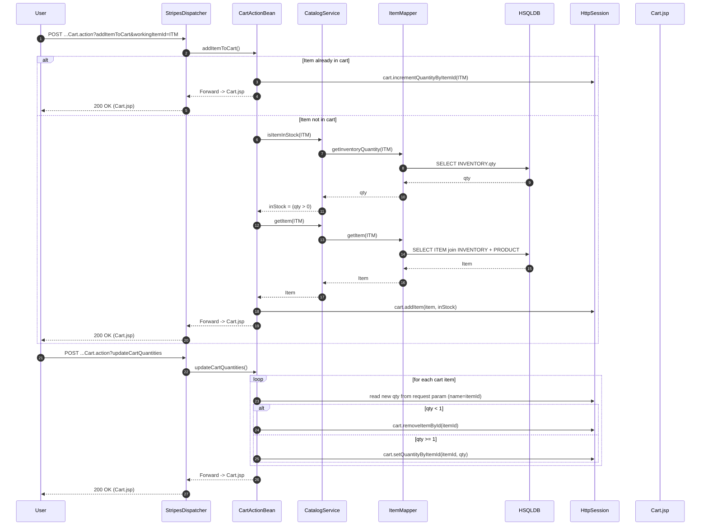
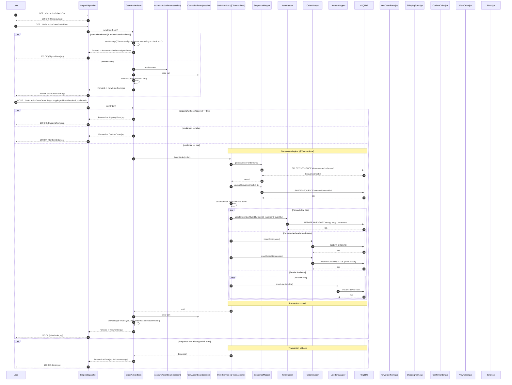
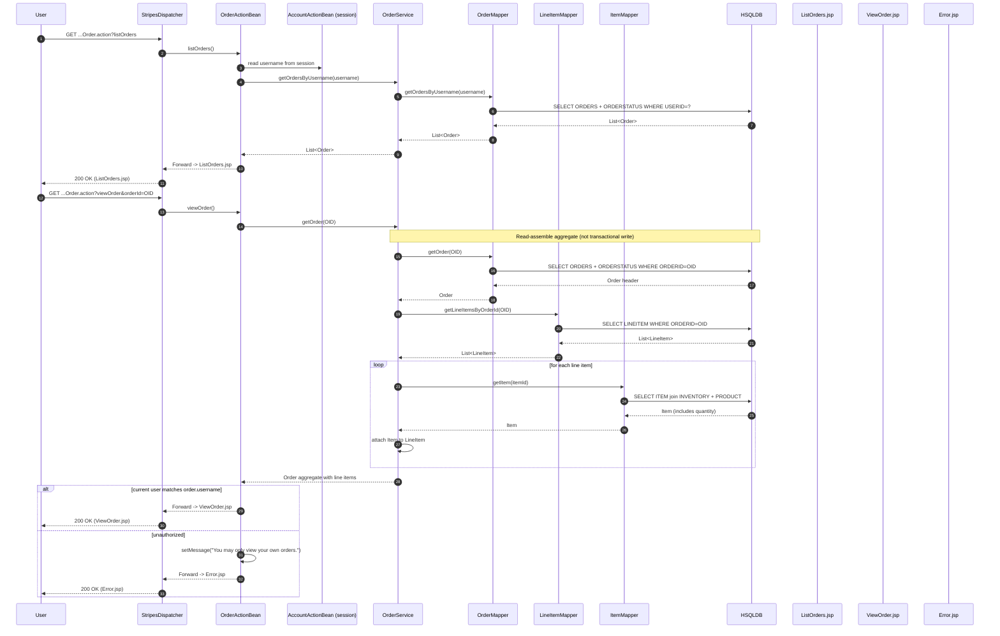
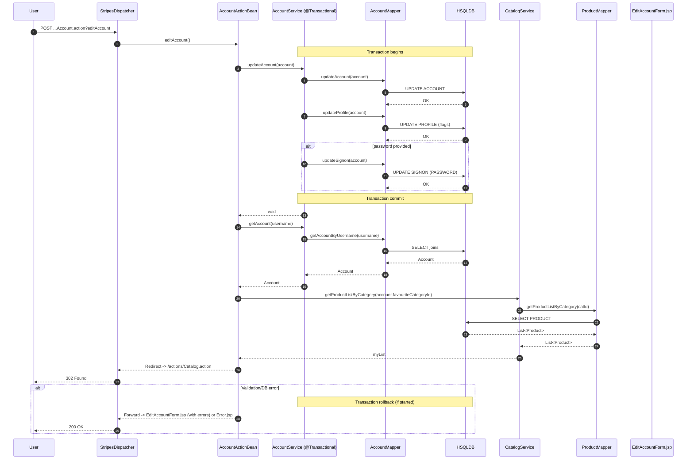

# Dynamic Interaction Flows and Sequence Diagrams

## 1) User Sign-in

Purpose and trigger
- User submits credentials to sign in and start an authenticated session.
- Trigger: POST /actions/Account.action?event=signon from SignonForm.jsp.

Communication patterns
- HTTP POST (Stripes action event)
- Synchronous in-process calls: ActionBean -> Service -> MyBatis Mapper -> DB
- Session state mutation (HttpSession)
- Redirect to CatalogActionBean (HTTP 302), then server-side forward to Main.jsp

Data flow
- Input: username/password
- Query: SIGNON + ACCOUNT + PROFILE (+ BANNERDATA join in mapper)
- Output: Account domain object; optional myList = favorite products by favouriteCategoryId

Error handling
- Invalid credentials -> set message, forward back to SignonForm.jsp
- Successful sign-in -> password nulled in memory; authenticated flag set; session attribute “accountBean” stored

```mermaid
sequenceDiagram
  autonumber
  participant U as User
  participant B as Browser
  participant D as StripesDispatcher (*.action)
  participant A as AccountActionBean
  participant S as AccountService
  participant M as AccountMapper (MyBatis)
  participant DB as HSQLDB
  participant C as CatalogService
  participant PM as ProductMapper
  participant SES as HttpSession
  participant J1 as SignonForm.jsp
  participant J2 as Main.jsp

  U->>B: Enter username/password
  B->>D: POST /actions/Account.action?event=signon
  D->>A: invoke signon()
  A->>S: getAccount(username, password)
  S->>M: getAccountByUsernameAndPassword(u, p)
  M->>DB: SELECT SIGNON + ACCOUNT + PROFILE (+ BANNERDATA)
  DB-->>M: Account row or null
  M-->>S: Account or null
  S-->>A: Account or null

  alt Authentication failed
    A->>A: setMessage("Invalid username or password.")
    A-->>D: Forward -> SignonForm.jsp
    D-->>B: 200 OK (render SignonForm.jsp)
  else Authentication success
    A->>A: account.password = null; authenticated = true
    A->>SES: set("accountBean", this)
    A->>C: getProductListByCategory(account.favouriteCategoryId)
    C->>PM: getProductListByCategory(catId)
    PM->>DB: SELECT PRODUCT by category
    DB-->>PM: List<Product>
    PM-->>C: List<Product>
    C-->>A: myList (favorites)
    A-->>D: Redirect to /actions/Catalog.action
    D-->>B: 302 Found (Location: /actions/Catalog.action)
    B->>D: GET /actions/Catalog.action (default event viewMain)
    D-->>B: 200 OK (render Main.jsp)
  end
```


## 2) Registration / New Account

Purpose and trigger
- Create a new user account with profile and credentials.
- Trigger: POST /actions/Account.action?event=newAccount from NewAccountForm.jsp.

Communication patterns
- HTTP POST (Stripes event)
- Synchronous, transactional service method across multiple tables
- Session state mutation; redirect on success

Data flow
- Inserts: SIGNON, ACCOUNT, PROFILE
- Reads: Account + favorites after creation

Error handling
- Any DB constraint/insert error -> transaction rollback; Stripes will resolve to error page (generic Error.jsp) depending on exception handling; otherwise standard success redirect.

```mermaid
sequenceDiagram
  autonumber
  participant U as User
  participant B as Browser
  participant D as StripesDispatcher
  participant A as AccountActionBean
  participant S as AccountService (@Transactional)
  participant M as AccountMapper
  participant DB as HSQLDB
  participant C as CatalogService
  participant PM as ProductMapper
  participant SES as HttpSession
  participant J as NewAccountForm.jsp

  U->>B: Fill registration fields
  B->>D: POST /actions/Account.action?event=newAccount
  D->>A: invoke newAccount()
  Note over S,DB: Transaction begins
  A->>S: insertAccount(account)
  S->>M: insertSignon(account)
  M->>DB: INSERT into SIGNON
  DB-->>M: OK
  S->>M: insertAccount(account)
  M->>DB: INSERT into ACCOUNT
  DB-->>M: OK
  S->>M: insertProfile(account)
  M->>DB: INSERT into PROFILE (flags 0/1)
  DB-->>M: OK
  Note over S,DB: Transaction commit
  S-->>A: void

  A->>S: getAccount(username)
  S->>M: getAccountByUsername(username)
  M->>DB: SELECT joins
  DB-->>M: Account
  M-->>S: Account
  S-->>A: Account
  A->>A: authenticated = true; account.password = null
  A->>SES: set("accountBean", this)
  A->>C: getProductListByCategory(account.favouriteCategoryId)
  C->>PM: getProductListByCategory(catId)
  PM->>DB: SELECT PRODUCT
  DB-->>PM: List<Product>
  PM-->>C: List<Product>
  C-->>A: myList
  A-->>D: Redirect to /actions/Catalog.action
  D-->>B: 302 Found

  alt DB error during insert
    Note over S,DB: Transaction rollback
    S-->>A: Exception
    A-->>D: Forward -> Error.jsp (message)
    D-->>B: 200 OK Error.jsp
  end
```


## 3) Browse Catalog (Category -> Product -> Item)

Purpose and trigger
- Navigate catalog hierarchy and view item details with live inventory.
- Triggers:
  - GET /actions/Catalog.action?event=viewCategory&categoryId=...
  - GET /actions/Catalog.action?event=viewProduct&productId=...
  - GET /actions/Catalog.action?event=viewItem&itemId=...

Communication patterns
- HTTP GET (Stripes events)
- Read-only synchronous service calls
- Server-side forwards to JSP views

Data flow
- Category view: CATEGORY + PRODUCT list
- Product view: PRODUCT + ITEM list
- Item view: ITEM join PRODUCT + INVENTORY (quantity)

Error handling
- Missing IDs are handled by ActionBean conditionals; typical behavior is forward to Error.jsp with message in edge cases.




## 4) Search Products

Purpose and trigger
- Full-text-like search on product name with multiple tokens.
- Trigger: GET /actions/Catalog.action?event=searchProducts&keyword=...

Communication patterns
- HTTP GET
- Loop over tokens; multiple synchronous mapper calls; aggregate results
- Forward to SearchProducts.jsp

Data flow
- For each token t: ProductMapper.searchProductList("%t%")
- Output: aggregated List<Product>

Error handling
- Empty keyword -> set message and forward to Error.jsp




## 5) Add to Cart and Update Cart

Purpose and trigger
- Add items to cart and adjust quantities.
- Triggers:
  - GET/POST /actions/Cart.action?event=addItemToCart&workingItemId=...
  - POST /actions/Cart.action?event=updateCartQuantities

Communication patterns
- HTTP requests to Stripes actions
- Synchronous service calls for stock check and item load
- Session-scoped cart mutated; forward to Cart.jsp

Data flow
- Reads: INVENTORY quantity, ITEM details (with product)
- Writes: Cart object in session

Error handling
- removeItemFromCart with missing workingItemId -> Error.jsp (not shown in this diagram)
- Out-of-stock item -> item can be added with inStock=false flag; UI conveys availability




## 6) Checkout and Place Order (Multi-step)

Purpose and trigger
- Convert cart into a persisted order, decrement inventory, and present confirmation.
- Triggers:
  - GET /actions/Cart.action?event=checkOut -> proceeds to Order flow
  - GET /actions/Order.action?event=newOrderForm
  - POST /actions/Order.action?event=newOrder (shippingAddressRequired/confirmed flags)

Communication patterns
- HTTP GET/POST for Stripes events
- Synchronous transactional service call for order creation
- Reads/writes across multiple tables; session state dependencies (AccountActionBean, CartActionBean)

Data flow
- Order.initOrder(account, cart): build Order and LineItems in memory
- insertOrder transaction:
  - Read/update SEQUENCE('ordernum')
  - Decrement INVENTORY per item
  - Insert ORDERS + ORDERSTATUS
  - Insert LINEITEM rows

Error handling
- Not authenticated -> forward to signon
- shippingAddressRequired -> ShippingForm.jsp
- Not confirmed -> ConfirmOrder.jsp
- Sequence missing or DB errors -> exception, transaction rollback, Error.jsp




## 7) List Orders and View Order Details

Purpose and trigger
- List user’s past orders and view order details enriched with current item and inventory data.
- Triggers:
  - GET /actions/Order.action?event=listOrders
  - GET /actions/Order.action?event=viewOrder&orderId=...

Communication patterns
- HTTP GET
- Synchronous service calls; getOrder aggregates multiple reads
- Authorization check for viewOrder

Data flow
- listOrders: ORDERS (+ ORDERSTATUS) by username
- viewOrder: ORDER header + LINEITEMS; for each line: load Item and current inventory quantity

Error handling
- viewOrder: if current user != order.username -> Error.jsp




## 8) Edit Account Profile

Purpose and trigger
- Update account details and optionally password.
- Trigger: POST /actions/Account.action?event=editAccount from EditAccountForm.jsp.

Communication patterns
- HTTP POST
- Synchronous transactional update across multiple tables
- Redirect to Catalog on success

Data flow
- Updates: ACCOUNT, PROFILE; SIGNON only if password is provided
- Reads: refresh Account; loads favorites

Error handling
- Validation errors by Stripes @Validate; DB errors cause transaction rollback and error forward




# Communication Patterns Summary (Across Flows)

- Web to Controller: HTTP GET/POST to Stripes action events (*.action). Sync.
- Controller to Service: In-process method calls. Sync.
- Service to Persistence: MyBatis mapper calls (JDBC). Sync.
- Persistence to Database: SQL queries and DML against HSQLDB. Sync.
- Transactions:
  - @Transactional on AccountService.insertAccount/updateAccount
  - @Transactional on OrderService.insertOrder and getOrder (read-assembly may or may not be transactional; writes are transactional)
- View navigation:
  - ForwardResolution (server-side forward to JSP) for most views
  - RedirectResolution (HTTP 302) after sign-in/registration/account edit to avoid form resubmission
- Session state:
  - AccountActionBean, CatalogActionBean, CartActionBean, OrderActionBean are @SessionScope; HttpSession holds conversational state (accountBean, cart, order-in-progress)


# Event-Driven Interactions

- Controller “events” are Stripes action methods (e.g., signon, newOrder, viewItem). They are HTTP-triggered and synchronous; there is no asynchronous message bus.
- No external eventing; all message flows are request/response oriented within a single process and DB transaction boundaries.


# Error Handling and Recovery Patterns

- Authentication failure: message set and forward to SignonForm.jsp (no redirect).
- Authorization failure (viewOrder of another user): message and forward to Error.jsp.
- Input validation failures: Stripes validation errors keep user on form (forward with messages).
- Transactional failures (e.g., DB constraint errors, missing sequence):
  - Service throws exception; Spring triggers transaction rollback; UI resolves to Error.jsp with message.
- Search with empty keyword: message and forward to Error.jsp.
- Cart operations with missing parameters (e.g., remove without workingItemId): forward to Error.jsp.
- Concurrency caveat: inventory decrement has no lower-bound check; negative inventory is possible under concurrent orders; current code relies on DB isolation/ordering but has no explicit recovery logic.