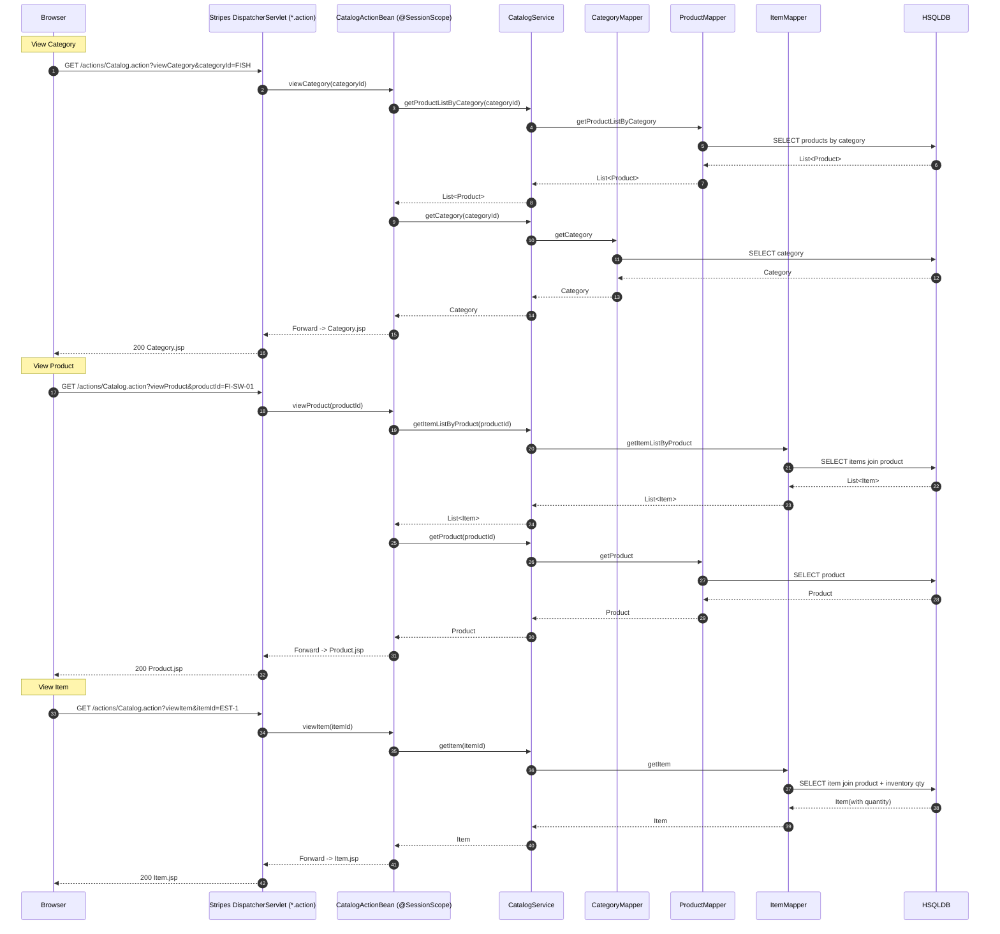
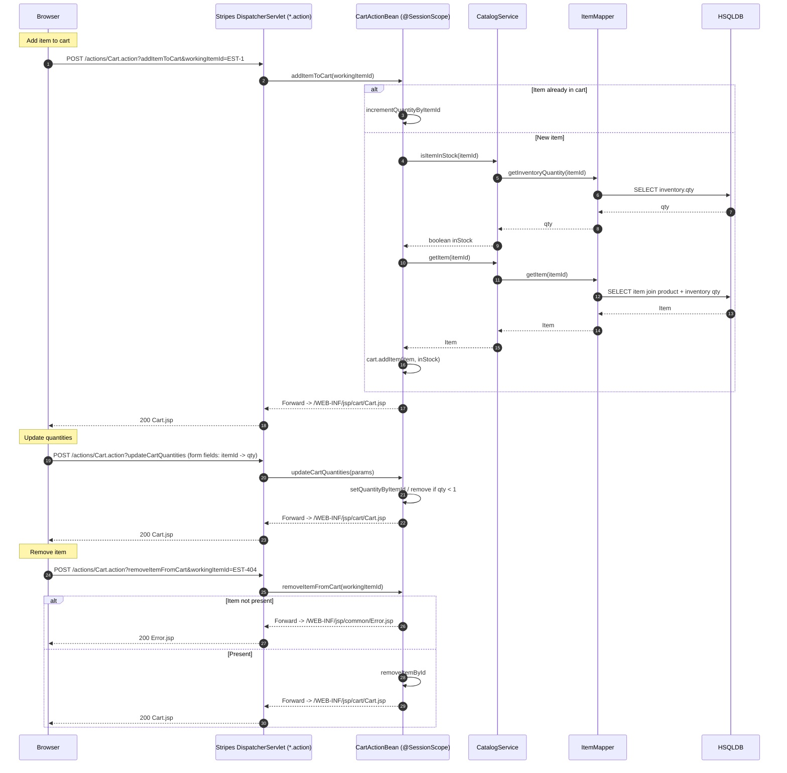
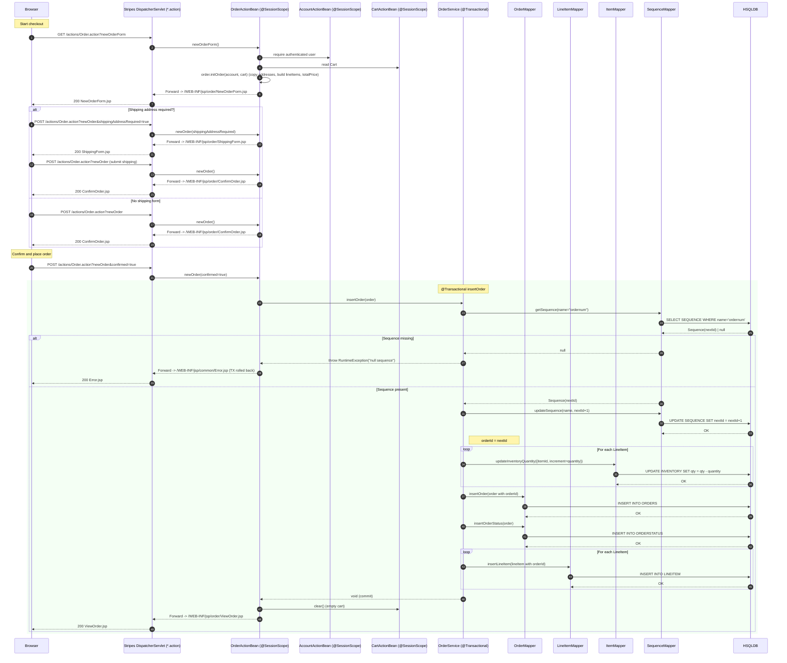

## Workflow 1: User Sign-in

Purpose and trigger:
- Authenticate a user via username/password to establish a session and load personalized “My List.”

Communication patterns:
- HTTP POST to Stripes Action (synchronous)
- In-process service calls (synchronous)
- MyBatis SQL queries (synchronous)
- No events; no external services
- No transaction (read-only) on sign-in; subsequent account load and myList retrieval are separate reads

```mermaid
sequenceDiagram
  autonumber
  participant U as User
  participant B as Browser
  participant S as Stripes DispatcherServlet (*.action)
  participant AAB as AccountActionBean (@SessionScope)
  participant AS as AccountService
  participant AM as AccountMapper (MyBatis)
  participant CS as CatalogService
  participant PM as ProductMapper (MyBatis)
  participant DB as HSQLDB

  U->>B: Enter credentials and submit
  B->>S: POST /actions/Account.action?signon
  S->>AAB: signon(username, password)
  AAB->>AS: getAccount(username, password)
  AS->>AM: getAccountByUsernameAndPassword
  AM->>DB: SELECT join SIGNON/ACCOUNT/PROFILE/BANNERDATA
  DB-->>AM: Account | null
  AM-->>AS: Account | null
  AS-->>AAB: Account | null

  alt Invalid credentials
    AAB-->>S: Forward -> /WEB-INF/jsp/account/SignonForm.jsp (error message)
    S-->>B: 200 SignonForm.jsp
  else Success
    Note over AAB,CS: Load personalized “My List” if favouriteCategoryId set
    AAB->>CS: getProductListByCategory(account.favouriteCategoryId)
    CS->>PM: getProductListByCategory
    PM->>DB: SELECT PRODUCT BY CATEGORY
    DB-->>PM: List<Product>
    PM-->>CS: List<Product>
    CS-->>AAB: List<Product>
    Note right of AAB: authenticated=true; sessionScope.accountBean=this
    AAB-->>S: Redirect to Catalog.action (viewMain)
    S-->>B: 302 Found
    B->>S: GET /actions/Catalog.action
    S-->>B: 200 Main.jsp
  end
```


## Workflow 2: Catalog Browsing (Category -> Product -> Item)

Purpose and trigger:
- Navigate catalog hierarchy to discover products/items and view availability.

Communication patterns:
- HTTP GET to Stripes Actions (synchronous)
- In-process service calls (synchronous)
- MyBatis SQL queries (synchronous)
- Read-only flows (no transaction boundaries needed)




## Workflow 3: Search Products

Purpose and trigger:
- Free-text keyword search across product names/descriptions via simple SQL LIKE per token.

Communication patterns:
- HTTP GET/POST to Stripes Action (synchronous)
- In-process service calls (synchronous)
- MyBatis SQL queries; loop per token (synchronous)
- Read-only

```mermaid
sequenceDiagram
  autonumber
  participant B as Browser
  participant S as Stripes DispatcherServlet (*.action)
  participant CAB as CatalogActionBean (@SessionScope)
  participant CS as CatalogService
  participant PRM as ProductMapper
  participant DB as HSQLDB

  B->>S: GET /actions/Catalog.action?searchProducts&keyword=gold fish
  S->>CAB: searchProducts(keyword)
  alt Empty keyword
    CAB-->>S: Forward -> /WEB-INF/jsp/common/Error.jsp
    S-->>B: 200 Error.jsp
  else Non-empty keyword
    Note over CS: Split by whitespace; iterate tokens
    CAB->>CS: searchProductList("gold fish")
    loop For each token t in ["gold","fish"]
      CS->>PRM: searchProductList("%t%")
      PRM->>DB: SELECT product WHERE lower(name) LIKE %t%
      DB-->>PRM: List<Product_t>
      PRM-->>CS: List<Product_t>
    end
    CS-->>CAB: Concatenated List<Product>
    CAB-->>S: Forward -> SearchProducts.jsp
    S-->>B: 200 SearchProducts.jsp
  end
```


## Workflow 4: Cart Operations (Add/Update/Remove)

Purpose and trigger:
- Maintain a session-scoped shopping cart: add items (with stock flag), update quantities, remove items.

Communication patterns:
- HTTP POST/GET to Stripes Actions (synchronous)
- In-process service calls (synchronous)
- MyBatis SQL for item lookup and stock check (read-only)
- Cart updates in session memory (no DB)
- No transaction needed




## Workflow 5: Checkout and Order Placement

Purpose and trigger:
- Convert the session cart into a persisted order, decrement inventory, and assign an order ID.

Communication patterns:
- Multi-step HTTP flow via Stripes (synchronous)
- In-process service call to OrderService (synchronous)
- MyBatis SQL within a single Spring @Transactional boundary for insertOrder
- No events; single-DB transaction used for atomicity




## Workflow 6: View Orders (List and Detail)

Purpose and trigger:
- Allow an authenticated user to list and view their orders; enforce authorization per username.

Communication patterns:
- HTTP GET to Stripes Actions (synchronous)
- In-process service calls (synchronous)
- MyBatis SQL queries (synchronous)
- Read-only

```mermaid
sequenceDiagram
  autonumber
  participant B as Browser
  participant S as Stripes DispatcherServlet (*.action)
  participant OAB as OrderActionBean (@SessionScope)
  participant AAB as AccountActionBean (@SessionScope)
  participant OS as OrderService
  participant OM as OrderMapper
  participant LM as LineItemMapper
  participant IM as ItemMapper
  participant DB as HSQLDB

  Note over B: List Orders
  B->>S: GET /actions/Order.action?listOrders
  S->>OAB: listOrders()
  OAB->>AAB: get current username
  OAB->>OS: getOrdersByUsername(username)
  OS->>OM: getOrdersByUsername
  OM->>DB: SELECT orders join orderstatus WHERE userid=username
  DB-->>OM: List<Order>
  OM-->>OS: List<Order>
  OS-->>OAB: List<Order>
  OAB-->>S: Forward -> /WEB-INF/jsp/order/ListOrders.jsp
  S-->>B: 200 ListOrders.jsp

  Note over B: View Order Detail
  B->>S: GET /actions/Order.action?viewOrder&order.orderId=1001
  S->>OAB: viewOrder(orderId)
  OAB->>AAB: verify current account.username matches order.username
  alt Unauthorized
    OAB-->>S: Forward -> /WEB-INF/jsp/common/Error.jsp
    S-->>B: 200 Error.jsp
  else Authorized
    OAB->>OS: getOrder(orderId)
    OS->>OM: getOrder(orderId)
    OM->>DB: SELECT order join orderstatus
    DB-->>OM: Order
    OM-->>OS: Order
    OS->>LM: getLineItemsByOrderId(orderId)
    LM->>DB: SELECT lineitems
    DB-->>LM: List<LineItem>
    LM-->>OS: List<LineItem>
    loop For each LineItem
      OS->>IM: getItem(lineItem.itemId)
      IM->>DB: SELECT item join product + inventory qty
      DB-->>IM: Item
      IM-->>OS: Item
      OS->>IM: getInventoryQuantity(lineItem.itemId)
      IM->>DB: SELECT inventory.qty
      DB-->>IM: qty
      IM-->>OS: qty
      OS->>OS: lineItem.item = Item; lineItem.item.quantity = qty
    end
    OS-->>OAB: Order (enriched)
    OAB-->>S: Forward -> /WEB-INF/jsp/order/ViewOrder.jsp
    S-->>B: 200 ViewOrder.jsp
  end
```


## Workflow 7: Account Registration and Profile Update

Purpose and trigger:
- Create a new account or update profile (and optionally password) atomically.

Communication patterns:
- HTTP POST to Stripes Actions (synchronous)
- In-process service calls (synchronous)
- MyBatis SQL writes within Spring @Transactional service methods

```mermaid
sequenceDiagram
  autonumber
  participant B as Browser
  participant S as Stripes DispatcherServlet (*.action)
  participant AAB as AccountActionBean (@SessionScope)
  participant AS as AccountService (@Transactional)
  participant AM as AccountMapper
  participant DB as HSQLDB

  Note over B: New Account
  B->>S: POST /actions/Account.action?newAccount (account + profile + signon fields)
  S->>AAB: newAccount(account)
  rect rgba(210, 255, 210, 0.25)
    Note over AS: @Transactional insertAccount
    AAB->>AS: insertAccount(account)
    AS->>AM: insertAccount
    AM->>DB: INSERT ACCOUNT
    DB-->>AM: OK
    AS->>AM: insertProfile
    AM->>DB: INSERT PROFILE
    DB-->>AM: OK
    AS->>AM: insertSignon
    AM->>DB: INSERT SIGNON
    DB-->>AM: OK
    AS-->>AAB: void (commit)
  end
  AAB->>AS: getAccount(username) (reload for session)
  AS->>AM: getAccountByUsername
  AM->>DB: SELECT join ACCOUNT/PROFILE/SIGNON/BANNERDATA
  DB-->>AM: Account
  AM-->>AS: Account
  AS-->>AAB: Account
  AAB-->>S: Redirect -> Catalog.action
  S-->>B: 302 Found

  Note over B: Edit Account
  B->>S: POST /actions/Account.action?editAccount (updated fields; optional password)
  S->>AAB: editAccount(account)
  rect rgba(210, 255, 210, 0.25)
    Note over AS: @Transactional updateAccount
    AAB->>AS: updateAccount(account)
    AS->>AM: updateAccount
    AM->>DB: UPDATE ACCOUNT
    DB-->>AM: OK
    AS->>AM: updateProfile
    AM->>DB: UPDATE PROFILE
    DB-->>AM: OK
    alt Password provided
      AS->>AM: updateSignon
      AM->>DB: UPDATE SIGNON
      DB-->>AM: OK
    else No password change
      Note right of AS: Skip SIGNON update
    end
    AS-->>AAB: void (commit)
  end
  AAB->>AS: getAccount(username) (reload)
  AS->>AM: getAccountByUsername
  AM->>DB: SELECT join tables
  DB-->>AM: Account
  AM-->>AS: Account
  AS-->>AAB: Account
  AAB-->>S: Redirect -> Catalog.action
  S-->>B: 302 Found
```


## Event-driven interactions and message flows

- None. All interactions are synchronous HTTP requests, in-process service calls, and synchronous SQL operations within local transactions.