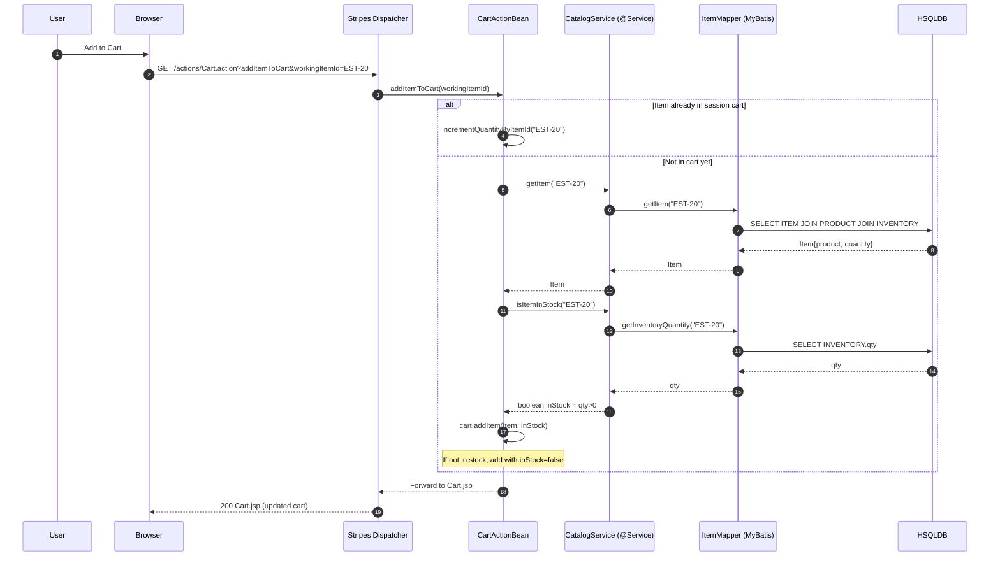
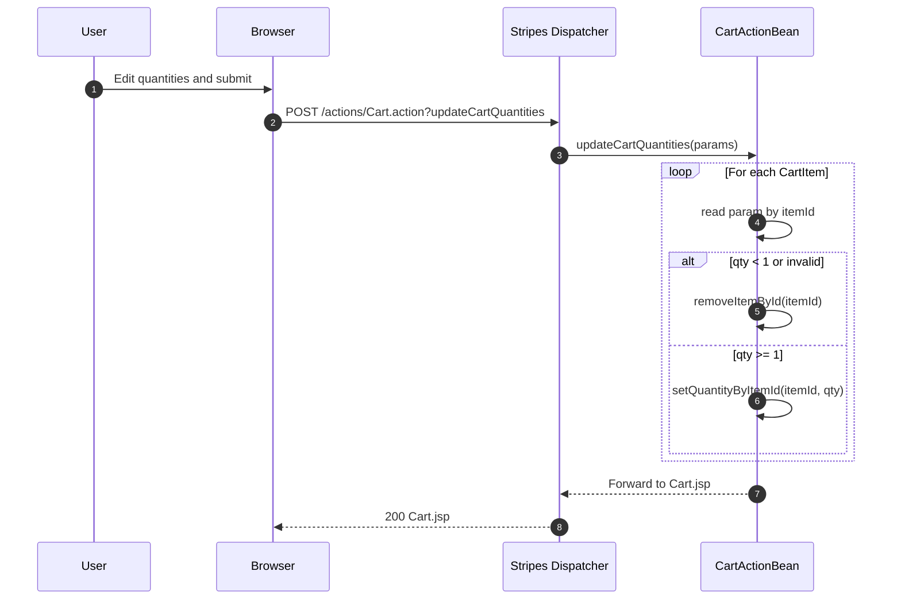
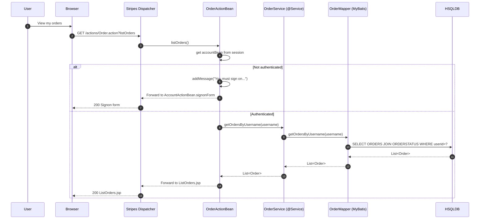

# Workflow 1 — User Sign-in (AccountActionBean.signon)

Purpose and triggers
- Purpose: Authenticate a user and load personalized main page data (favorite category “my list”, banner).
- Trigger: POST /actions/Account.action?signon from SignonForm.jsp.

Communication patterns
- HTTP: Browser → Stripes Dispatcher (synchronous).
- In-process: ActionBean → Spring @Service (synchronous).
- Persistence: MyBatis mapper → HSQLDB (synchronous SQL SELECT).
- Caching: MyBatis second-level cache on AccountMapper/ProductMapper may serve reads.
- State: Session mutations (store accountBean, ActionBean state).
- Errors: On invalid credentials, message added and forward to SignonForm.jsp.

```mermaid
sequenceDiagram
  autonumber
  participant U as User
  participant B as Browser (JSP)
  participant D as Stripes Filter/DispatcherServlet
  participant AA as AccountActionBean
  participant AS as AccountService (@Service)
  participant CS as CatalogService (@Service)
  participant AM as AccountMapper (MyBatis)
  participant PM as ProductMapper (MyBatis)
  participant DB as HSQLDB

  U->>B: Submit username/password
  B->>D: POST /actions/Account.action?signon
  D->>AA: dispatch signon()
  note right of D: Spring DI injects AS, CS

  AA->>AS: getAccount(username, password)
  AS->>AM: getAccountByUsernameAndPassword(u,p)
  AM->>DB: SELECT JOIN SIGNON/ACCOUNT/PROFILE/BANNERDATA
  DB-->>AM: Account row (or none)
  AM-->>AS: Account or null
  AS-->>AA: Account or null

  alt Auth success
    AA->>AA: authenticated=true; clear password
    AA->>CS: getProductListByCategory(account.favouriteCategoryId)
    CS->>PM: getProductListByCategory(cat)
    note over PM,DB: MyBatis 2nd-level cache may serve
    PM->>DB: SELECT PRODUCT by category
    DB-->>PM: List<Product>
    PM-->>CS: List<Product>
    CS-->>AA: myList
    AA->>D: Redirect to /actions/Catalog.action
    D-->>B: 302 Found
  else Auth failure
    AA->>AA: addMessage("Invalid username or password")
    AA-->>D: Forward to SignonForm.jsp
    D-->>B: 200 Signon form with error
  end
```


# Workflow 2 — Browse Catalog and View Item

Purpose and triggers
- Purpose: Navigate categories/products and view item details including current stock.
- Triggers:
  - GET /actions/Catalog.action?viewCategory&categoryId={catId}
  - GET /actions/Catalog.action?viewItem&itemId={itemId}

Communication patterns
- HTTP: Browser → Stripes Dispatcher (synchronous).
- In-process: ActionBean → CatalogService (synchronous).
- Persistence: MyBatis mappers → HSQLDB (synchronous SQL SELECT).
- Caching: Category/Product/Item mappers cached.
- Errors: Missing required parameters lead to error forward.

```mermaid
sequenceDiagram
  autonumber
  participant U as User
  participant B as Browser (JSP)
  participant D as Stripes Dispatcher
  participant CA as CatalogActionBean
  participant CS as CatalogService (@Service)
  participant CM as CategoryMapper (MyBatis)
  participant PM as ProductMapper (MyBatis)
  participant IM as ItemMapper (MyBatis)
  participant DB as HSQLDB

  == View Category ==
  U->>B: Click a category
  B->>D: GET /actions/Catalog.action?viewCategory&categoryId=CATS
  D->>CA: viewCategory(categoryId)
  CA->>CS: getProductListByCategory(CATS)
  CS->>PM: getProductListByCategory(CATS)
  note over PM,DB: Cached SELECTs may be served
  PM->>DB: SELECT products by category
  DB-->>PM: List<Product>
  PM-->>CS: List<Product>
  CS-->>CA: List<Product>

  CA->>CS: getCategory(CATS)
  CS->>CM: getCategory(CATS)
  CM->>DB: SELECT CATEGORY
  DB-->>CM: Category
  CM-->>CS: Category
  CS-->>CA: Category
  CA-->>D: Forward to Category.jsp
  D-->>B: 200 Category.jsp

  == View Item ==
  U->>B: Click an item id
  B->>D: GET /actions/Catalog.action?viewItem&itemId=EST-20
  D->>CA: viewItem(itemId)
  CA->>CS: getItem("EST-20")
  CS->>IM: getItem("EST-20")
  IM->>DB: SELECT ITEM JOIN PRODUCT JOIN INVENTORY (qty)
  DB-->>IM: Item{product, quantity}
  IM-->>CS: Item
  CS-->>CA: Item
  CA-->>D: Forward to Item.jsp
  D-->>B: 200 Item.jsp (shows stock from INVENTORY.qty)
```


# Workflow 3 — Add Item to Cart (CartActionBean.addItemToCart)

Purpose and triggers
- Purpose: Add or increment an item in the shopping cart; record stock availability.
- Trigger: GET /actions/Cart.action?addItemToCart&workingItemId={itemId}.

Communication patterns
- HTTP: Browser → Stripes Dispatcher (synchronous).
- Session state: Cart stored in CartActionBean in session; no DB for cart.
- In-process: ActionBean → CatalogService (synchronous).
- Persistence: MyBatis ItemMapper for item and stock (synchronous SQL SELECT).
- Caching: ItemMapper queries cached.
- Errors: None fatal; even if out of stock, item is added with inStock=false flag.




# Workflow 4 — Update Cart Quantities / Remove

Purpose and triggers
- Purpose: Adjust quantities or remove items from cart.
- Trigger: POST /actions/Cart.action?updateCartQuantities with form inputs named by itemId.

Communication patterns
- HTTP: Browser → Stripes Dispatcher (synchronous).
- Session state only: No service or DB calls.
- Errors: Quantities < 1 remove the item; invalid/missing params ignored safely.




# Workflow 5 — Checkout and Place Order (multi-step)

Purpose and triggers
- Purpose: Execute checkout, optionally collect shipping address, confirm, then persist order with inventory decrement in a single transaction.
- Triggers:
  - GET /actions/Order.action?newOrderForm
  - POST /actions/Order.action?newOrder (with shippingAddressRequired? and confirmed? flags)

Communication patterns
- HTTP: Browser → Stripes Dispatcher (synchronous).
- In-process: ActionBean → OrderService (synchronous).
- Persistence: MyBatis mappers on Sequence, Item, Order, LineItem (synchronous SQL).
- Transaction: OrderService.insertOrder is @Transactional; all DB updates are atomic; rollback on failure.
- Caching: MyBatis caches on mappers; updates flush related caches (e.g., inventory).
- State: Reads accountBean and CartActionBean from session; clears cart on success.
- Errors and recovery:
  - Not authenticated: forward to signon with message.
  - Any DB error: transaction rollback; forward to error page.

```mermaid
sequenceDiagram
  autonumber
  participant U as User
  participant B as Browser
  participant D as Stripes Dispatcher
  participant OA as OrderActionBean
  participant OS as OrderService (@Service, @Transactional)
  participant SM as SequenceMapper (MyBatis)
  participant IM as ItemMapper (MyBatis)
  participant OM as OrderMapper (MyBatis)
  participant LM as LineItemMapper (MyBatis)
  participant DB as HSQLDB

  == Start checkout ==
  U->>B: Proceed to checkout
  B->>D: GET /actions/Order.action?newOrderForm
  D->>OA: newOrderForm()
  OA->>OA: get accountBean, cartBean from session
  alt Not authenticated
    OA->>OA: addMessage("You must sign on...")
    OA-->>D: Forward to AccountActionBean.signonForm
    D-->>B: 200 Signon form
  else Authenticated
    OA->>OA: order.initOrder(account, cart) // copies addresses, totals
    OA-->>D: Forward to NewOrderForm.jsp
    D-->>B: 200 NewOrderForm.jsp
  end

  == Optional shipping step ==
  U->>B: Submit with "shippingAddressRequired"
  B->>D: POST /actions/Order.action?newOrder&shippingAddressRequired=true
  D->>OA: newOrder()
  OA->>OA: shippingAddressRequired=false
  OA-->>D: Forward to ShippingForm.jsp
  D-->>B: 200 ShippingForm.jsp

  == Confirm step ==
  U->>B: Submit without confirmed flag
  B->>D: POST /actions/Order.action?newOrder
  D->>OA: newOrder()
  OA-->>D: Forward to ConfirmOrder.jsp
  D-->>B: 200 ConfirmOrder.jsp

  == Place order (transactional) ==
  U->>B: Click Confirm (confirmed=true)
  B->>D: POST /actions/Order.action?newOrder&confirmed=true
  D->>OA: newOrder()
  OA->>OS: insertOrder(order)

  rect rgb(230,255,230)
    note over OS: Transaction begins
    OS->>SM: getSequence("ordernum")
    SM->>DB: SELECT SEQUENCE WHERE name='ordernum'
    DB-->>SM: Sequence{nextId}
    SM-->>OS: Sequence
    OS->>SM: updateSequence(nextId+1)
    SM->>DB: UPDATE SEQUENCE SET nextid=nextId+1
    DB-->>SM: OK
    SM-->>OS: OK
    OS->>OS: order.orderId = nextId

    loop For each LineItem
      OS->>IM: updateInventoryQuantity(itemId, increment=qty)
      IM->>DB: UPDATE INVENTORY SET QTY = QTY - qty
      DB-->>IM: OK
      IM-->>OS: OK
    end

    OS->>OM: insertOrder(order)
    OM->>DB: INSERT INTO ORDERS (...)
    DB-->>OM: OK
    OM-->>OS: OK

    OS->>OM: insertOrderStatus(order)
    OM->>DB: INSERT INTO ORDERSTATUS (orderid, timestamp, status)
    DB-->>OM: OK
    OM-->>OS: OK

    loop For each LineItem
      OS->>LM: insertLineItem(line)
      LM->>DB: INSERT INTO LINEITEM (...)
      DB-->>LM: OK
      LM-->>OS: OK
    end
    note over OS: Commit transaction
  end

  OS-->>OA: Success (orderId assigned)
  OA->>OA: clear CartActionBean from session; addMessage("Order submitted")
  OA-->>D: Forward to ViewOrder.jsp
  D-->>B: 200 ViewOrder.jsp (orderId shown)

  alt Any failure during transaction
    OS-->>OA: Exception -> rollback
    OA-->>D: Forward to Error.jsp
    D-->>B: 200 Error page
  end
```


# Workflow 6 — Order History List

Purpose and triggers
- Purpose: Show all orders placed by the logged-in user.
- Trigger: GET /actions/Order.action?listOrders.

Communication patterns
- HTTP: Browser → Stripes Dispatcher (synchronous).
- In-process: ActionBean → OrderService (synchronous).
- Persistence: MyBatis OrderMapper.getOrdersByUsername (synchronous SQL SELECT join).
- Caching: OrderMapper cache enabled.
- Errors: If not authenticated, forward to signon.




# Workflow 7 — View Single Order (with enrichment)

Purpose and triggers
- Purpose: Load a specific order and enrich lines with current item and stock details; authorize access.
- Trigger: GET /actions/Order.action?viewOrder&orderId={id}.

Communication patterns
- HTTP: Browser → Stripes Dispatcher (synchronous).
- In-process: ActionBean → OrderService (synchronous).
- Persistence: MyBatis OrderMapper, LineItemMapper, ItemMapper (synchronous SQL SELECTs).
- Caching: Mappers cached; item/product joins reduce N+1 queries.
- Errors: If logged-in user does not match order.username, forward to error.

```mermaid
sequenceDiagram
  autonumber
  participant U as User
  participant B as Browser
  participant D as Stripes Dispatcher
  participant OA as OrderActionBean
  participant OS as OrderService (@Service)
  participant OM as OrderMapper (MyBatis)
  participant LM as LineItemMapper (MyBatis)
  participant IM as ItemMapper (MyBatis)
  participant DB as HSQLDB

  U->>B: View order details
  B->>D: GET /actions/Order.action?viewOrder&orderId=1001
  D->>OA: viewOrder(orderId)
  OA->>OS: getOrder(1001)

  OS->>OM: getOrder(1001)
  OM->>DB: SELECT order header JOIN ORDERSTATUS
  DB-->>OM: Order header
  OM-->>OS: Order

  OS->>LM: getLineItemsByOrderId(1001)
  LM->>DB: SELECT LINEITEM WHERE orderid=1001
  DB-->>LM: List<LineItem>
  LM-->>OS: List<LineItem>

  loop Enrich each line item
    OS->>IM: getItem(itemId)
    IM->>DB: SELECT ITEM JOIN PRODUCT JOIN INVENTORY
    DB-->>IM: Item{product, quantity}
    IM-->>OS: Item
    OS->>OS: attach Item to LineItem; set availability from quantity
  end

  OS-->>OA: Order with line item details
  OA->>OA: authorize username == order.username?
  alt Authorized
    OA-->>D: Forward to ViewOrder.jsp
    D-->>B: 200 ViewOrder.jsp
  else Unauthorized
    OA-->>D: Forward to Error.jsp
    D-->>B: 200 Error page
  end
```


# Workflow 8 — Register New Account and Edit Account

Purpose and triggers
- Purpose: Create a new account or edit an existing one; update profile and optionally password.
- Triggers:
  - POST /actions/Account.action?newAccount
  - POST /actions/Account.action?editAccount

Communication patterns
- HTTP: Browser → Stripes Dispatcher (synchronous).
- In-process: ActionBean → AccountService (+ CatalogService for “my list”).
- Persistence: MyBatis INSERT/UPDATE across ACCOUNT, PROFILE, SIGNON (synchronous SQL).
- Transaction: AccountService.insertAccount/updateAccount execute multiple statements atomically.
- Caching: AccountMapper cached (read-through), but writes update tables.
- Errors: Validation errors (required fields) forward back to forms.

```mermaid
sequenceDiagram
  autonumber
  participant U as User
  participant B as Browser
  participant D as Stripes Dispatcher
  participant AA as AccountActionBean
  participant AS as AccountService (@Service, transactional)
  participant CS as CatalogService (@Service)
  participant AM as AccountMapper (MyBatis)
  participant PM as ProductMapper (MyBatis)
  participant DB as HSQLDB

  == New Account ==
  U->>B: Fill registration form
  B->>D: POST /actions/Account.action?newAccount
  D->>AA: newAccount()
  AA->>AS: insertAccount(account)
  rect rgb(230,255,230)
    note over AS: Transaction (ACCOUNT, PROFILE, SIGNON)
    AS->>AM: insertAccount(account)
    AM->>DB: INSERT INTO ACCOUNT
    DB-->>AM: OK
    AS->>AM: insertProfile(account)
    AM->>DB: INSERT INTO PROFILE
    DB-->>AM: OK
    AS->>AM: insertSignon(account)
    AM->>DB: INSERT INTO SIGNON
    DB-->>AM: OK
  end
  AS-->>AA: OK
  AA->>AS: getAccount(username)
  AS->>AM: getAccountByUsername(username)
  AM->>DB: SELECT JOIN ACCOUNT/PROFILE/BANNERDATA
  DB-->>AM: Account
  AM-->>AS: Account
  AS-->>AA: Account

  AA->>CS: getProductListByCategory(account.favouriteCategoryId)
  CS->>PM: getProductListByCategory
  PM->>DB: SELECT PRODUCT by category
  DB-->>PM: List<Product>
  PM-->>CS: List<Product>
  CS-->>AA: myList
  AA->>D: Redirect to /actions/Catalog.action
  D-->>B: 302 Found

  == Edit Account ==
  U->>B: Edit account fields (optional new password)
  B->>D: POST /actions/Account.action?editAccount
  D->>AA: editAccount()
  AA->>AS: updateAccount(account)
  rect rgb(230,255,230)
    note over AS: Transaction (ACCOUNT, PROFILE, conditional SIGNON)
    AS->>AM: updateAccount(account)
    AM->>DB: UPDATE ACCOUNT SET ...
    DB-->>AM: OK
    AS->>AM: updateProfile(account)
    AM->>DB: UPDATE PROFILE SET ...
    DB-->>AM: OK
    alt password present and non-empty
      AS->>AM: updateSignon(account)
      AM->>DB: UPDATE SIGNON SET password=...
      DB-->>AM: OK
    else no password change
      note over AS: Skip SIGNON update
    end
  end
  AS-->>AA: OK
  AA->>AS: getAccount(username)
  AS->>AM: getAccountByUsername(username)
  AM->>DB: SELECT JOIN
  DB-->>AM: Account
  AM-->>AS: Account
  AS-->>AA: Account

  AA->>CS: getProductListByCategory(account.favouriteCategoryId)
  CS->>PM: getProductListByCategory
  PM->>DB: SELECT PRODUCT by category
  DB-->>PM: List<Product>
  PM-->>CS: List<Product>
  CS-->>AA: myList
  AA->>D: Redirect to /actions/Catalog.action
  D-->>B: 302 Found
```


# Cross-cutting Interaction Notes

- Synchronous vs asynchronous
  - All flows are synchronous request/response; no asynchronous messaging or event bus in the monolith.
- Transactions
  - OrderService.insertOrder: single transactional unit for sequence allocation, inventory decrement, order header/status, and line item inserts; rollback on any failure.
  - AccountService.insertAccount/updateAccount: transactional around multi-table writes.
- Caching
  - MyBatis second-level cache enabled per mapper; read queries may be served from cache; UPDATE/INSERT flush the corresponding mapper cache.
- Error handling and recovery
  - Authentication failure: message + forward to signon.
  - Authorization failure (viewOrder): forward to error page.
  - Missing/invalid form params: forwards to same form with messages or to Error.jsp (e.g., removeItem with null workingItemId).
  - Transactional failures: exceptions trigger rollback and error view.
- Data flow highlights (critical operations)
  - Checkout: OrderActionBean builds order from session account/cart; OrderService assigns orderId via Sequence, decrements INVENTORY per line, persists order and status, persists line items, then clears cart in session.
  - View Order: Enrichment step pulls current Item and INVENTORY for each line to display availability at view time.