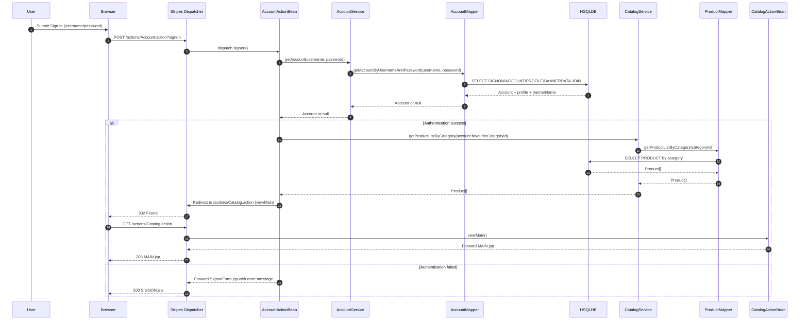
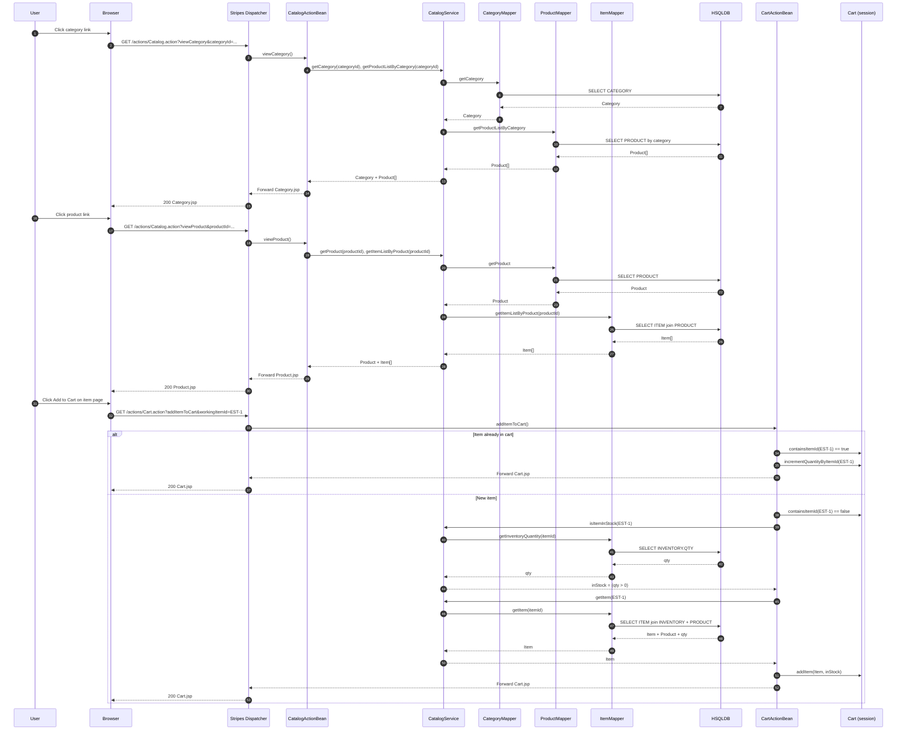
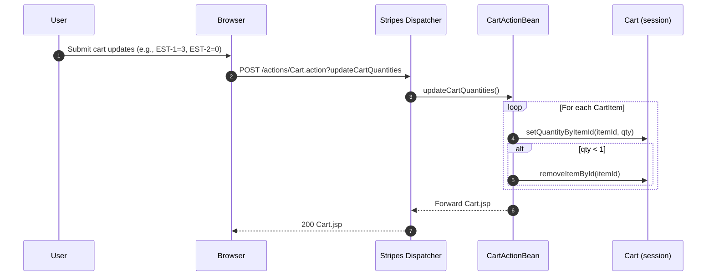
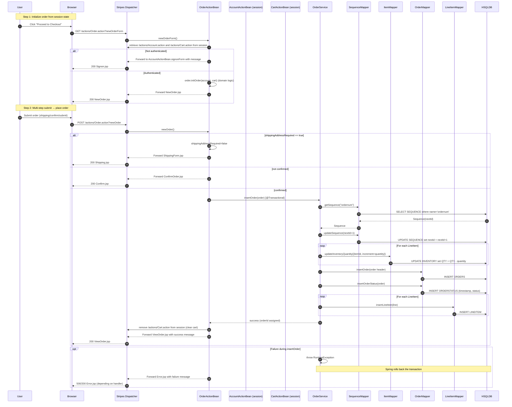
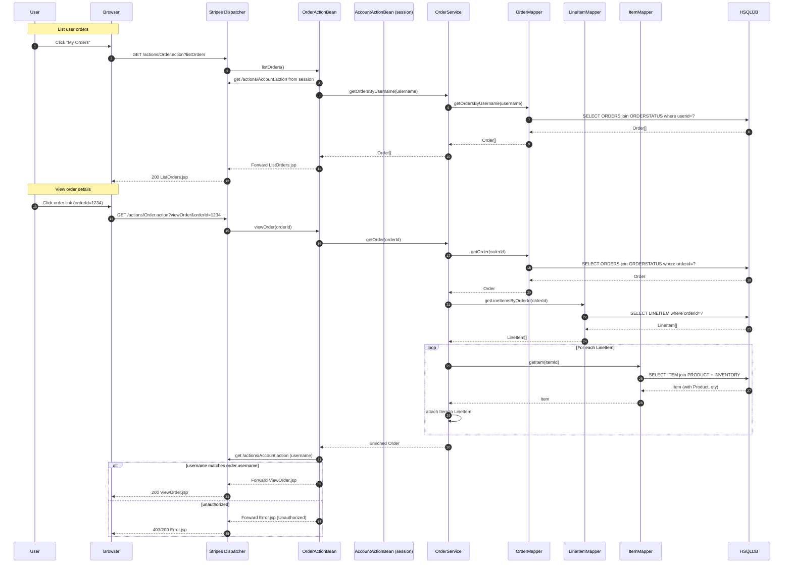
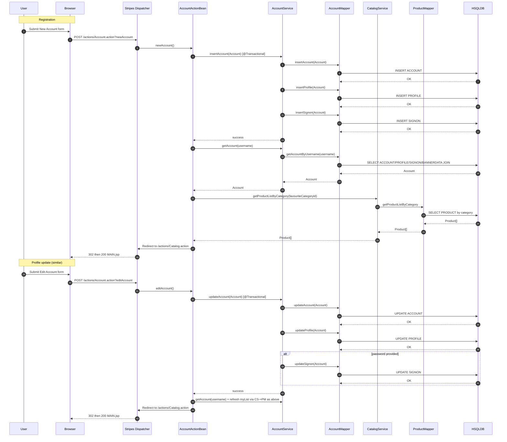
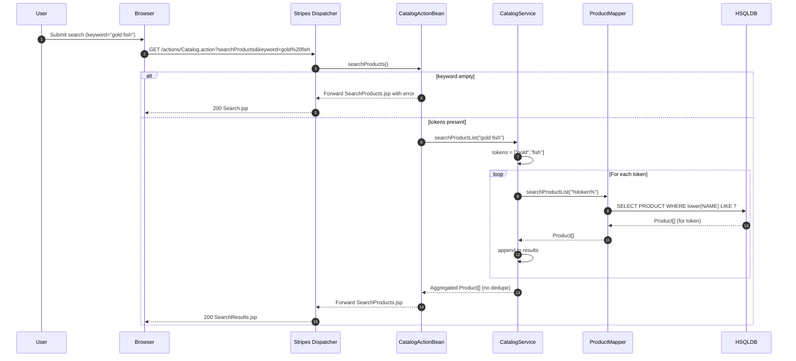

# Workflow 1: User Sign-in

Purpose and trigger
- Purpose: Authenticate a user and establish session-scoped account state (banner, favorites).
- Trigger: User submits the Sign In form (POST /actions/Account.action?signon).

Communication patterns
- HTTP form POST handled by Stripes MVC (synchronous).
- In-process synchronous calls: AccountActionBean → AccountService → AccountMapper → DB.
- Additional synchronous read for favorites: CatalogService → ProductMapper → DB.
- Database transaction: read-only; no explicit transaction annotation required.

Data flow
- Input: username, password.
- Reads SIGNON, ACCOUNT, PROFILE, BANNERDATA to hydrate Account.
- On success, reads PRODUCT list for favouriteCategoryId; stores AccountActionBean in session; redirects to main catalog.

Error handling and recovery
- On invalid credentials: adds message and forwards to SignonForm.jsp (no redirect, no session set).
- Any mapper/DB error propagates to generic error handling (Stripes/JSP error page).

---

# Workflow 2: Browse Catalog and Add Item to Cart

Purpose and trigger
- Purpose: Navigate categories/products/items and add an item to the cart with in-stock flag.
- Trigger: User browses catalog and clicks “Add to Cart” on an item page.

Communication patterns
- HTTP GET requests to Stripes actions and JSP forwards (synchronous).
- Catalog retrieval: CatalogActionBean → CatalogService → Mappers → DB (synchronous).
- Add-to-cart: CartActionBean → CatalogService → ItemMapper/ProductMapper → DB (synchronous).
- No async events.

Data flow
- Read-only for browsing: CATEGORY, PRODUCT, ITEM (+PRODUCT join), INVENTORY.
- Add-to-cart reads INVENTORY qty for stock flag and ITEM (joined with PRODUCT, INVENTORY).

Error handling and recovery
- If workingItemId is null on add: forward to Error.jsp.
- Otherwise always forwards to Cart.jsp.

---

# Workflow 3: Update Cart Quantities

Purpose and trigger
- Purpose: Adjust item quantities or remove items in the cart.
- Trigger: User submits the cart form with per-item quantity fields; action updateCartQuantities.

Communication patterns
- HTTP POST to Stripes action; no service/DB calls (business in session-scoped Cart).

Data flow
- Inputs: key-value pairs where key=itemId and value=desired quantity.
- Updates Cart’s in-memory state in session.

Error handling and recovery
- If quantity < 1, item is removed.
- Invalid/missing params are ignored per item; forwards to Cart.jsp.

---

# Workflow 4: Checkout and Place Order (Multi-step)

Purpose and trigger
- Purpose: Convert the cart into a confirmed order, decrement inventory, record status.
- Triggers:
  - newOrderForm (GET) to initialize Order from Account + Cart.
  - newOrder (POST) to navigate shipping/confirmation, and finally place the order.

Communication patterns
- HTTP GET/POST with Stripes.
- In-process service calls: OrderActionBean → OrderService → Mappers → DB (synchronous).
- Transactional boundary: OrderService.insertOrder is @Transactional (ACID across sequence, inventory, order, line items).

Data flow
- Reads Account + Cart from session; Order.initOrder computes totals and line items.
- Writes: INVENTORY (decrement), ORDERS, ORDERSTATUS, LINEITEM; SEQUENCE updated atomically.

Error handling and recovery
- Not authenticated in newOrderForm: redirect/forward back to sign-on with message.
- newOrder steps:
  - If shippingAddressRequired: show shipping form.
  - If not confirmed: show confirmation.
  - On insertOrder failure (e.g., missing sequence): transaction rollback; forward to Error.jsp.

---

# Workflow 5: View Order History and Order Details

Purpose and trigger
- Purpose: Allow users to list their orders and view details; enforce simple authorization.
- Triggers:
  - listOrders (GET) from navigation.
  - viewOrder (GET) with orderId from link.

Communication patterns
- Synchronous reads to DB via OrderService and mappers.
- Enrichment: OrderService.getOrder hydrates line items with Item and current INVENTORY quantity.

Data flow
- listOrders reads ORDERS + ORDERSTATUS (by username).
- viewOrder reads ORDERS + ORDERSTATUS + LINEITEM; for each line item reads ITEM + PRODUCT + INVENTORY.

Error handling and recovery
- viewOrder rejects access if session username ≠ order.username (forwards to Error.jsp).

---

# Workflow 6: Account Registration and Profile Update

Purpose and trigger
- Purpose: Create a new account (spanning ACCOUNT/PROFILE/SIGNON) or update existing profile and optionally password.
- Triggers:
  - newAccountForm → newAccount (POST).
  - editAccountForm → editAccount (POST).

Communication patterns
- Synchronous service calls with transactional writes:
  - AccountService.insertAccount: INSERT into ACCOUNT, PROFILE, SIGNON (single transaction).
  - AccountService.updateAccount: UPDATE ACCOUNT, PROFILE, and conditionally SIGNON.

Data flow
- INSERT/UPDATE across ACCOUNT, PROFILE, SIGNON; on success, reload Account and precompute favorites (CatalogService.getProductListByCategory).

Error handling and recovery
- On any write failure, transaction rollback; forwards to error page (Stripes default).
- On success: redirect to main catalog.

---

# Workflow 7: Product Search

Purpose and trigger
- Purpose: Search products by keyword(s) against product name (case-insensitive).
- Trigger: User submits search form (searchProducts).

Communication patterns
- Synchronous calls: CatalogActionBean → CatalogService → ProductMapper → DB.
- No async events; read-only.

Data flow
- Input: keyword string.
- Service splits on whitespace; for each token calls ProductMapper.searchProductList("%kw%"); concatenates results (no deduplication).

Error handling and recovery
- If keyword empty/null: forward to SearchProducts.jsp with error message.
- DB errors show error page.

---

# Cross-cutting Communication and Error Patterns

- Communication types:
  - HTTP requests to Stripes actions (synchronous).
  - In-process service and mapper calls via Spring DI (synchronous).
  - Database access via MyBatis mappers (synchronous SQL).
  - No asynchronous messaging, background jobs, or external APIs.

- Transactions:
  - OrderService.insertOrder and AccountService insert/update methods are transactional. Failures trigger rollback across all involved tables.
  - Reads are non-transactional or default transactional read-only behavior.

- Caching:
  - MyBatis second-level cache per mapper (<cache/>) reduces repeated reads; cache is invalidated on writes to the same namespace.

- Error handling:
  - Validation/flow errors: Forward to relevant JSP with messages (e.g., signon failure, empty search, unauthorized order view).
  - System/DB errors: Propagate to Error.jsp; transactional methods roll back state on exception.

- Session and state:
  - Session-scoped ActionBeans maintain conversational state (Account, Cart, Order) under keys like "/actions/Account.action".
  - On successful sign-in, "accountBean" is also stored for banner and favorites rendering.
  - On order completion, CartActionBean is cleared from session.