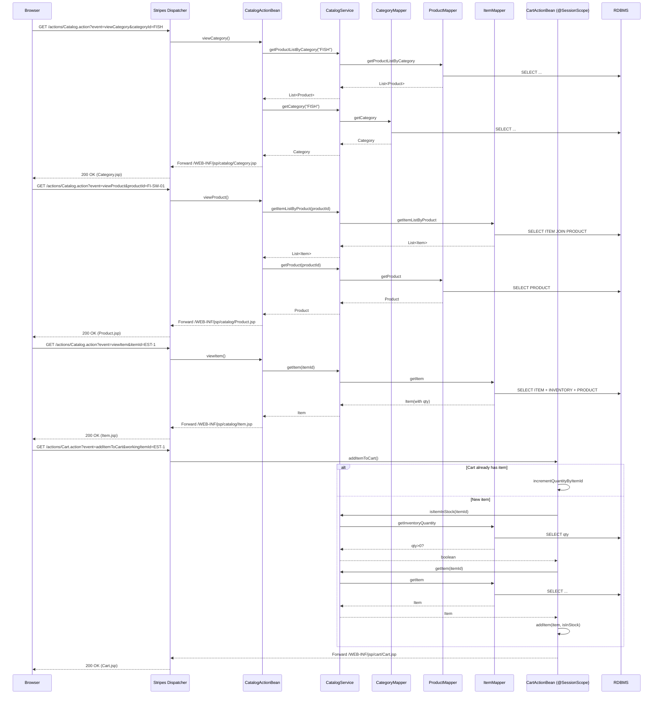
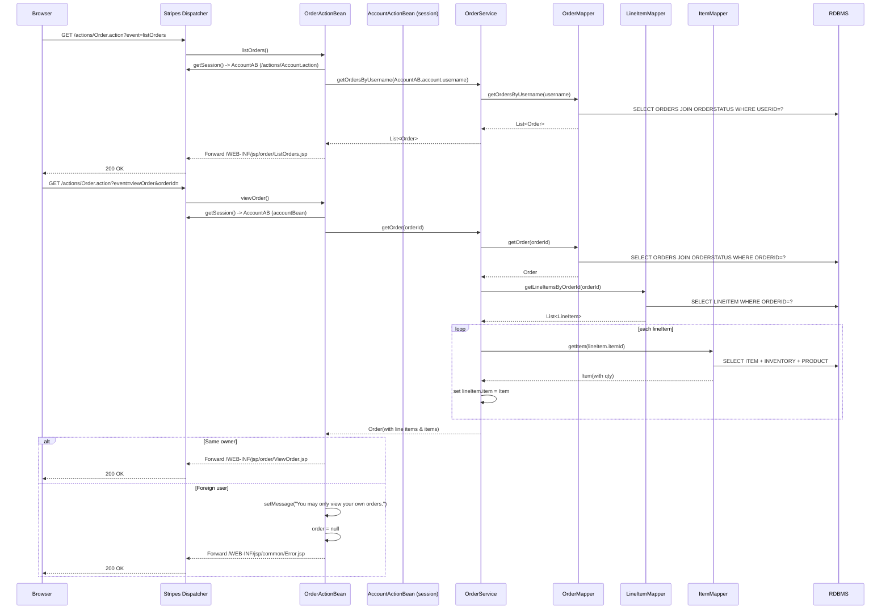
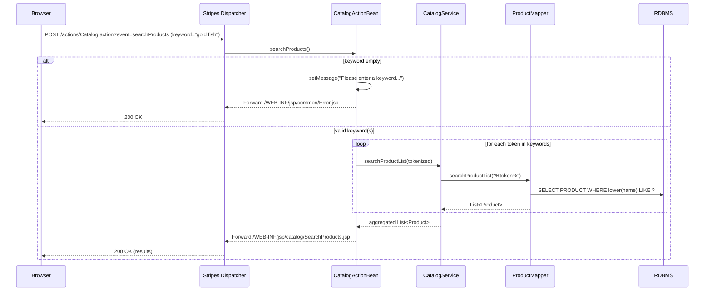
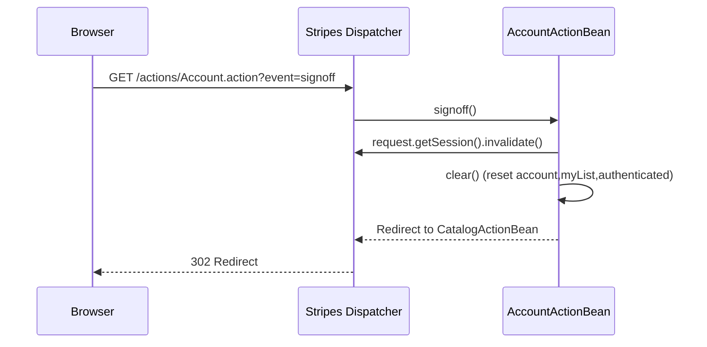

# Runtime Interaction Flows and Sequence Diagrams

## 1) User Registration (Create Account)

Purpose/trigger:
- A visitor chooses Sign In → Register Now!; submits NewAccountForm to create an account.

Communication patterns:
- HTTP form POST to Stripes Action (in-process)
- Intra-process service calls (Spring DI)
- Synchronous DB writes via MyBatis mappers (single transaction)
- Redirect to catalog after success
- Session state updated (authenticated user and personalized myList)

Mermaid sequence diagram:
```mermaid
sequenceDiagram
    participant B as Browser
    participant S as Stripes Dispatcher (*.action)
    participant AccountAB as AccountActionBean
    participant AccountSvc as AccountService (@Transactional)
    participant AccountMapper as AccountMapper
    participant CatalogSvc as CatalogService
    participant ProductMapper as ProductMapper
    participant DB as RDBMS

    B->>S: GET /actions/Account.action?event=newAccountForm
    S->>AccountAB: newAccountForm()
    AccountAB-->>S: Forward /WEB-INF/jsp/account/NewAccountForm.jsp
    S-->>B: 200 OK (NewAccountForm.jsp)

    B->>S: POST /actions/Account.action?event=newAccount + form data
    S->>AccountAB: newAccount()
    note over AccountAB: Build Account from form

    AccountAB->>AccountSvc: insertAccount(account)  [TX BEGIN]
    AccountSvc->>AccountMapper: insertAccount(account)
    AccountMapper->>DB: INSERT ACCOUNT
    AccountSvc->>AccountMapper: insertProfile(account)
    AccountMapper->>DB: INSERT PROFILE
    AccountSvc->>AccountMapper: insertSignon(account)
    AccountMapper->>DB: INSERT SIGNON
    AccountSvc-->>AccountAB: (TX COMMIT)

    AccountAB->>AccountSvc: getAccount(username)
    AccountSvc->>AccountMapper: getAccountByUsername(username)
    AccountMapper->>DB: SELECT ... JOIN PROFILE,SIGNON,BANNERDATA
    AccountMapper-->>AccountSvc: Account
    AccountSvc-->>AccountAB: Account

    AccountAB->>CatalogSvc: getProductListByCategory(favouriteCategoryId)
    CatalogSvc->>ProductMapper: getProductListByCategory(catId)
    ProductMapper->>DB: SELECT PRODUCT WHERE CATEGORY=?
    ProductMapper-->>CatalogSvc: List<Product>
    CatalogSvc-->>AccountAB: List<Product>

    Note over AccountAB: authenticated=true; set myList; put bean in session
    AccountAB-->>S: Redirect to CatalogActionBean
    S-->>B: 302 Redirect
```

- Transactions: AccountService.insertAccount is atomic (ACID). All 3 table writes succeed or roll back together.
- Errors: Any mapper/DB error throws; transaction rolls back and container error page (or global error handler) is returned.


## 2) User Sign-in

Purpose/trigger:
- A user submits username/password to sign in.

Communication patterns:
- HTTP POST to Stripes Action
- Synchronous DB read via MyBatis
- Conditional forward vs redirect
- Session state update

Mermaid sequence diagram:
```mermaid
sequenceDiagram
    participant B as Browser
    participant S as Stripes Dispatcher
    participant AccountAB as AccountActionBean
    participant AccountSvc as AccountService
    participant AccountMapper as AccountMapper
    participant CatalogSvc as CatalogService
    participant ProductMapper as ProductMapper
    participant DB as RDBMS

    B->>S: POST /actions/Account.action?event=signon (username,password)
    S->>AccountAB: signon()
    AccountAB->>AccountSvc: getAccount(username,password)
    AccountSvc->>AccountMapper: getAccountByUsernameAndPassword(u,p)
    AccountMapper->>DB: SELECT ... JOINs WHERE username=? AND password=?
    AccountMapper-->>AccountSvc: Account or null
    AccountSvc-->>AccountAB: Account or null

    alt Invalid credentials
      AccountAB->>AccountAB: setMessage("Invalid username or password...")
      AccountAB-->>S: Forward /WEB-INF/jsp/account/SignonForm.jsp
      S-->>B: 200 OK (SignonForm.jsp)
    else Success
      AccountAB->>CatalogSvc: getProductListByCategory(favouriteCategoryId)
      CatalogSvc->>ProductMapper: getProductListByCategory(catId)
      ProductMapper->>DB: SELECT PRODUCT WHERE CATEGORY=?
      ProductMapper-->>CatalogSvc: List<Product>
      CatalogSvc-->>AccountAB: myList
      Note over AccountAB: authenticated=true; password=null;<br/>put 'accountBean' and session-scoped bean in session
      AccountAB-->>S: Redirect to CatalogActionBean
      S-->>B: 302 Redirect
    end
```

- Transactions: Read-only (no TX demarcation)
- Errors: Failed login handled with message + forward; success path redirects.


## 3) Browse Catalog → View Product/Item → Add to Cart

Purpose/trigger:
- A user navigates categories/products/items and adds an item to cart.

Communication patterns:
- HTTP GET for views; Stripes forwards to JSPs
- Synchronous DB reads via CatalogService mappers
- Cart is maintained in HTTP session (no DB)
- Add-to-cart triggers synchronous stock check and item fetch from DB

Mermaid sequence diagram:


- Transactions: Read-only for browse; add-to-cart uses only reads and in-memory updates.
- Errors: None specific during browse; add-to-cart relies on real-time stock check.


## 4) Update Cart Quantities and Remove Item

Purpose/trigger:
- A user updates quantities or removes items in the cart.

Communication patterns:
- HTTP POST to Stripes Action
- In-memory cart mutation; no DB calls
- Forward to cart view

Mermaid sequence diagram:
```mermaid
sequenceDiagram
    participant B as Browser
    participant S as Stripes Dispatcher
    participant CartAB as CartActionBean (@SessionScope)

    B->>S: POST /actions/Cart.action?event=updateCartQuantities (form itemId=qty...)
    S->>CartAB: updateCartQuantities()
    CartAB->>CartAB: for each CartItem: parse qty; setQuantityByItemId
    opt quantity < 1
      CartAB->>CartAB: remove via iterator.remove()
    end
    CartAB-->>S: Forward /WEB-INF/jsp/cart/Cart.jsp
    S-->>B: 200 OK (Cart.jsp)

    B->>S: GET /actions/Cart.action?event=removeItemFromCart&workingItemId=X
    S->>CartAB: removeItemFromCart()
    CartAB->>CartAB: item = removeItemById(X)
    alt item == null
      CartAB->>CartAB: setMessage("Attempted to remove null CartItem...")
      CartAB-->>S: Forward /WEB-INF/jsp/common/Error.jsp
      S-->>B: 200 OK (Error.jsp)
    else item removed
      CartAB-->>S: Forward /WEB-INF/jsp/cart/Cart.jsp
      S-->>B: 200 OK (Cart.jsp)
    end
```

- Transactions: None (session state only).
- Errors: Removing non-existent item forwards to Error.jsp with message.


## 5) Checkout and Order Creation

Purpose/trigger:
- A user proceeds to checkout, enters payment/shipping, confirms, and submits order.

Communication patterns:
- HTTP GET/POST to Stripes Actions (multi-step)
- In-process stateful OrderActionBean (session-scoped)
- Synchronous DB writes in a single transaction in OrderService.insertOrder
- Inventory reservation is immediate (atomic decrement)
- Cart cleared after successful order

Mermaid sequence diagram:
```mermaid
sequenceDiagram
    participant B as Browser
    participant S as Stripes Dispatcher
    participant OrderAB as OrderActionBean (@SessionScope)
    participant AccountAB as AccountActionBean (session)
    participant CartAB as CartActionBean (session)
    participant OrderSvc as OrderService (@Transactional)
    participant ItemMapper as ItemMapper
    participant OrderMapper as OrderMapper
    participant LineItemMapper as LineItemMapper
    participant SequenceMapper as SequenceMapper
    participant DB as RDBMS

    B->>S: GET /actions/Order.action?event=newOrderForm
    S->>OrderAB: newOrderForm()
    OrderAB->>S: getSession()
    S-->>OrderAB: AccountAB (/actions/Account.action), CartAB
    alt Not authenticated
      OrderAB->>OrderAB: setMessage("You must sign on...")
      OrderAB-->>S: Forward to AccountActionBean.signonForm
      S-->>B: 200 OK (SignonForm.jsp)
    else Authenticated + Cart exists
      OrderAB->>OrderAB: order.initOrder(account, cart)  (builds lineItems, totals)
      OrderAB-->>S: Forward /WEB-INF/jsp/order/NewOrderForm.jsp
      S-->>B: 200 OK
    end

    B->>S: POST /actions/Order.action?event=newOrder (shippingAddressRequired?)
    S->>OrderAB: newOrder()
    alt shippingAddressRequired == true
      OrderAB->>OrderAB: shippingAddressRequired=false
      OrderAB-->>S: Forward /WEB-INF/jsp/order/ShippingForm.jsp
      S-->>B: 200 OK
    else confirmed == false
      OrderAB-->>S: Forward /WEB-INF/jsp/order/ConfirmOrder.jsp
      S-->>B: 200 OK
    else confirmed == true and order != null
      OrderAB->>OrderSvc: insertOrder(order)  [TX BEGIN]
      OrderSvc->>SequenceMapper: getSequence("ordernum")
      SequenceMapper->>DB: SELECT name,nextid
      alt sequence found
        SequenceMapper-->>OrderSvc: Sequence(nextId)
        OrderSvc->>SequenceMapper: updateSequence(nextId+1)
        SequenceMapper->>DB: UPDATE SEQUENCE
      else sequence missing
        SequenceMapper-->>OrderSvc: null
        OrderSvc-->>OrderAB: throw RuntimeException (TX ROLLBACK)
        OrderAB-->>S: (propagate -> error page)
        S-->>B: 500 or mapped error
        break
      end

      loop Each lineItem
        OrderSvc->>ItemMapper: updateInventoryQuantity({itemId, increment=qty})
        ItemMapper->>DB: UPDATE INVENTORY SET QTY = QTY - qty
      end
      OrderSvc->>OrderMapper: insertOrder(order)
      OrderMapper->>DB: INSERT ORDERS
      OrderSvc->>OrderMapper: insertOrderStatus(order)
      OrderMapper->>DB: INSERT ORDERSTATUS
      loop Each lineItem
        OrderSvc->>LineItemMapper: insertLineItem(lineItem)
        LineItemMapper->>DB: INSERT LINEITEM
      end
      OrderSvc-->>OrderAB: (TX COMMIT)

      OrderAB->>S: getSession() -> CartAB
      OrderAB->>CartAB: clear() (empties cart)
      OrderAB->>OrderAB: setMessage("Thank you, your order has been submitted.")
      OrderAB-->>S: Forward /WEB-INF/jsp/order/ViewOrder.jsp
      S-->>B: 200 OK (ViewOrder.jsp)
    else order == null
      OrderAB->>OrderAB: setMessage("order was null")
      OrderAB-->>S: Forward /WEB-INF/jsp/common/Error.jsp
      S-->>B: 200 OK
    end
```

- Transactions: OrderService.insertOrder runs in one transaction (sequence fetch/update, inventory decrements, order and line items inserts).
- Error handling:
  - Not authenticated → message + forward to sign-in
  - Sequence missing → RuntimeException, transaction rollback
  - Null order guard → message + Error.jsp


## 6) View Order History and Order Details

Purpose/trigger:
- A signed-in user reviews past orders and drills into order detail.

Communication patterns:
- HTTP GET to Stripes Action
- Synchronous DB reads via OrderService and mappers
- Authorization check by username equality
- Item details and current inventory quantity are hydrated per line item

Mermaid sequence diagram:


- Transactions: Read-only (annotated @Transactional on getOrder for consistent multi-step hydration).
- Errors: Unauthorized access → message + Error.jsp.


## 7) Product Search

Purpose/trigger:
- A user searches products using header search box.

Communication patterns:
- HTTP POST to Stripes Action
- Multiple synchronous DB searches (per keyword) via MyBatis

Mermaid sequence diagram:


- Transactions: Read-only.
- Errors: Empty keyword → message + Error.jsp.


## 8) Sign-off (Session Termination)

Purpose/trigger:
- A user clicks Sign Out; session cleared.

Communication patterns:
- HTTP GET to Stripes Action
- Session invalidation

Mermaid sequence diagram:


- Transactions: None.
- Errors: None.


---

# Cross-cutting Patterns

- Synchronous vs Asynchronous:
  - All inter-component communications are synchronous, in-process method calls (ActionBean → Service → Mapper).
  - No message queues or async events; “events” refer to Stripes action methods triggered by the event parameter.

- Data flow and persistence:
  - Services coordinate MyBatis mappers. Domain objects (Account, Product, Item, Order, LineItem) flow from/to ActionBeans and Services.
  - Insert/update operations are aggregated and demarcated with Spring @Transactional.

- Transaction boundaries:
  - AccountService.insertAccount/updateAccount: write operations across ACCOUNT/PROFILE/SIGNON tables.
  - OrderService.insertOrder: sequence reservation, inventory decrements, order and line item persistence.
  - OrderService.getOrder: annotated @Transactional to ensure consistent multi-step reads/hydration.

- Error handling and recovery:
  - User-facing validation paths forward to Error.jsp with SimpleMessage:
    - Invalid login
    - Empty search keyword
    - Removing non-existent cart item
    - Unauthorized order view
  - System errors:
    - Missing SEQUENCE row in getNextId causes RuntimeException; transaction rolls back and error propagates to container error page.
  - Forwards vs Redirects:
    - Forwards for view rendering and recoverable validation errors.
    - Redirects after state-changing operations (login success, signoff, registration) to avoid resubmits.

- Session state:
  - @SessionScope ActionBeans (AccountActionBean, CartActionBean, OrderActionBean) persist conversational state.
  - Stripes also registers beans under path keys (e.g., "/actions/Account.action"). AccountActionBean additionally stores itself as "accountBean".

- External interfaces:
  - The app is a monolith: no outbound REST calls; all DB access via MyBatis to the configured RDBMS (Docker Compose uses MySQL 8 with init SQL; tests use HSQL).