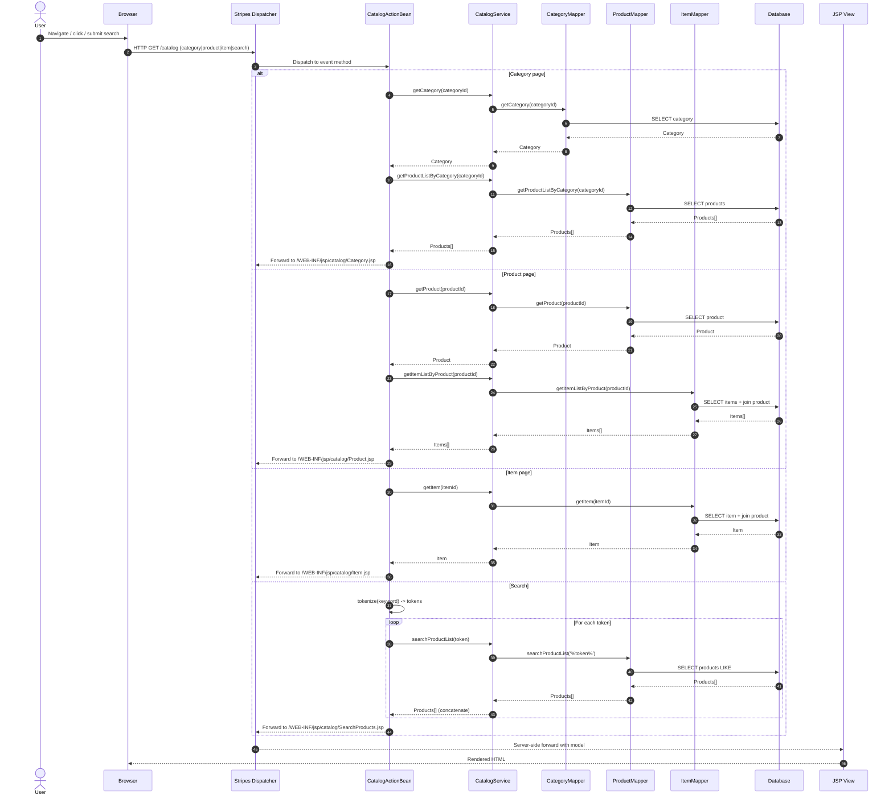
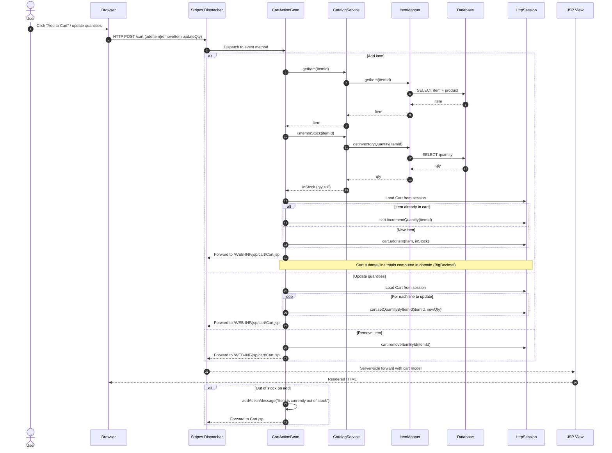
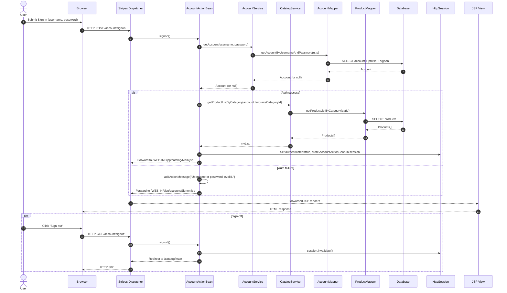
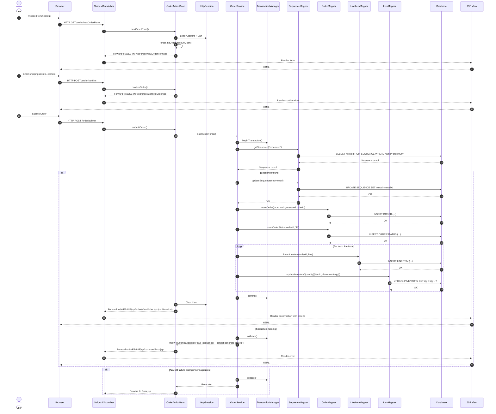
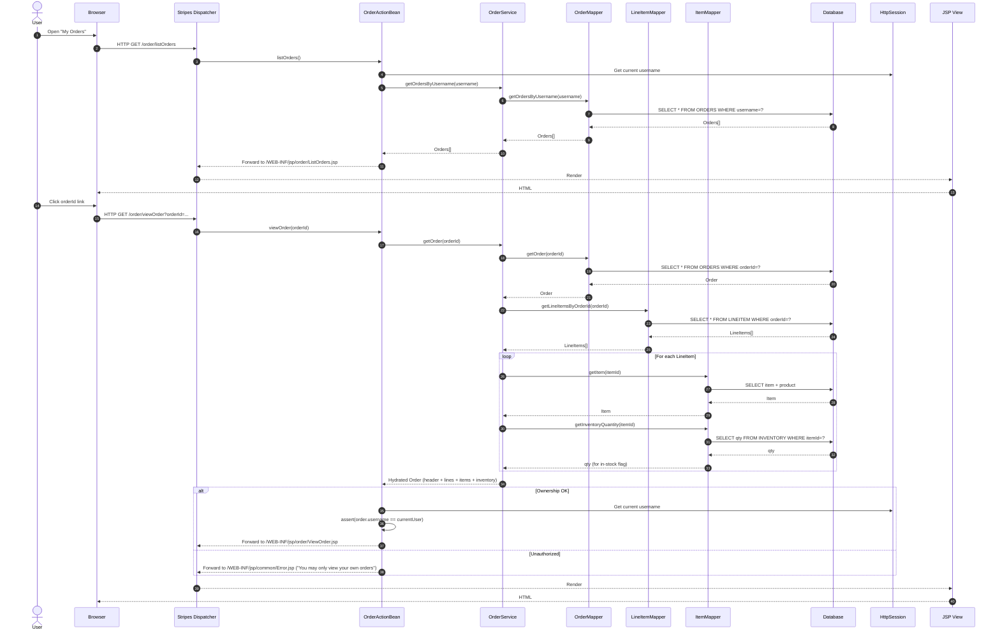
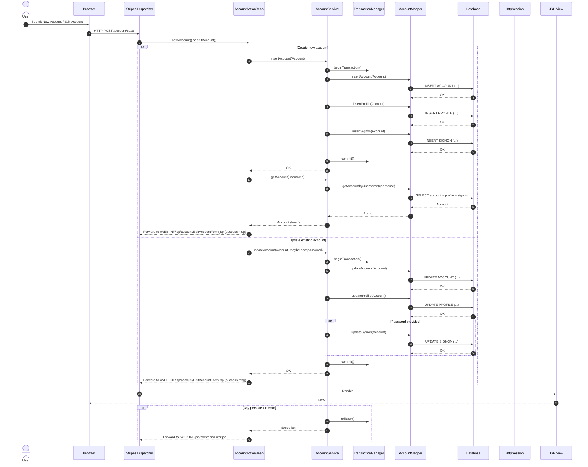

## Workflow 1: Catalog browsing and search

- Purpose and triggers:
  - Users browse categories/products/items or search by keyword to discover products.
  - Triggered by HTTP GET to catalog endpoints (home, category page, product page, item page, search).
- Communication patterns:
  - Synchronous HTTP request/response (Browser → Stripes Dispatcher → ActionBean → JSP).
  - Intra-process synchronous calls (ActionBean → CatalogService).
  - Synchronous DB reads via MyBatis mappers (Category/Product/Item).
  - No asynchronous/event-driven messaging.
- Data flow highlights:
  - Reads category/product/item data; search tokenizes keywords and aggregates product results.
  - No session writes except transient browsing state (selected IDs, keyword).

## Workflow 2: Add to cart and update quantities (with stock checks)

- Purpose and triggers:
  - Users add items to cart, remove items, or adjust quantities from cart view.
  - Triggered by HTTP POST/GET to cart endpoints.
- Communication patterns:
  - Synchronous HTTP request/response.
  - Intra-process synchronous calls (CartActionBean → CatalogService).
  - Synchronous DB reads for item details and stock checks (ItemMapper).
  - Session state mutation (Cart in HttpSession).
- Data flow highlights:
  - Reads item + inventory; writes cart lines (CartItem) into session; recalculates totals client-side in domain objects.

## Workflow 3: User sign-on (authentication) and session management

- Purpose and triggers:
  - Authenticate users and load personalized context (recommended list).
  - Triggered by HTTP POST from sign-in form; logout via link/action.
- Communication patterns:
  - Synchronous HTTP request/response.
  - Intra-process synchronous calls (AccountActionBean → AccountService; CatalogService for recommendations).
  - Synchronous DB reads via AccountMapper and ProductMapper.
  - Session mutation for authentication state; session invalidation on sign-off.
- Data flow highlights:
  - Reads account + profile + signon; optionally reads product list by favorite category; writes AccountActionBean/auth flags to session.

## Workflow 4: Checkout and place order (transactional with inventory updates)

- Purpose and triggers:
  - Guide users from cart to order submission, persist the order, adjust inventory atomically, and show confirmation.
  - Triggered by starting checkout, entering shipping, confirming, and submitting.
- Communication patterns:
  - Synchronous HTTP request/response.
  - Intra-process synchronous orchestration (OrderActionBean → OrderService).
  - Transactional DB writes via MyBatis (OrderMapper, LineItemMapper, ItemMapper, SequenceMapper) under Spring transaction manager.
  - No asynchronous events; all updates occur within a single transaction.
- Data flow highlights:
  - Reads and updates sequence for orderId.
  - Writes order header, status, line items; decrements inventory per line item.
  - On success, clears cart in session.

## Workflow 5: View order history and order details (aggregate hydration + authorization)

- Purpose and triggers:
  - Users review past orders and inspect a specific order’s details.
  - Triggered by navigation to order list or clicking an order ID.
- Communication patterns:
  - Synchronous HTTP request/response.
  - Intra-process synchronous calls (OrderActionBean → OrderService).
  - Synchronous DB reads via MyBatis (orders, line items, item details, inventory quantities).
  - Simple authorization check in controller (ownership enforcement).
- Data flow highlights:
  - getOrdersByUsername returns list of order headers.
  - getOrder hydrates: order header, line items, each item’s details, current inventory quantity for display.

## Workflow 6: Account registration and profile update (multi-table, transactional)

- Purpose and triggers:
  - Create a new user account or update existing profile/credentials.
  - Triggered by submitting New Account or Edit Account forms.
- Communication patterns:
  - Synchronous HTTP request/response.
  - Intra-process synchronous calls (AccountActionBean → AccountService).
  - Transactional DB writes across multiple tables (account, profile, signon).
- Data flow highlights:
  - Insert path: insert into all three tables; update path: update account, profile, and optionally signon if password present; reload account after persist.

